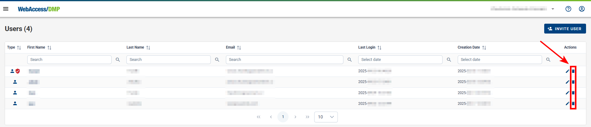

## Remove Users

### Remove a User from a Company

**To remove a user**:

1. Make sure that you're in the right company where you want to remove the user, then select _Users_ from the _Side Menu_.

2. On the _"Users"_ page, click the _"Remove User from Company"_ action button on the right of the page.

### Delete a User Account

- Each user can delete his or her own account (this feature is currently available only directly via **API**)

- On-Premises user accounts with System Administrator priviledges are also able to delete accounts of other users.
