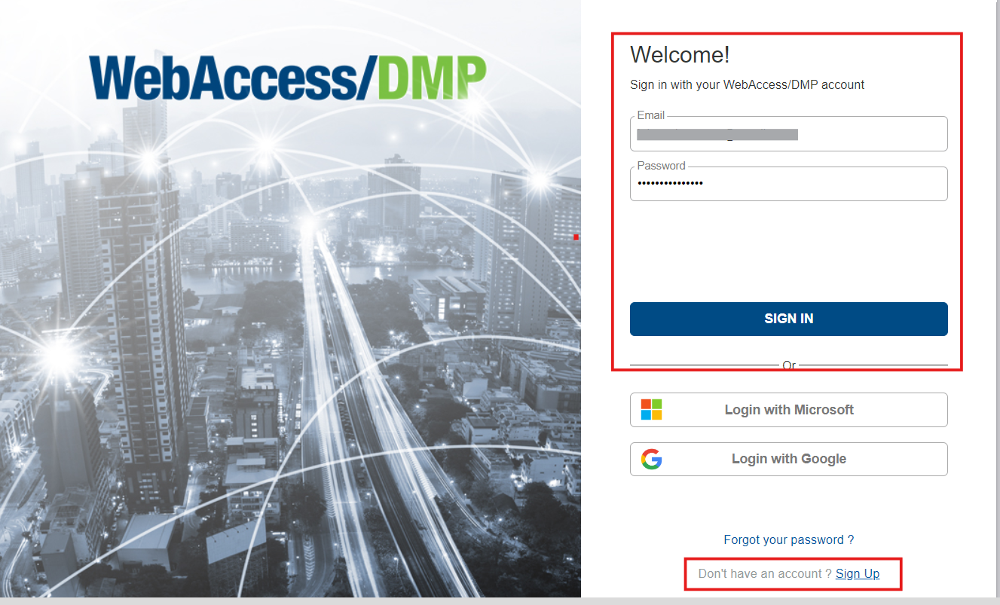
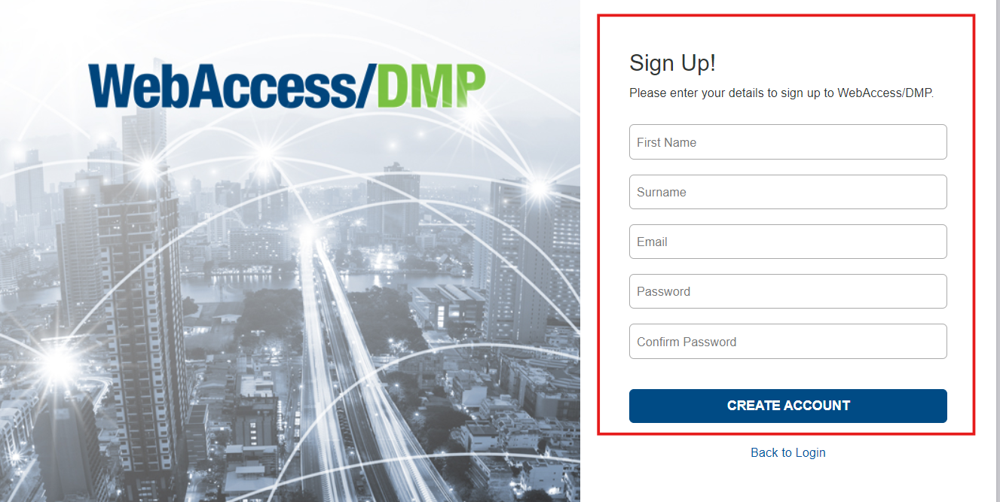
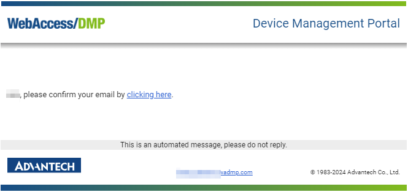
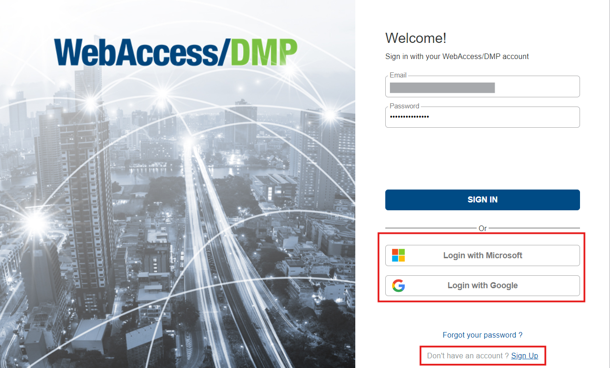

## Sign Up / Sign In

**Access the WebAccess/DMP Site: Navigate to [wadmp3.com](https://wadmp3.com), which will redirect you to the login page.**

- Initiate Sign Up:
  Click on the "Sign Up" link if you are the first from your company to register. If another company member is already registered,request them to add you to the company.

- Complete the Registration Form:
  Fill in your details on the sign-up page and click the "Create Account" button.

- Email Confirmation:
  Check your email inbox for the confirmation email. Click the confirmation link to activate your account.

- Finalize Account Setup:
  After confirming your email, your account will be ready. You can now log in to WebAccess/DMP using your login credentials.

### Using Other Identity Providers to Sign up/Sign in

**Below are the provided options:**

**Google:** Allow users to utilize their Google accounts for registration or login purposes.

**Microsoft:** Integrate with Microsoft accounts for authentication.

