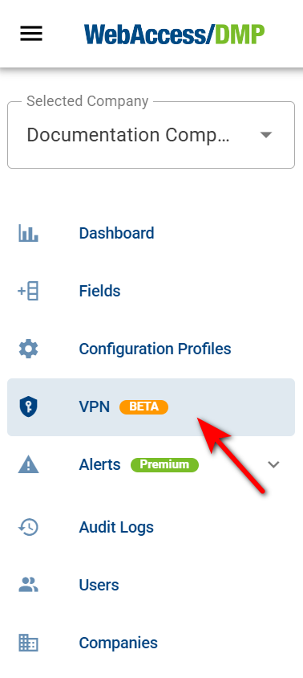
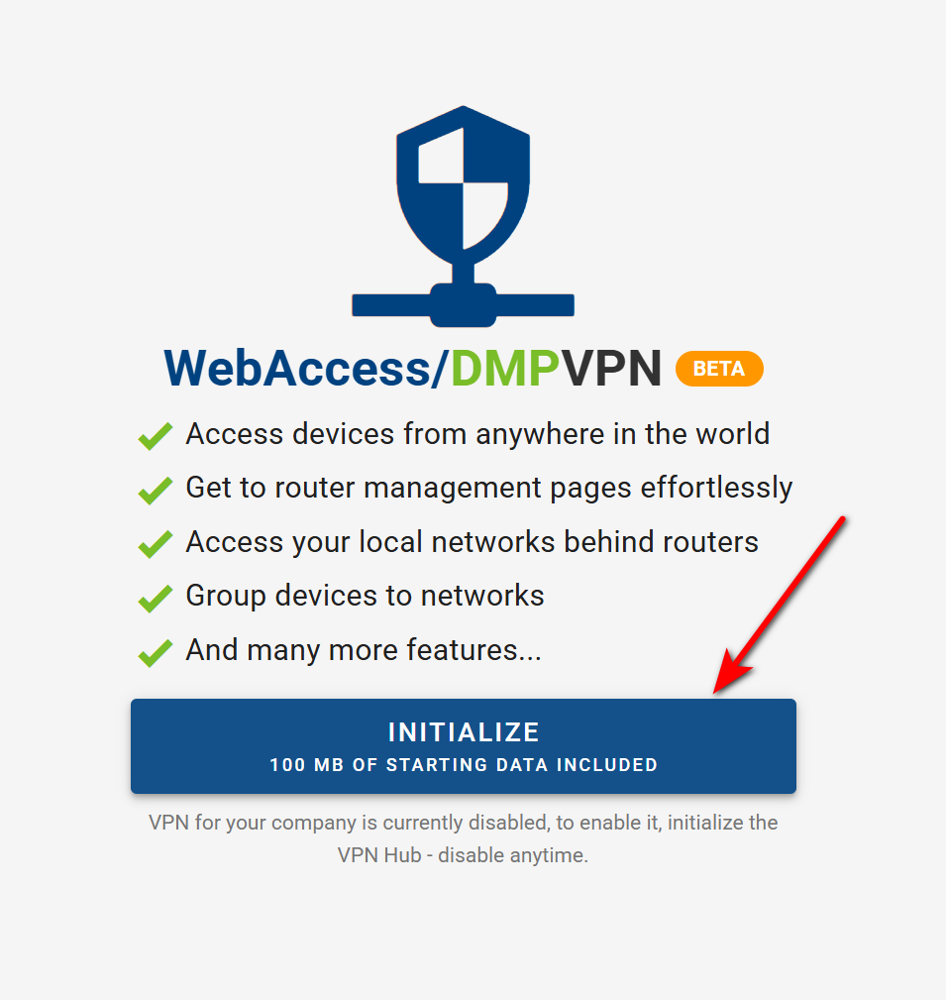
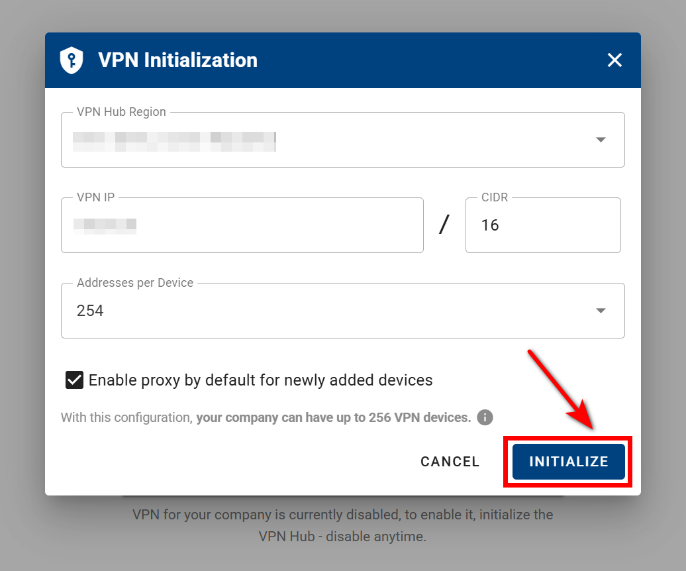

# Introduction to WADMP VPN Service

WADMP VPN is a secure networking feature designed to facilitate encrypted communication between industrial routers, IoT gateways, and the WebAccess/DMP platform. By leveraging WireGuard, WADMP VPN ensures a secure and private connection for remote device management, configuration, and data transfer.

As part of the WADMP GEN 3 ecosystem, this feature simplifies the deployment of VPN connections without requiring complex manual configurations. It provides a centralized management interface that allows administrators to set up, monitor, and troubleshoot VPN connections across multiple devices efficiently.

WADMP VPN utilizes WireGuard, a modern and high-performance VPN protocol known for its simplicity, speed, and strong cryptographic security. The service enhances cybersecurity by enforcing strong encryption, authentication mechanisms, and secure tunneling, reducing the risk of data breaches and unauthorized access.

This section will guide you through the key functionalities of WADMP VPN, its setup process, and best practices for ensuring secure and reliable connectivity within your network infrastructure.

- Start by navigating to the title panel and selecting the VPN section.

- Click the INITIALIZE button to start your 31-day free trial with 100MB of starting data for your company. If you don’t upgrade to the premium company plan, the feature will be disabled after the trial period.

- Next, complete the initialization form with your corresponding configuration. Once done, click the Initialize button to proceed.

- For detailed information on billing, go to [Billing](../companies/billing/) and navigate to the VPN Billing Summary section.