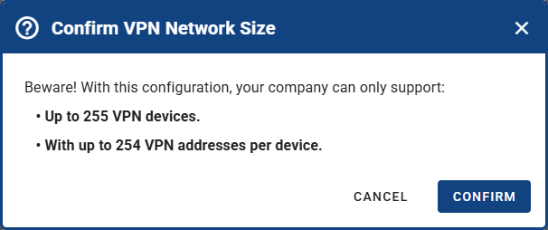
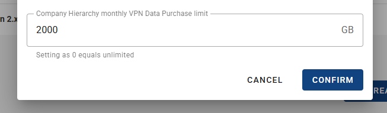

# VPN Service

## Introduction

VPN Service on WebAccess/DMP is a secure networking feature that allows remote access to industrial routers, IoT gateways, and local networks. It simplifies VPN deployment through a centralized management interface and utilizes WireGuard for secure, high-performance communication.

### Key Features

- Access devices from anywhere in the world
- Get to router management pages effortlessly
- Securely access your local networks behind routers
- Group devices into networks

## Setting Up VPN

### 1. Initialize the VPN Hub

To start using VPN:

1. Navigate to the **VPN** section in menu.
2. Click the **INITIALIZE** button to activate your **30-day free trial**, which includes **100 MB of data** for your company. If you do not upgrade to a premium company plan, the feature will be disabled after the trial period.

### 2. Configure the VPN

When setting up VPN, you need to select VPN Hub region and setup VPN Network:

- VPN Hub Region - All VPN communication in your company runs through VPN Hub that will be started in this region (a virtual machine running on server dedicated for your company).
- VPN IP and CIDR - This is your VPN Network. You can type in desired IP address. CIDR affects the maximum number of VPN devices (together with Addresses per Device). See the calculated number at the bottom changing interactively when adjusting CIDR and Addresses per Device.
- Addresses per Device - How many VPN addresses can a device use. Affects the maximum number of VPN devices (together with CIDR). See the calculated number at the bottom changing interactively when adjusting CIDR and Addresses per Device. This parameter can be later changed individually per device.
- Enable proxy by default for newly added devices - this determines if newly added device has proxy link active. Can be disabled/enabled individualy per device.

All values can be changed later (Configuration on VPN Overview page).

⚠️ **Note:** If VPN is initialized, the maximum number of VPN devices (determined by the **CIDR** range and **Addresses per Device** settings) is also the **maximum number of devices** that can be added to the company.

### 3. Complete the Initialization Form

After configuring your VPN Hub, click the **Initialize** button to proceed. Confirmation dialog with a maximum number of devices and in company will appear. Confirm, and the VPN Hub is starting.

⚠️ **Note:** To connect a device to VPN, ensure the device has Client Router App version 3.2.0 or higher installed, where VPN is supported.

## VPN FAQs

### Does starting a VPN Hub cost anything? How do I purchase VPN data, and what are the costs?

Starting of VPN Hub is free. Both Free and Premium Companies have free 100 MB of traffic to be spent via VPN (VPN Downloaded counted as traffic).
After 100 MB spent, you can upgrade to Premium, where you can purchase more data on VPN Overview page.
Purchased data is then billed to parent company, price of 1 GB of VPN data traffic is equivalent to price per device (e.g. if you pay 2 Euros per device, every 1 GB of VPN data traffic would be additional 2 Euros). For detailed information on billing, go to [Billing](../companies/billing/) and navigate to the VPN Billing Summary section.

### How and when do I pay for the data?

Data are billed to parent Company in month of purchase and are available until spent. So if a subcompany buys data, the parent company is responsible for the payment. Since buying data is just a few clicks away, to prevent accidental excessive purchases you can set the overall data purchase limit in parent company (default is 2000 GB). Navigate to Companies - select parent Company - then edit Company Profile, including _Company Hierarchy monthly VPN Data Purchase limit_.

### What features are available for free?

VPN Features are not limited for Free company trial, only data limit of 100 MB, 30 days after initialization and also limit of max. 5 devices apply (including Roadwarriors - counted as devices). There are not speed limitations. After 30 days you can request upgrade to Premium to buy more data and add more devices.

### How do I connect a device to VPN?

With VPN Hub running, ensure that a device has Client Router App version 3.2.0 or higher installed. Then device should connect to VPN automatically. Check the status on device page header, or when added in Network, or via VPN Connected Field on Dashboard.
