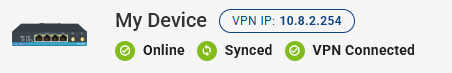
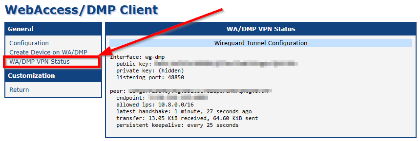
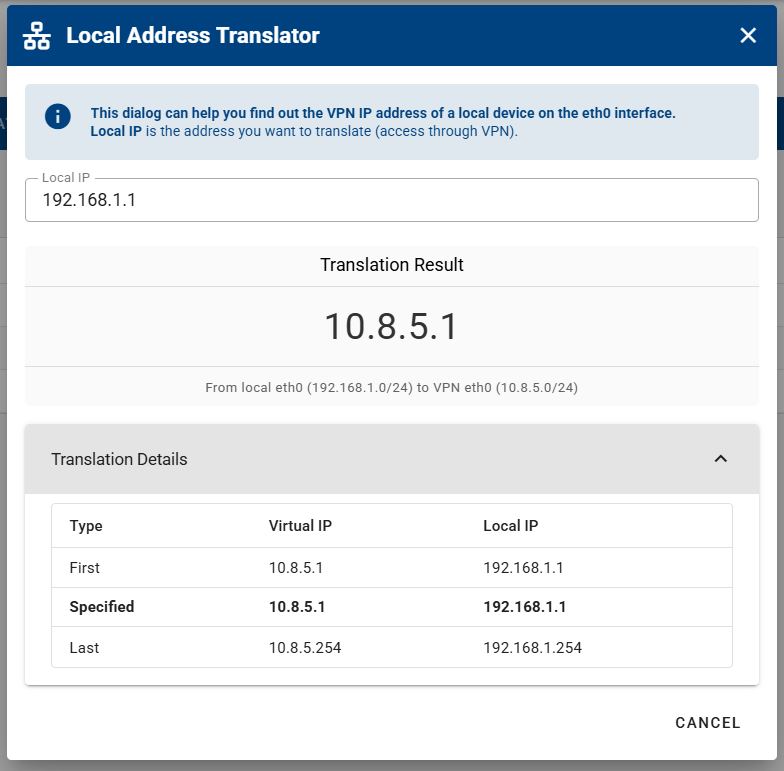

# Networks & Devices

- You need to add Devices / Roadwarriors (remote VPN users) to same Network (group) to make them visible to each other via VPN.

## Networks

- On Networks page, you can manage Networks (groups) of your company VPN. Navigate to VPN - Networks section in menu.

- Here you'll be able to add new networks by clicking the **ADD** button.

- You can choose between two network types:

- Tooltips are available for both network types and their roles. They are displayed as a small gray question mark icon — hovering over the icon provides additional explanations and guidance. For a more detailed, in-depth explanation, see the descriptions below:

1. **All to All** &rarr; _All to All_ refers to a network configuration where all devices see each other, allowing direct communication between every device in the network without restrictions. Each device can send and receive data to and from any other device. Roadwarriors (remote VPN users) have a special role → they can see all devices, but the devices do not see them, so the Roadwarrior must initiate the communication. Roadwarriors also do not see each other.

2. **Master to Slave** &rarr; _Master-to-Slave_ refers to a network configuration where the Master device (server) controls and manages the connections, while the Slave devices follow its instructions. This setup is often used for centralized management and control. The Master and Slave devices always see each other, but a Slave device does not see other Slaves. Roadwarriors (remote VPN users) have a special role → they can see all devices (both Master and Slave), but the devices do not see them, so the Roadwarrior must initiate the communication. Roadwarriors do not see each other.

- Once you've created your networks, you can either enter them by clicking on their name, or edit/delete them using the options on the right side of each line.
  

- When you enter your desired network, you can edit the network's name by clicking the **EDIT NETWORK** button, or add devices by clicking the **ADD DEVICES** button.

- When adding devices to your network, you can either select all available devices or choose specific ones based on your preference.

- Using _Add Device_, a Roadwarrior can also be added to the network, and all of them are reffered as Clients.

- You can now either enter your device by clicking its name, or use the options on the right side of its line to access the _Proxy Link_, edit its role, or delete it.

- When editing your device's role, you can switch between _Master_ and _Slave_ modes (applicable in Master-Slave network type only).

## Devices

### Status of a Device

⚠️ **Note:** To connect a device to VPN, ensure the device has Client Router App version 3.2.0 or higher installed, where VPN is supported.

On WebAccess/DMP, the status of VPN connection of the device is visible on device page header. Also "VPN Connected" Field can be added on the dashboard. When the device is added in Network, connection status of devices is also visible on Network detail page.

On device in client, you can check the VPN Connection status on this page in WebAccess/DMP Client Router App:

### Removing Devices from a VPN Network

If you want to remove devices from a VPN network, open the desired network in the VPN Network details and select the devices you no longer want included. You can also select all devices, up to a maximum of 5,000 at a time.

### VPN Tab on Device Detail Page

- Once you're in the device's VPN tab, you can configure the following settings:

1. **VPN Enabled** - *Enable* or *Disable* the device’s VPN client. When disabled, the device disconnects from the VPN network and stops routing any traffic through the VPN tunnel. When enabled, it reconnects and resumes secure communication with remote peers.

2. **Networks** — add or remove the device from VPN networks, thereby controlling which devices can communicate with it over VPN. 

3. **VPN Subnet** — allows you to configure how many virtual IP addresses are assigned to the device within the VPN network. Changing this setting reassigns IPs and removes all existing Proxy links.  

4. **Exposed Interfaces** — define which network interfaces are accessible through the VPN and can exchange traffic with remote VPN peers.

5. **Data Usage This Month** — check the device's data usage over the the past year. 

#### PROXY LINKS

1. In the **Proxy Links** section, you can *Enable* or *Disable* the Proxy using the slide button. Disabling the Proxy will not delete it.  

2. You can add additional Proxy links by specifying the following options:
- **Proxy Type** — Router or LAN Device  
- **Name** — Name of your Proxy link  
- **Protocol** — HTTPS or HTTP  
- **Port** — Choose the desired port  
- **Expiration Date** — Set the expiration date for the Proxy link (after that the Proxy link will be deleted) 

This is useful when you have a device with a Web User Interface behind the router and want to access it directly via VPN. You need to know the address of the local network where the device is accessible. Note that adding a Proxy link will expose it to the Internet (a LAN interface will be automatically exposed on the LANs tab).

3. Edit or Delete the Proxy link from the device.

**Notes:**

- Change in Proxy link may take up to 3 minutes to update the config on server.

- When in UI on a device via VPN Proxy link, size of file that can be uploaded is limited to 256 MB.

- Known Issue: Proxy links do not work when the device has Firmware versions 6.5.1 or 6.5.0. Please update Firmware on the device.

#### INTERFACES

In the **Interfaces** section, you can:

1. **Expose or Unexpose an Interface** — use the slide button. Disabling exposure blocks VPN traffic to devices behind this interface. VPN subnets may change, which can shift existing Proxy links to new IP addresses.  

2. **Access the Local Address Translator (NAT)** — the interface must be exposed to view the NAT translator.

#### CONNECTION HISTORY

1. In the **Device Connection History** section, you can track when your device was connected or disconnected during the selected month. Similarly, the **VPN Connection History** shows the times your device connected or disconnected from the VPN within the selected month.

