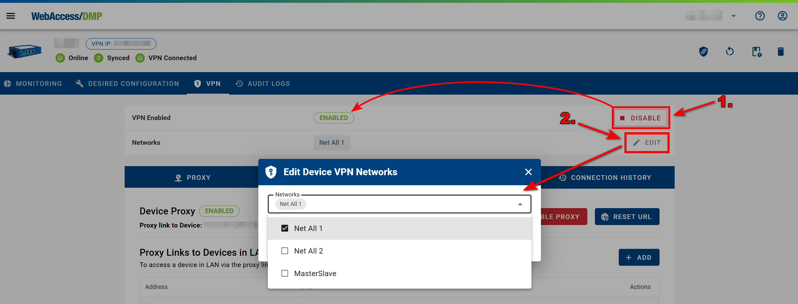
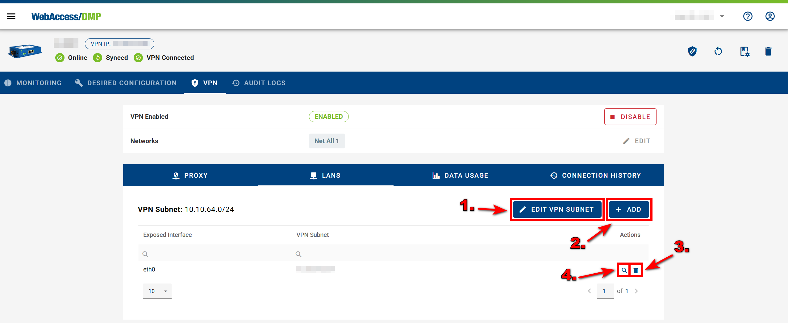

# Networks & Devices

- Start by navigating to the VPN section in the Context Panel, then select the Networks section.

  

- Here you'll be able to add new networks by clicking the **ADD** button.

- You have two options for adding new networks:

1. **All to All** &rarr; *All to All* refers to a network configuration where all devices are connected to each other, allowing direct communication between every device in the network without restrictions. Each device can send and receive data to and from any other device. Roadwarriors have a special role → they can see all devices, but the devices do not see them, so the Roadwarrior must initiate the communication. Roadwarriors also do not see each other.

2. **Master to Slave** &rarr; *Master-to-Slave* refers to a network configuration where the Master device (server) controls and manages the connections, while the Slave devices follow its instructions. This setup is often used for centralized management and control. The Master and Slave devices always see each other, but a Slave device does not see other Slaves. Roadwarriors have a special → role they can see all devices (both Master and Slave), but the devices do not see them, so the Roadwarrior must initiate the communication. Roadwarriors do not see each other.

- Once you've created your networks, you can either enter them by clicking on their name, or edit/delete them using the options on the right side of each line.

- When you enter your desired network, you can edit the network's name by clicking the **EDIT NETWORK** button, or add devices by clicking the **ADD DEVICES** button.

- When adding devices to your network, you can either select all available devices or choose specific ones based on your preference.

- Using *Add Device*, a Roadwarrior can also be added to the network, and all of them are Clients.

- You can now either enter your device by clicking its name, or use the options on the right side of its line to access the *Proxy Link*, edit its role, or delete it.

- When editing your device's role, you can switch between *Master* and *Slave* modes.

## Main VPN Device Interface 

- Once you're in the device's VPN interface, you can configure the following settings:

1. Disable or Enable VPN client of the device
2. Edit device VPN networks.

### PROXY

1. In the Proxy section, you can disable the proxy and reset its URL using the **DISABLE PROXY** and **RESET URL** buttons.

2. You can add additional Proxy links, where you can specify the Local IP, CIDR, and Local Interface of the device. This is useful when you have a device with a Web User Interface behind the router and want to access it directly via VPN. You need to know the address of the local network where the device behind the router is accessible. Note that adding a proxy link will expose the link to the Internet (it will automatically add a LAN interface on the LANs tab).

3. Delete the Proxy link from the device.

### LANS

1. In the LANS section, you can edit the VPN subnet by clicking the **EDIT VPN SUBNET** button.

2. Add additional LAN interfaces by clicking the **ADD** button. Adding a LAN interface enables direct access via VPN to any device behind the router. 1:1 NAT is used; to find the VPN IP address of your locally known device, use the provided address translator (magnifying glass icon for the added interface).

3. Delete the LAN interfaces from the device.

4. Access Local Address Translator. You can then access your device directly in the VPN network, e.g., via SSH.

  

### DATA USAGE

1. In the Data Usage section, you can view the data usage over the past year.

### CONNECTION HISTORY

1. In the Connection History section, you can track the times when your device was connected or disconnected.

