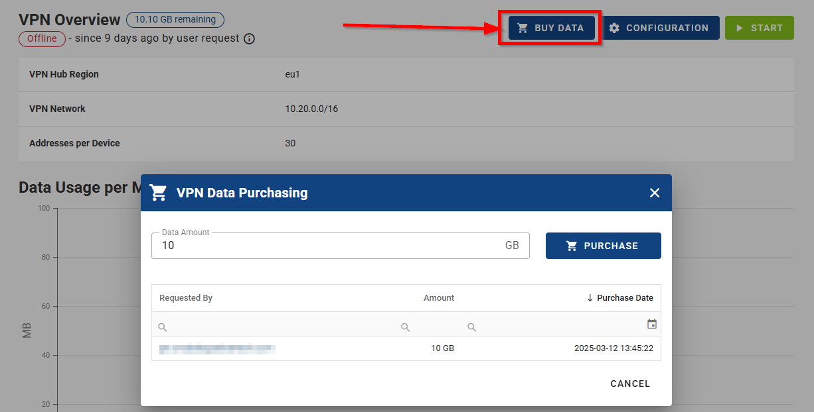
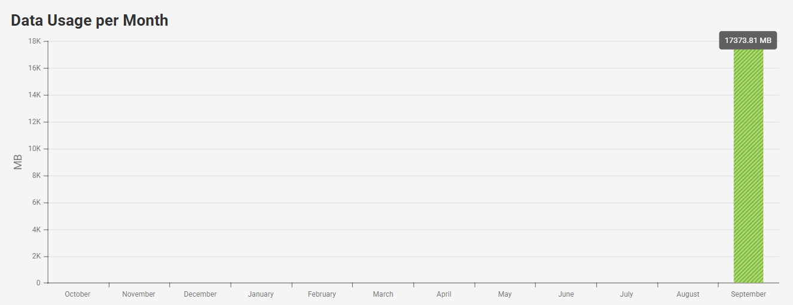
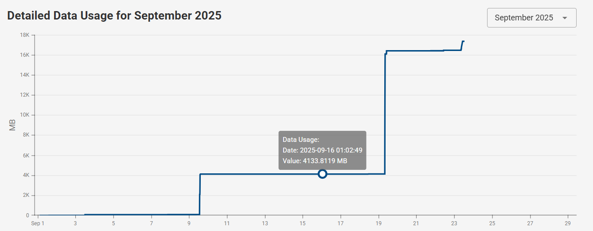

# Overview

- On VPN Overview page you can overview and control VPN Hub for your company. Navigate to the VPN - Overview section in menu.

## VPN Hub Overview

- In top part, you can see VPN Hub status and you can manage VPN Hub (start, stop, configure). After VPN initialization, the VPN Hub is started by default.

Below, the VPN Hub parameters and stats are shown:

- VPN Hub Region
- VPN Network
- Addresses per Device
- Data Usage per Month
- Detailed Data Usage for selected month

- Premium companies do not have the "days left" indicator and have additional "Buy Data" button to purchase more data for VPN traffic. See [VPN Billing Summary](../../companies/billing/#vpn-billing-summary) for details on billing.

- **Data Usage per Month** — displays the total data consumption for each month over the past year.  

- **Detailed Data Usage** — shows the total data consumption for the entire duration of the selected month. The amount of data used is accumulated throughout the month and resets at the beginning of the next month. 

## VPN Hub Configuration

- In this section you can also edit your VPN configuration (VPN Hub) by clicking on the **CONFIGURATION** button as showcased on the picture below, and confirm it with the **CONFIRM** button.

- Modifying settings in the **Danger Zone** section can have significant impacts on your VPN network. Reconfiguring the VPN will remap device addresses, which may lead to connection loss, especially if other services, settings, or devices depend on the existing configuration.

- This can affect:

1. Connected devices behind routers
2. _Roadwarriors_ (remote VPN users), who may no longer be able to connect
3. Existing network settings and communication

- Because of these potential disruptions, it is highly recommended to carefully review and update all dependent configurations after making changes in the Danger Zone.

- See all configuration parameters explained in Initialization description: [Configure the VPN](../../vpn/#_2-configure-the-vpn)

⚠️ Note, that if VPN initialized in the company, the number of VPN Devices (given by VPN Configuration) is also maximum number of all devices that can be added to the Company, where VPN is initialized.

::: tip VPN Fields:

- On the dashboard, you can add VPN-related fields to create a dedicated VPN overview. You can include columns such as, VPN Connection Status, VPN IP, VPN Data Used, Network Role and more for a clear and organized view of your VPN details.
  :::
