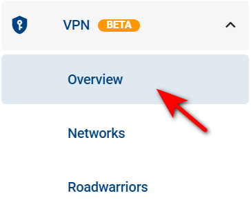
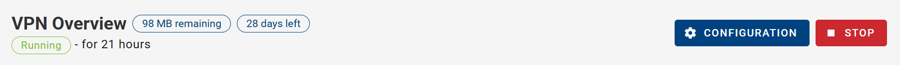
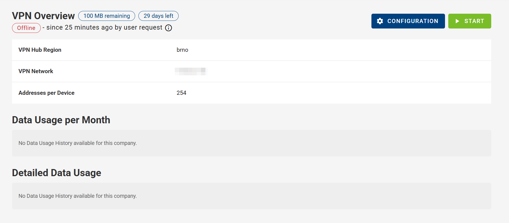
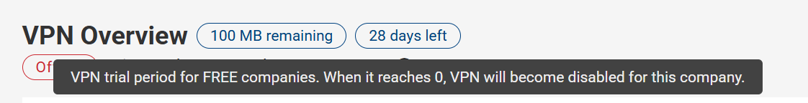
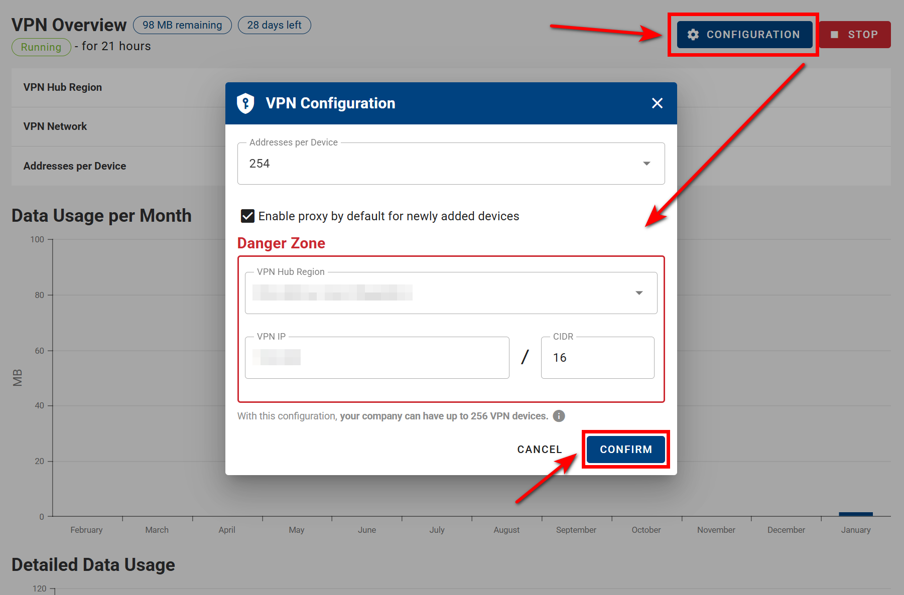

# Overview

- Start by navigating to the VPN section in the Context Panel, then select the Overview section.

  

- By default, you will see that the VPN is in **Running** mode.

By default, the overview displays the following information:

1. VPN Hub Region
2. VPN Network
3. Addresses per Device

- Additionally, there are two fields: _Data Usage per Month_ and _Detailed Data Usage_.

- You can stop it by clicking the red **STOP** button.

- As mentioned in the introduction (this applies only for Free companies, doesn't show up if you have Premium), the "days left" indicate when the VPN feature will be disabled for this company.

- In this section you can also edit your VPN configuration by clicking on the **CONFIGURATION** button as showcased on the picture below, and confirm it with the **CONFIRM** button.

- Modifying settings in the **Danger Zone** section can have significant impacts on your VPN network. Reconfiguring the VPN will remap device addresses, which may lead to connection loss, especially if other services, settings, or devices depend on the existing configuration.

- This can affect:

1. Connected devices behind routers
2. _Roadwarriors_, who may no longer be able to connect
3. Existing network settings and communication

- Because of these potential disruptions, it is highly recommended to carefully review and update all dependent configurations after making changes in the Danger Zone.

⚠️ Note, that the number of VPN Devices (given by VPN Configuration) is also maximum number of all devices that can be added to the Company, where VPN is initialized.

::: tip VPN Fields:

- On the dashboard, you can add VPN-related fields to create a dedicated VPN overview. You can include columns such as, VPN Connection Status, VPN IP, VPN Data Used, Network Role and more for a clear and organized view of your VPN details.
  :::
