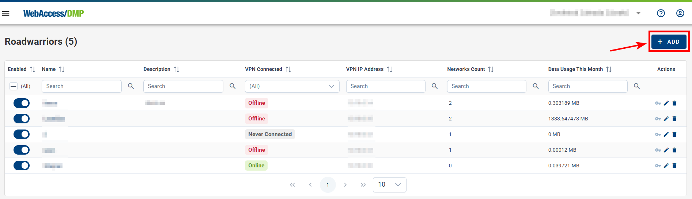
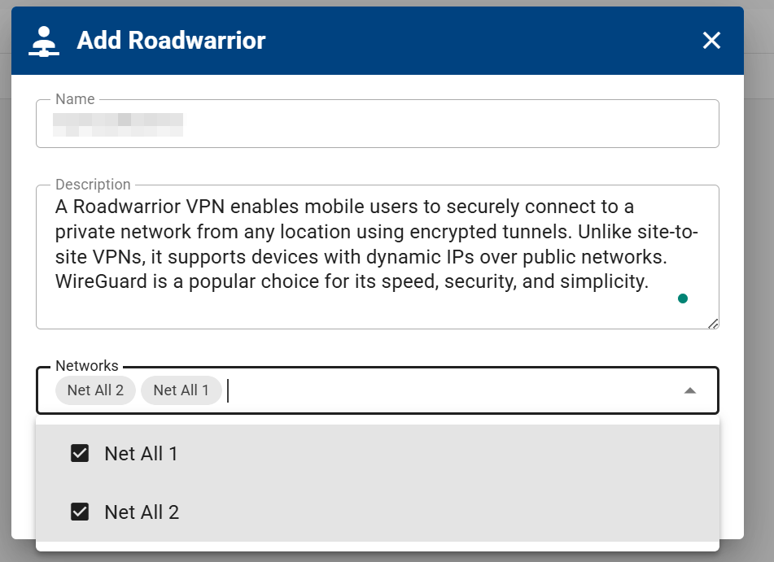
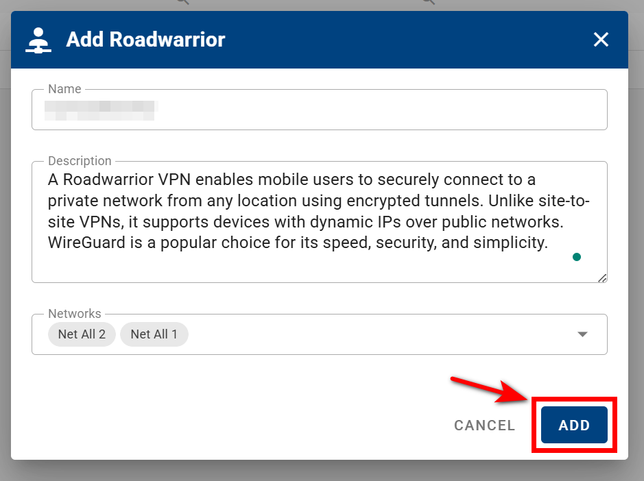
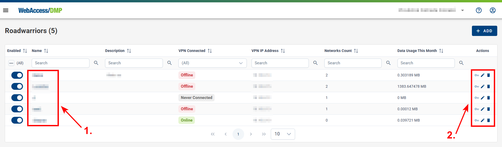
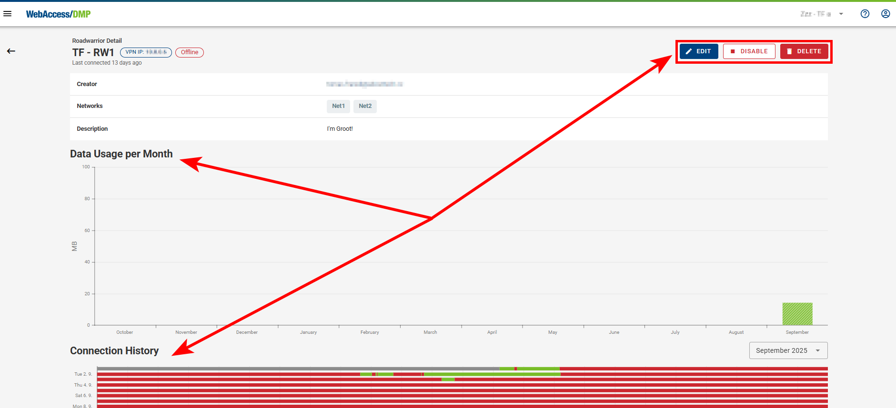
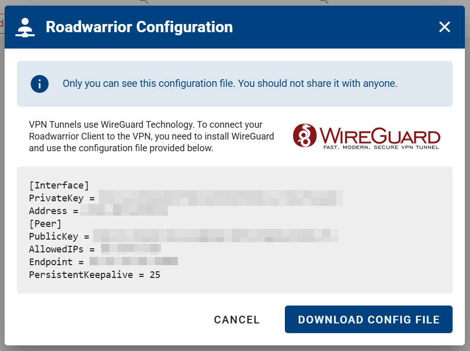

# Roadwarriors

Roadwarriors refer to a VPN configuration designed for mobile users (Windows, Android, macOS, iOS, Linux and basically any device where [WireGuard](https://www.wireguard.com/install/) can be installed) who need secure remote access to a private network from various locations. Unlike site-to-site VPNs, which connect fixed networks, a Roadwarrior setup allows individual devices with dynamic IP addresses to establish encrypted connections over untrusted networks, such as public Wi-Fi or mobile data. This approach ensures secure access to corporate resources, protects sensitive data, and enhances online privacy.

- On Roadwarriors page, you can manage VPN Roadwarriors in your company. Navigate to VPN - Roadwarriors section in menu.

- Add your Roadwarrior by clicking the **ADD ROADWARRIOR** button.

- Enter the name and description, then select the specific networks you want your Roadwarrior to be part of.

- Click the **ADD** button to confirm and proceed.

- Now you can disable/enable Roadwarrior in the first column, view Roadwarror detail or click actions in column on the right:

1. You can view your Roadwarrior's details by clicking on its name and specify the configuration here.

- In the Roadwarrior's details, you can edit its configuration, including the name, description, and networks membership. You can also disable/enable or delete it. Below, you’ll find information about its _Data Usage_ and _Connection History_.

2. From here, you can view the WireGuard configuration, edit, or delete your Roadwarrior.

- If you choose to view the WireGuard configuration, a form will display your configuration details. You can also download them as a configuration file by clicking the **DOWNLOAD CONFIG FILE** button.

- **Note that only the creator of the Roadwarrior can view its configuration.**
