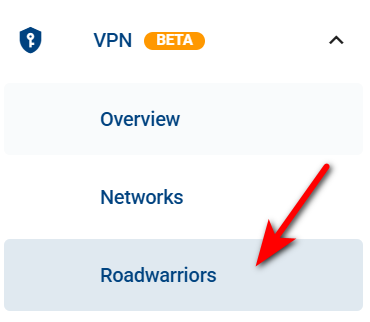

# Roadwarriors

Roadwarriors refers to a VPN configuration designed for mobile users who need secure remote access to a private network from various locations. Unlike site-to-site VPNs, which connect fixed networks, a Roadwarrior setup allows individual devices with dynamic IP addresses to establish encrypted connections over untrusted networks, such as public Wi-Fi or mobile data. This approach ensures secure access to corporate resources, protects sensitive data, and enhances online privacy.

- Start by navigating to the VPN section in the Context Panel, then select the Roadwarriors section.

- Next, add your Roadwarrior by clicking the **ADD ROADWARRIOR** button.

- Enter the name and description, then select the specific networks you want your Roadwarrior to be part of.

- Click the **ADD** button to confirm and proceed.

- Now you have 2 options:

1. You can view your Roadwarrior's details by clicking on its name and specify the configuration here.

2. From here, you can view the WireGuard configuration, edit, or delete your Roadwarrior.

- If you choose to view the WireGuard configuration, a form will display your configuration details. You can also download them as a configuration file by clicking the **DOWNLOAD CONFIG FILE** button.

- **Note that only the creator of the Roadwarrior can view its configuration.**
