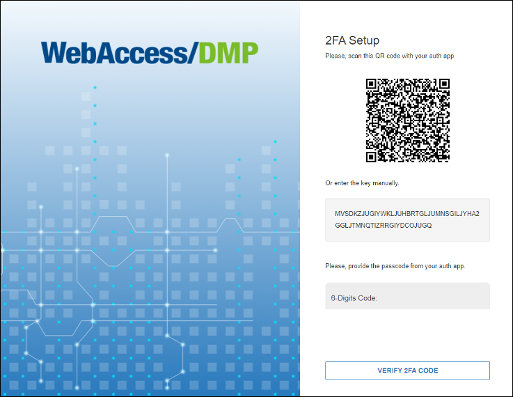

# Two-Factor Authentication

**2FA** (*Two-Factor authentication*) provides an additional level of security to protect your account.

If it is enabled and already setup after a successful login you will be asked for one time password to enter from your Auth App (Microsoft Authenticator, Google Authenticator, Authy, etc.…)

## Authenticator Apps
To configure 2FA, you should first download the Authenticator app to your phone. We support a wide array of Auth apps.

- [Google Authenticator](https://play.google.com/store/apps/details?id=com.google.android.apps.authenticator2&hl=en&gl=US)

- [Microsoft Authenticator](https://play.google.com/store/apps/details?id=com.azure.authenticator&hl=en&gl=US)

- [Google Authenticator (IOS)](https://apps.apple.com/us/app/google-authenticator/id388497605)

- [Microsoft Authenticator (IOS)](https://apps.apple.com/us/app/microsoft-authenticator/id983156458)

## Enable 2FA

You are able to activate 2FA in the *Company Edit Form*.

After it is turned on, you can configure a 2FA using your Auth application.

**Important Notice:** Enabling 2FA will add an extra option “Service Account” (in user's permissions settings) so company admins are able to enable/disable this feature for users in a company having 2FA enabled (this will allow users to use the scripts even if they have 2FA enabled otherwise they will not be able to).

When you enable 2FA for a company all users will be forced to setup the 2FA after they login, they will not be able to use the system until they complete the 2FA setup.

## 2FA Login

Once you have downloaded the application, you need to scan the QR code or enter the given code manually.

Type in the unique password you see in your Auth app to sign in.

**Important Notice:** Turning 2FA off for the company will turn it off for all users in that company.

