# User management

To start using WebAccess/DMP, you need a user account first.

Use Sign Up link only if you are the first from your company to access the platform. If someone else has already Signed Up, ask them to create a user to add you to the company.

## 1- Sign up / Sign in

- Go to [wadmp3.com](https://wadmp3.com). You will be redirected to the login page.

- Click on the Sign Up link and fill in your details.

- After clicking the Create Account button, enter your email inbox and confirm your new user.

- After clicking the confirmation in your email, your account will be ready to log in to WebAccess/DMP with your login data on the main page.

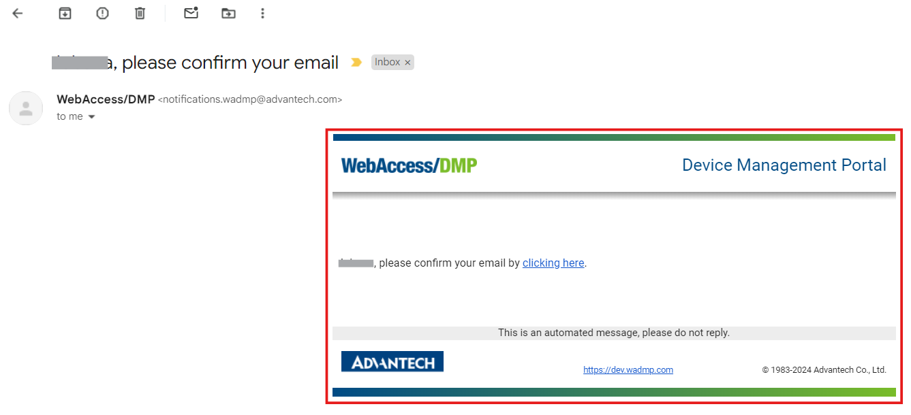

### Using other identity providers to sign up/sign in

 Sign in with External Provider 

If your company is listed as an external provider, you can sign in immediately.

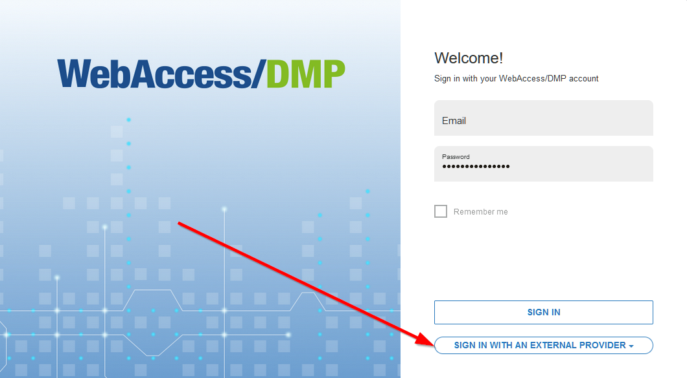

OAuth/OpenIP type of authentication is supported for external providers. Don't hesitate to contact us if you want your company to be listed as an external provider.

## 2- Add users

### Invite existing users
You can invite existing or new users who just created their account to any company you have permission to. You can do it similarly, like when creating a new user.

You can check your permissions if you edit your user. Your assigned permissions are shown as check marks.

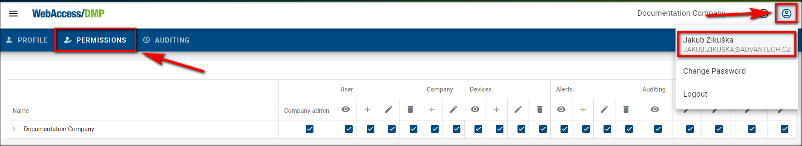

To invite a user:

1. Make sure that you're in the right company where you want to invite the user, then select *Users* from the *Title Menu*.
2. On the *Users* page, click the *Invite User* action button on the right top of the page.

3. To the invitation form, fill in the user's email and set up your specific permissions for him to use.

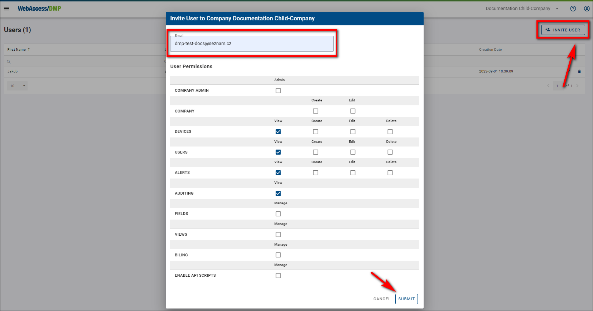

4. Now, the user needs to head to his email to confirm the sent invitation by clicking on the link in the email.

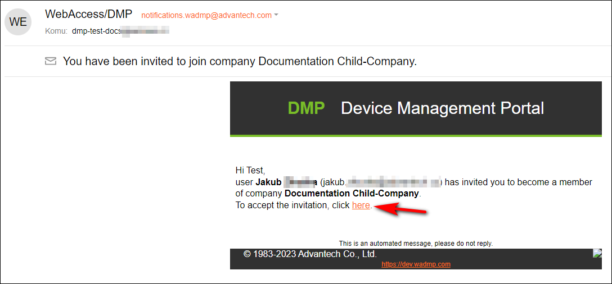

5. After clicking on the invitation, the link will redirect him to our main page, where he will be notified that he has been added to the company.

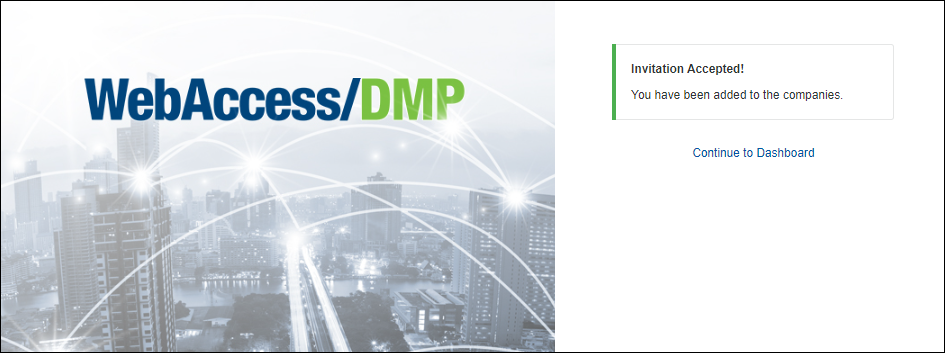

6. From now on, the user can click the "Continue to Dashboard" link and check that he's in the company.

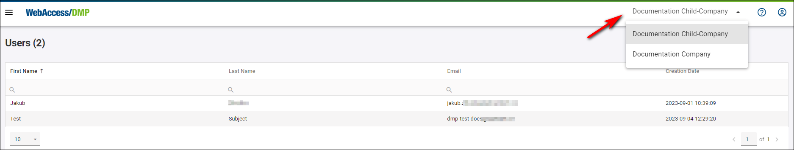

### Create new users

Creating them yourself is the only way to add users to your companies. When a user signs up, he can also make a company with no relation to yours.

As with companies, remember that the creation of a user depends on two conditions:
- You can log in to the platform and
- That you have permission to create companies

You can check your permissions if you edit your user. Your assigned permissions are shown as check marks.

To create a user, you can do it in two almost identical ways:

1. Make sure that you're in the right company where you want to invite the user, then select *Users* from the *Title Menu*.
2. On the *Users* page, click the *Invite User* action button on the right top of the page.

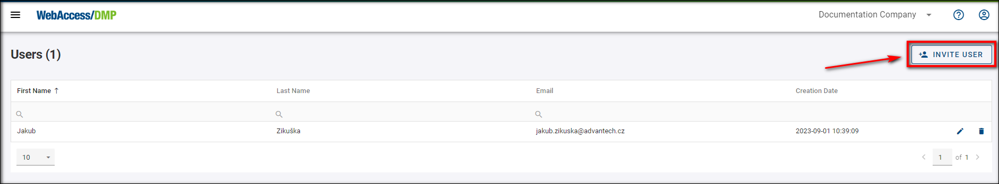

3. To the invitation form, fill in the user's email and set up your specific permissions for him to use.

4. Now, the user needs to head to his email to confirm the sent invitation by clicking on the link in the email.

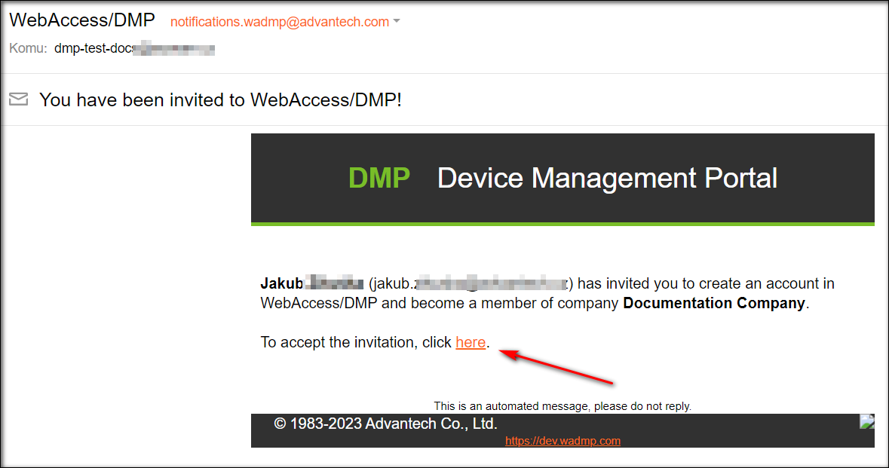

5. After clicking on the invitation, the link will redirect him to our main page, where he will need to fill up his login data and click the *Create Account* button, as shown in the picture below. The email is already set up from the link and cannot be changed.

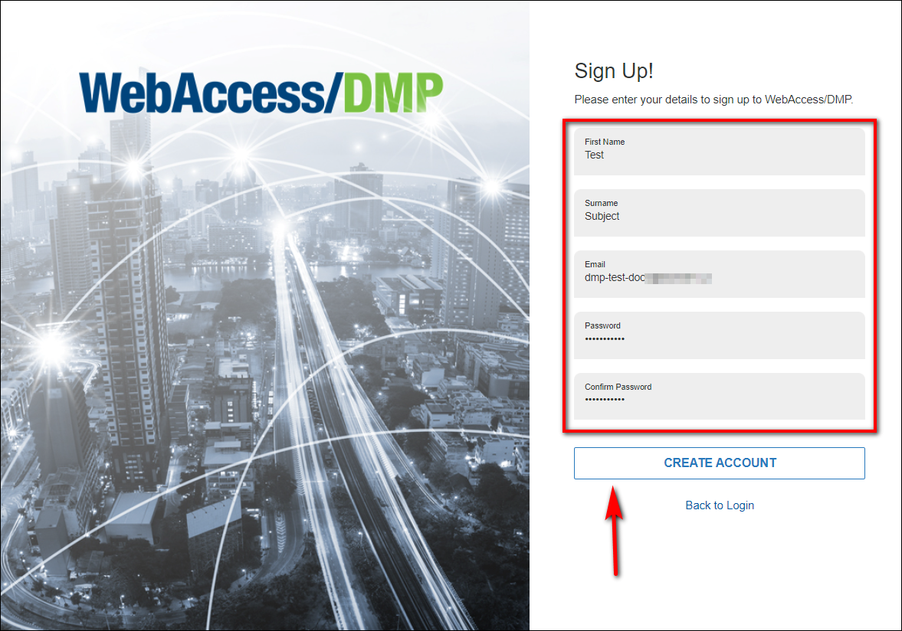

6. After clicking the create account button, you will get a message that your registration has been completed. You can now access your account by clicking the *Dashboard* link or logging in on the main page.

The second way to create a user:

1. Select "Companies" from the *Title Menu*. 
2. On the Companies page, click on your desired company, then on the "Invite User" action button.

.png)

3. From now on, the process is the same as in the first way of creating a user.

## 3- Remove users 

### A- Remove a user from a company

 **To remove a user**:

1. Make sure that you're in the right company where you want to remove the user, then select *Users* from the *Title Menu*.

2. On the *"Users"* page, click the *"Remove User from Company"* action button on the right of the schedule.

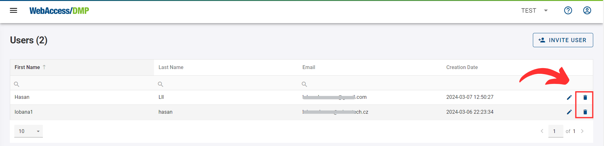

### B- Delete a user account

#### General User Permissions:

- Normal users cannot delete other users.

- They can remove users from a company (kick out).

---

#### System Administrator Privileges:

- Only system administrators have the authority to delete other users.

---

#### Self-deletion of User Account:

- Users have the capability to delete their own account.

- This functionality is currently not available in the User Interface (UI).

-Until it is added to the UI, users must delete their accounts directly using the "API".

## 4- Two-Factor authentication (2-FA)

**2FA** (*Two-Factor authentication*) provides an additional level of security to protect your account.

Suppose it is enabled and already set up after a successful login. In that case, you will be asked for a one-time password to enter from your Auth App (Microsoft Authenticator, Google Authenticator, Authy, etc.)

 **Authenticator Apps**

To configure 2FA, you should first download the Authenticator app to your phone. We support a wide array of Auth apps.

- [Google Authenticator](https://play.google.com/store/apps/details?id=com.google.android.apps.authenticator2&hl=en&gl=US)

- [Microsoft Authenticator](https://play.google.com/store/apps/details?id=com.azure.authenticator&hl=en&gl=US)

- [Google Authenticator (IOS)](https://apps.apple.com/us/app/google-authenticator/id388497605)

- [Microsoft Authenticator (IOS)](https://apps.apple.com/us/app/microsoft-authenticator/id983156458)

### How to enable 2-FA

You can activate 2FA in the *Company Edit Form*.

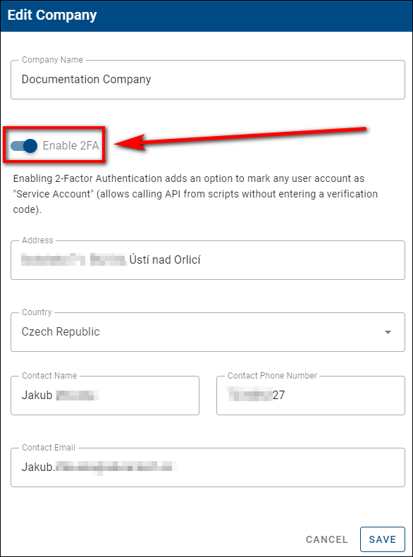

After turning it on, you can configure a 2FA using your Auth application.

 **Important Notice:** Enabling 2FA will add an extra option, “Service Account” (in the user's permissions settings), so company admins can enable/disable this feature for users in a company having 2FA enabled (this will allow users to use the scripts even if they have 2FA enabled otherwise they will not be able to).

When you enable 2FA for a company, all users will be forced to set up the 2FA after they log in. They cannot use the system until they complete the 2FA setup.

### Using 2-FA

Once you have downloaded the application, you must scan the QR code or enter the given code manually.

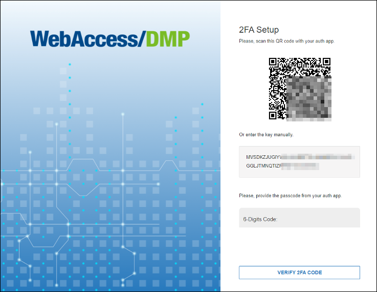

Type in the unique password you see in your Auth app to sign in.

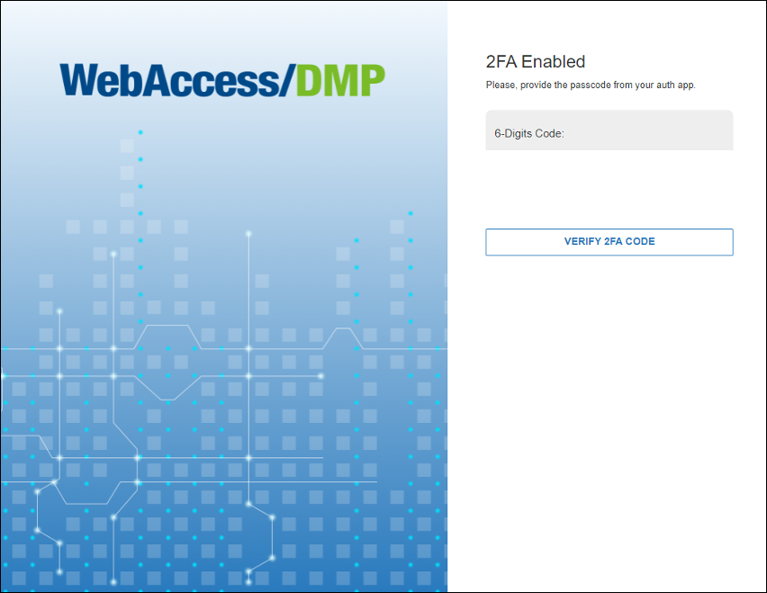

 :warning: **Important Notice:**  

**Turning 2FA off for the company will turn it off for all users in that company.**

## 5- Permissions 

### Permissions management

xxxxxxx

### Explanations of individual permissions

xxxxx

