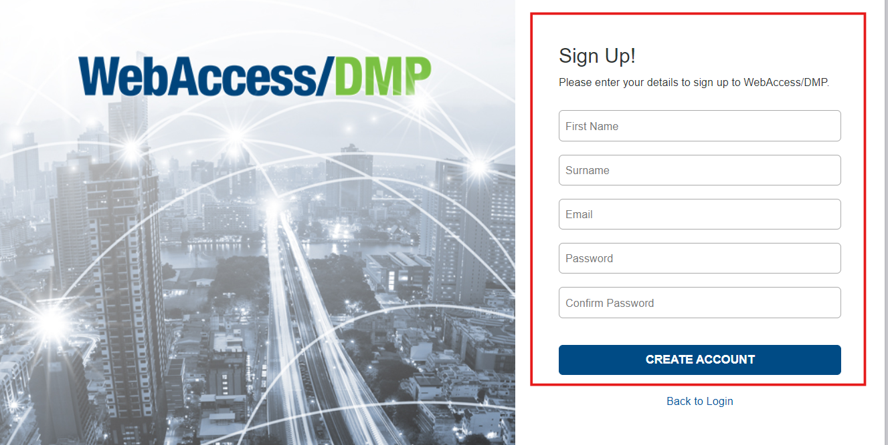
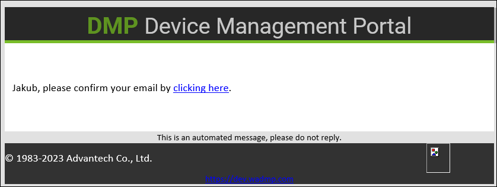
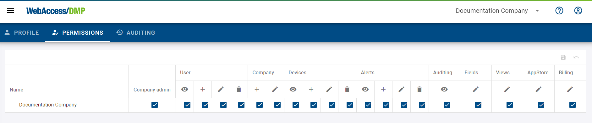

# User management

To start using WebAccess/DMP, you need a user account first.

Use Sign Up link only if you are the first from your company to access the platform. If someone else has already Signed Up, ask them to create a user to add you to the company.

## 1. Sign up / Sign in

**Access the WebAccess/DMP Site: Navigate to wadmp3.com, which will redirect you to the login page.**

* Initiate Sign Up:
Click on the "Sign Up" link if you are the first from your company to register. If another company member is already registered,request them to add you to the company.

* Complete the Registration Form:
  Fill in your details on the sign-up page and click the "Create Account" button.

* Email Confirmation:
 Check your email inbox for the confirmation email. Click the confirmation link to activate your account.

* Finalize Account Setup:
 After confirming your email, your account will be ready. You can now log in to WebAccess/DMP using your login credentials.

### Using other identity providers to sign up/sign in

xxxxx

## 2. Add users

### Create new users

* **Overview:**
  Creating users is the primary method to add them to your companies. When a user is invited, the process differs based on whether they are an **existing user** or a **new one**:

* **New User:**
 Will receive a registration link via email, which, upon completion of registration, will not only create their account but also add them to your company.

* **Preconditions:**

   * You must be logged into the platform.
   * You must have permissions to create users, which can be verified by editing your profile and checking for the appropriate permissions.

**Steps to Create a New User:**

* Select the Appropriate Context:
  * Navigate to Users from the Title Menu in the context of the company where you want to add the user.

  * Alternatively, select "Companies" from the Title Menu, choose your desired company, then proceed to invite a user.

* **Initiate User Invitation:**
  * Click the Invite User button located on the right top of the Users or Companies page.

.png)

* **Fill Out the Invitation Form:**
  * Enter the prospective user's email and define specific permissions for their role.

* **User Email Confirmation:**
  * The invitee will receive an email with a link to confirm the invitation. They must click this link to proceed.

* **Account Registration:**
  * The link directs the invitee to the main page to complete their account setup. The email field is pre-filled from the link and cannot be changed. They must fill up the remaining login data and click the Create Account button.

* **Confirmation of Registration:**
   * After account creation, a confirmation message is displayed. The new user can now access their account either by clicking the Dashboard link or by logging in on the main page.

### Invite existing users

* You can invite existing or new users who just created their account to any company you have permission to. You can do it similarly, like when creating a new user.

* You can check your permissions if you edit your user. Your assigned permissions are shown as check marks.

**To invite existing users to your company:**

* **Navigate to Users:**
  Select Users from the Title Menu in the context of the company where you want to add the user.

* **Initiate Invitation:**
  Click on the Invite User button located at the top right of the Users page.

* **Fill Out Invitation Form:**
  Enter the user's email address and assign specific permissions for the user.

* **Send and Confirm Invitation:**
  The user will receive an email invitation. They must click the link in the email to proceed with account setup.

* **Complete Account Setup:**
  The user follows the link to the main page, fills in their login details, and clicks Create Account. The email used is pre-filled and cannot be changed.

## 3. Remove users 
xxxxxxxxxxxx

### Remove a user from a company
xxxxxxxxxxxxxxxxx

### Delete a user account
xxxxxxxxxxxxxxxxx

## 4. Two-Factor authentication (2-FA)

xxxxx

### How to enable 2-FA

xxxxxx

### Using 2-FA
xxxxxx

## 5. Permissions 

### Permissions management

* User Restrictions:

  * Users cannot edit their own permissions.
  * Users cannot add themselves to any company.

* Leaving a Company:

  * A user can remove themselves from a company if:

      * The company has at least one other Company Admin.
      * The user has the "Edit Users" permission for that company.

* Profile Information Editing:
  * Users may always edit their own profile information (e.g., email, name) regardless of their permissions.

Managing Other Users:
  * A user can remove another user from a company if they have "Edit Users" permission on that company.
  * A user can edit another user's profile information only if they have "Edit Users" permission for at least one of the companies the user is in.

### Explanations of individual permissions

#### Company Admin - sets a fixed set of permissions:

* User Permissions:
     * View: Allows viewing a list of users they have access to.
     * Create: Allows the user to create new users for their company.
     * Edit: Allows the user to edit an existing user.
     * Delete: Allows the user to delete another user.

* Company Permissions:
     * Create: Allows the user to create new standalone companies.
     * Edit: Allows the user to edit an existing company.

* Devices Permissions:
     * View: Allows the user to view device details.
     * Claim & Release: Allows the user to claim a device in the system.
     * Edit: Allows the user to make changes to a device.
     * Delete: Allows the user to delete a device from the company. System-wide device deletion requires sysadmin permissions.

* Alerts, History, Rules & Endpoints Permissions:
     * View: Allows viewing a list of Alerts, History, Rules & Endpoints.
     * Create: Allows the creation of new Alerts, History, Rules & Endpoints.
     * Edit: Allows editing of existing Alerts, History, Rules & Endpoints.
     * Delete: Allows deletion of Alerts, History, Rules & Endpoints.

* Additional Permissions:
     * Auditing: View auditing details.
     * Fields: Manage fields.
     * Views: Manage views. 
     * AppStore: Manage the AppStore.
     * Billing: Manage billing.