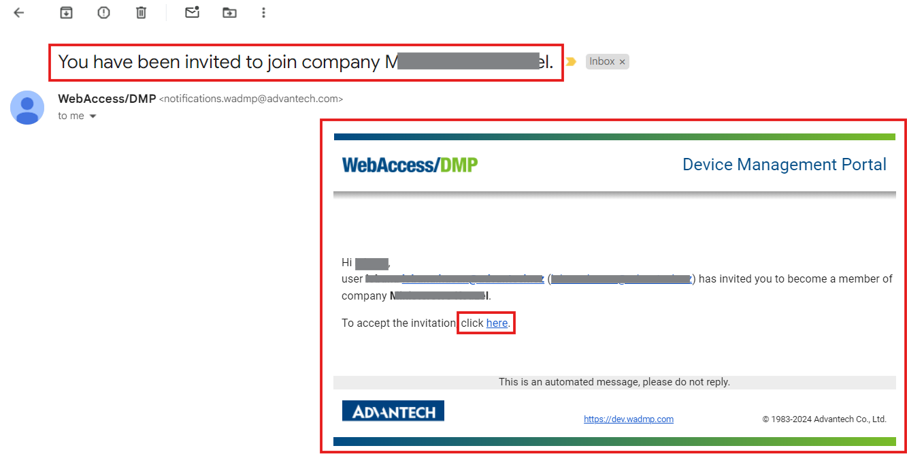
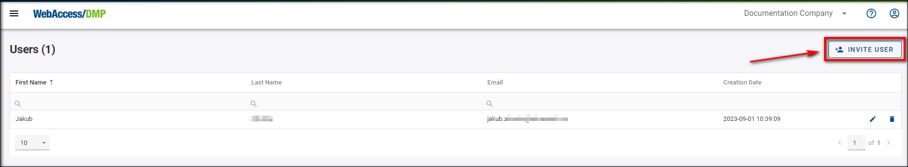

# User management

To start using WebAccess/DMP, you need a user account first.

Use Sign Up link only if you are the first from your company to access the platform. If someone else has already Signed Up, ask them to create a user to add you to the company.

## 1- Sign up / Sign in

- Go to [wadmp3.com](https://wadmp3.com). You will be redirected to the login page.

- Click on the Sign Up link and fill in your details.

- After clicking the Create Account button, enter your email inbox and confirm your new user.

- After clicking the confirmation in your email, your account will be ready to log in to WebAccess/DMP with your login data on the main page.

### Using other identity providers to sign up/sign in

 Sign in with External Provider 

If your company is listed as an external provider, you can sign in immediately.

OAuth/OpenIP type of authentication is supported for external providers. Don't hesitate to contact us if you want your company to be listed as an external provider.

## 2- Add users

### Invite existing users
You can invite existing or new users who just created their account to any company you have permission to. You can do it similarly, like when creating a new user.

You can check your permissions if you edit your user. Your assigned permissions are shown as check marks.

To invite a user:

1. Make sure that you're in the right company where you want to invite the user, then select *Users* from the *Title Menu*.
2. On the *Users* page, click the *Invite User* action button on the right top of the page.

3. To the invitation form, fill in the user's email and set up your specific permissions for him to use.

4. Now, the user needs to head to his email to confirm the sent invitation by clicking on the link in the email.

5. After clicking on the invitation, the link will redirect him to our main page, where he will be notified that he has been added to the company.

6. From now on, the user can click the "Continue to Dashboard" link and check that he's in the company.

### Create new users

Creating them yourself is the only way to add users to your companies. When a user signs up, he can also make a company with no relation to yours.

As with companies, remember that the creation of a user depends on two conditions:
- You can log in to the platform and
- That you have permission to create companies

You can check your permissions if you edit your user. Your assigned permissions are shown as check marks.

To create a user, you can do it in two almost identical ways:

1. Make sure that you're in the right company where you want to invite the user, then select *Users* from the *Title Menu*.
2. On the *Users* page, click the *Invite User* action button on the right top of the page.

3. To the invitation form, fill in the user's email and set up your specific permissions for him to use.

4. Now, the user needs to head to his email to confirm the sent invitation by clicking on the link in the email.

5. After clicking on the invitation, the link will redirect him to our main page, where he will need to fill up his login data and click the *Create Account* button, as shown in the picture below. The email is already set up from the link and cannot be changed.

6. After clicking the create account button, you will get a message that your registration has been completed. You can now access your account by clicking the *Dashboard* link or logging in on the main page.

The second way to create a user:

1. Select "Companies" from the *Title Menu*. 
2. On the Companies page, click on your desired company, then on the "Invite User" action button.

.png)

3. From now on, the process is the same as in the first way of creating a user.

## 3- Remove users 
xxxxxxxxxxxx

### Remove a user from a company
xxxxxxxxxxxxxxxxx

### Delete a user account
xxxxxxxxxxxxxxxxx

## 4- Two-Factor authentication (2-FA)

xxxxx

### How to enable 2-FA

xxxxxx

### Using 2-FA
xxxxxx

## 5- Permissions 

### Permissions management

xxxxxxx

### Explanations of individual permissions

xxxxx

