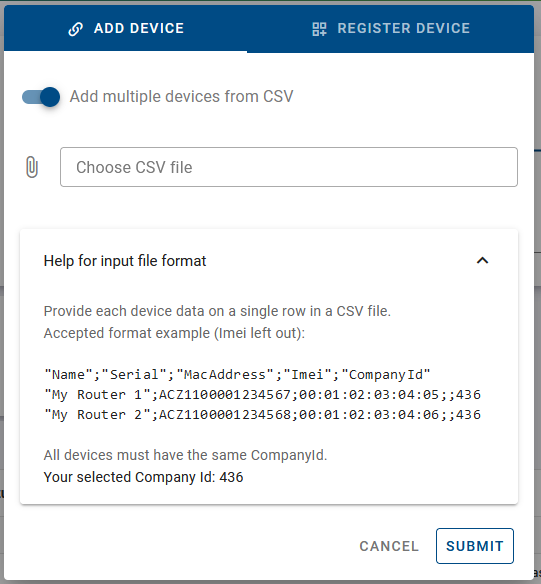
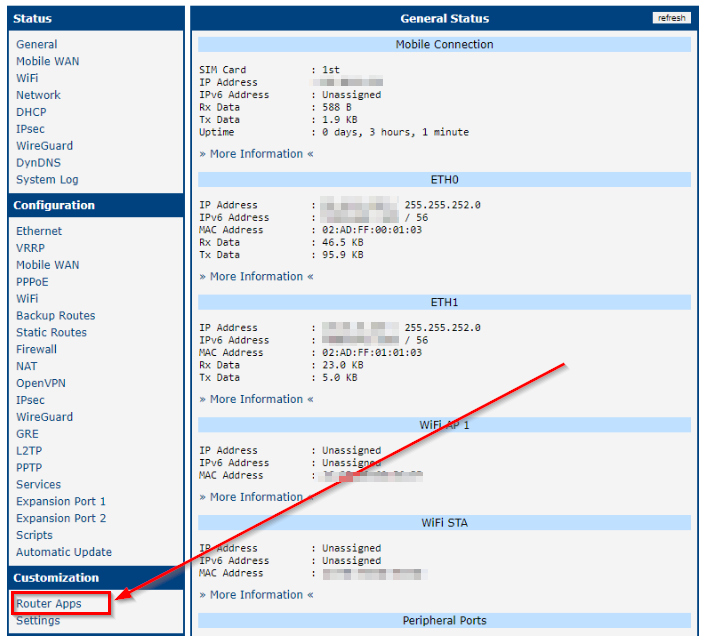
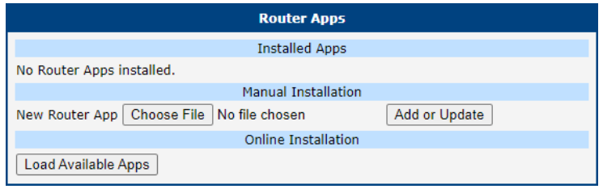
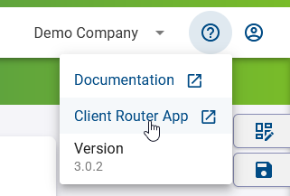
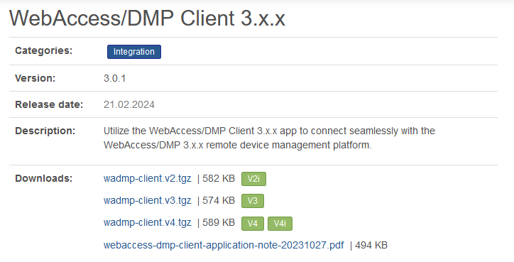
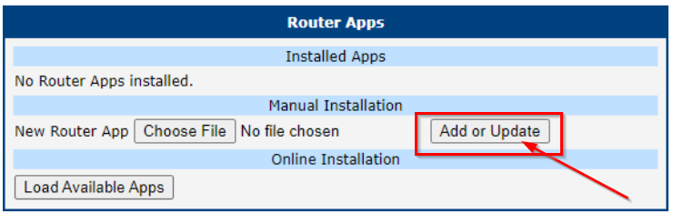
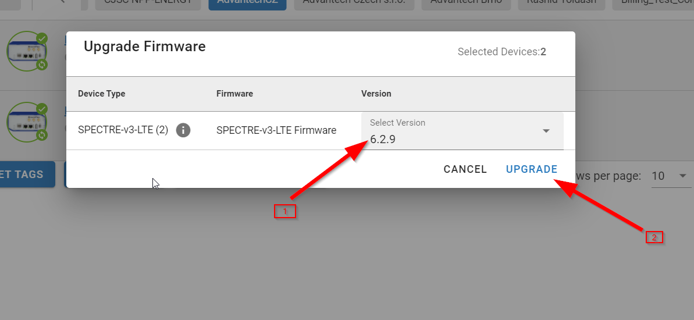

# Adding Devices

##	1. Register A Device (On-Premises Only)

In the on-premises version of our system, administrators must register devices before they can be added. This process is necessary because on-premises installations lack access to our manufacturing database, which is utilized for device registration in the public instance. Here's how administrators can register a device:

1. **Accessing Device Registration:**
   - Navigate to the dashboard interface.
   - Click on the "+" icon located above the dashboard table.

2. **Registration Process:**
   - Upon clicking the "+" icon, administrators will be directed to the device registration interface.
   - Administrators will notice an additional tab labeled "Create Device."

      

   - Fill in the required details about the device in this tab.

      

3. **API Endpoint:**
   - Additionally, administrators have the option to register devices programmatically using the API endpoint designated for device registration.

By following these steps, administrators can efficiently register devices in the on-premises version of our system, ensuring seamless integration and management within their environment.

##	2. Add A Device
 ⚠️ You must have the appropriate permissions to add a device to your company.

**Note:** The Device can be connected to the WebAccess/DMP instance only if WebAccess/DMP Client Router App is installed in the device. This Router App is installed automaticaly when manufacturing the device, so you do not have to do it manually. In most cases adding the device to WebAccess/DMP instance is enough to connect your device. Otherwise follow [Install/Upgrade a WebAccess/DMP client app](https://docs.wadmp.com/gen3/explanations/adding%20devices/#_3-install-upgrade-a-webaccess-dmp-client-app).

### User Criteria for adding a Device

* You need to have the right permissions, Check the [permissions](https://docs.wadmp.com/gen3/explanations/#_5-permissions).

### Rules

* Both removed and new devices can be added.
* A device can only be added by one company at a time.
* A company can remove a device it has previously added.
* A device must be added by a company before it can be managed or monitored.
* A free company can add up to five unique devices. 

 ⚠️ Once you add five devices, you cannot add more, even if you remove a device. The limit is based on the number of times the "Add" device function has been used successfully, not the current number of devices.

### Steps To Add a Device

#### How to obtain router information?

* You can obtain router information through the WebAccess/DMP Client application by following these steps:
 1. Login to the router's user interface.
 2. Navigate to Router Apps (in Customization section of the menu).
 3. Enter the WebAccess/DMP Client application.
 4. Click on Create Device on WA/DMP.
 5. You will find the information about this router there.

* You can also use the printed device labe:

 

#### Steps to add a device for your company (Assuming you have the required permissions):

**1. Navigate to the "Dashboard" on the Side Menu.**

**2. Click the "Add Devices" action button above the table.**

   

**3. Fill out the "Add Device" form with the following information:**

   - **Alias:**
    Enter a human-friendly name to help identify the device later.*This field is optional.*

   - **MAC Address:**
    Enter the exact MAC Address for ETH0 of your device as it appears on the device label. The format should be `00:0A:14:aa:bb:cc`. *This is a required field.*

   - **Serial Number:**
    Enter the exact Serial Number as printed on the device label, including any alphanumeric characters. *This is a required field.*

   - **IMEI:**
    Enter the exact IMEI number as printed on the device label. Note that some devices may not have an IMEI number; *this field is only required if applicable.*

  

**4. If you need to add more than one device at a time, enable the option "Add multiple devices from CSV":**
  * Prepare the CSV file for your devices. Expandable help on the required format will be available after you enable "Add multiple devices from CSV".
  * For large shipments of devices, you can optionally request a prepared list of devices from support. Please contact support for assistance with this.

  
 
  * You can also download an example CSV file that you can edit for your needs:[CSV file example](https://advantecho365-my.sharepoint.com/:x:/g/personal/jan_svoboda_advantech_com/EdaGjukivhVOr27kSyinoREBkJmhzTbvhCZjn6LM9-ypNA?e=e7lVad)

**5. Click the *Submit* button to complete the add.**

  * After successfully adding a device, it will appear in the Device List for your company, as shown here:

##	3. Install/Upgrade a WebAccess/DMP client app

If you want to migrate your device from 2.x.x instance, you need to upgrade Router App to 3.x.x version via 2.x.x WebAccess/DMP Instance - go to [Migration from 2.x.x to 3.x.x Instance](https://docs.wadmp.com/gen3/explanations/Migration%20from%202.x.x%20to%203.x.x%20instance/#step-1-export-data-from-2-x-x-instance).

To install a "WebAccess/DMP client app" user needs to:
1. Select the device.
2. Click on "Router Apps".
3. Review the installed Router Apps.
4. Please note the following: *Yellow (unknown) Router Apps cannot have their properties edited because the platform does not yet support them. If the platform recognizes the app but not the installed version, it will also appear in yellow. You can reinstall it with a known version.*

* To add more Router Apps, click on this icon:

If you do not have WebAccess/DMP Router App client installed, or you are not sure if you have client installed, follow these steps:

**Step 1:** Check for the Installed client Router App:
 * Log in to your router's web interface (the default IP is 192.168.1.1 on the ETH0 local interface).
 * Navigate to Customization > Router Apps in the menu.

 
📌 *Note:* If you see the WebAccess/DMP Client Router App installed, it should be able to connect to the WebAccess/DMP instance. Check the version and upgrade to the latest one if necessary (recommended).
 
**Step 2:** If you do not see the WebAccess/DMP Router App installed in device, you need to download it first and install. 

**Step 3:** Download the Client Router App from WebAccess/DMP Instance here: 

 

* This will direct you to the **download link** on our website: [WebAccess/DMP Client 3.x.x](https://icr.advantech.com/products/software/user-modules#webaccessdmp-client-3xx)

* **Note:** An Application Note is available for reference and settings of the client Router App if needed.

**Step 4:** Download the appropriate ".tgz" router app file based on your device platform and install it manually through your device user interface.

**Step 5:** Installation finished 
* Your device should now be able to connect to the WebAccess/DMP instance.
* For manual upgrades of the client, follow the same steps and reinstall by adding the file to the device via Customize > Router Apps page.

### Upgrade Devices to the Latest Firmware

To upgrade your devices to the latest Firmware, follow these steps:

1. Choose *"My Devices"*.
2. Select exactly *"one company"* to enable device selection. Optionally, filter the devices using Groups, Tags, other filters at the top right, or search.
3. Select all filtered devices (or manually select specific devices from the list).
4. Click the *"Upgrade Firmware"* button at the bottom.

5. For every *Device Type*, select the version of Firmware.
6. Click on *"Upgrade"*.

##	4. Firewall considerations (ports & addresses to whitelist)

### WADMP Ports/Addresses

This section provides a list of addresses and ports that **customers need to whitelist** in their firewall.

:::warning Caution:
Please be aware that IP addresses may change with updates to our infrastructure.
Only the FQDN names will remain stable.
:::

| FQDN                  | IP                                                          | Port | Accessed from router?      |
| --------------------- | ----------------------------------------------------------- | ---- | -------------------------- |
| management.wadmp3.com | 
3.73.182.61 3.124.54.255 52.29.40.29
 | 8883 | 
Yes
       |
| bootstrap.wadmp3.com  | 
3.124.228.128 52.28.186.90 3.67.107.51
 | 8884 | 
Yes
       |
| content.wadmp3.com    | 
3.72.206.176 3.124.104.54 52.29.166.166
 | 443  | 
Yes
       |
| gateway.wadmp3.com    | 52.57.47.37                                                 | 443  | 
Yes
       |

