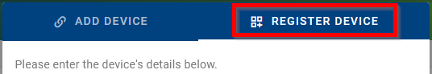

# Adding devices

##	1. Register a device (on-premises only)

In the on-premises version of our system, administrators must register devices before they can be added. This process is necessary because on-premises installations lack access to our manufacturing database, which is utilized for device registration in the public instance. Here's how administrators can register a device:

1. **Accessing Device Registration:**
   - Navigate to the dashboard interface.
   - Click on the "+" icon located above the dashboard table.

2. **Registration Process:**
   - Upon clicking the "+" icon, administrators will be directed to the device registration interface.
   - Administrators will notice an additional tab labeled "Create Device."
   - Fill in the required details about the device in this tab.

   - 

3. **Required Information:**
   - During the registration process, administrators must provide details about the device being registered.
     - Device name
     - Serial number
     - Mac address
     - IMEI
     - Device type
     - Order code

     - 

4. **API Endpoint:**
   - Additionally, administrators have the option to register devices programmatically using the API endpoint designated for device registration.

By following these steps, administrators can efficiently register devices in the on-premises version of our system, ensuring seamless integration and management within their environment.

##	2. Add a Device
**You must have the appropriate permissions to add a device to your company.**

### User Criteria for adding a Device

1. **User Authentication:** Successful login is required.
2. **User Authorization:** You must have the appropriate permissions.

* You can select your username from the Users list to check your permissions.

 * An example of how permissions are displayed is shown below:

### Rules

* Only Removed devices (referred to as "removed") can be added.
* A device can only be added by one company at a time.
* A company can remove a device it has previously added.
* A device must be added by a company before it can be managed or monitored.
* A free company can add up to five unique devices. addng additional devices is not possible unless one of the previously added devices is removed.

### Steps to add a Device

* Follow these steps to add a device for your company, assuming you have the required permissions:

1. Navigate to the "Dashboard" on the Side Menu.
2. Click the "Add Devices" action button above the table.

   

**3. Fill out the *Add Device* form with the following information:**

   - **Alias:**
    Enter a human-friendly name to help identify the device later. This field is optional.

   - **MAC Address:**
    Enter the exact MAC Address for ETH0 of your device as it appears on the device label. The format should be `00:0A:14:aa:bb:cc`. This is a required field.

   - **Serial Number:**
    Enter the exact Serial Number as printed on the device label, including any alphanumeric characters. This is a required field.

   - **IMEI:**
    Enter the exact IMEI number as printed on the device label. Note that some devices may not have an IMEI number; this field is only required if applicable.

   

**4. If you need to add more than one device at a time, enable the option "Add multiple devices from CSV".**

**5. Click the *Submit* button to complete the add.**

* **Below is an example of a printed device label:**

* **Here’s how the Add Device form would look when filled out:**

* **After successfully adding a device, it will appear in the Device List for your company, as shown here:**

**You can also obtain router information through the WebAccess/DMP Client application by following these steps:**
1. Enter the router settings.
2. Navigate to Router Apps.
3. Enter the WebAccess/DMP Client application.
4. Click on Create Device on WA/DMP.

  You will find the information about this router there.

  

##	3. Install a WebAccess/DMP client app
xxxxxxxxxxxxxxxxxxxxxxxx

##	4. Firewall considerations (ports & addresses to whitelist)
xxxxxxxxxxxxxxxxx

