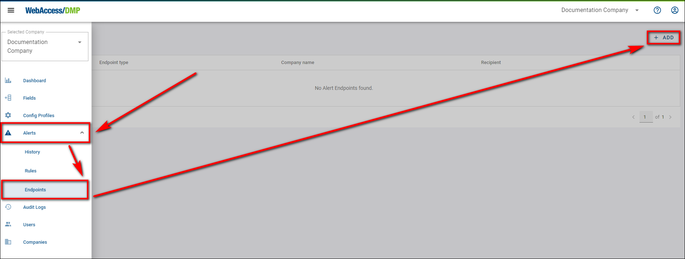
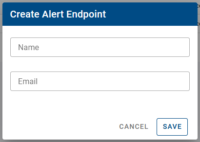
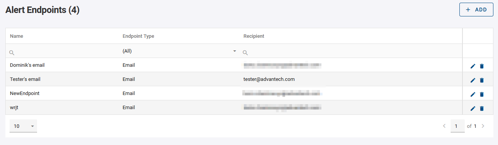
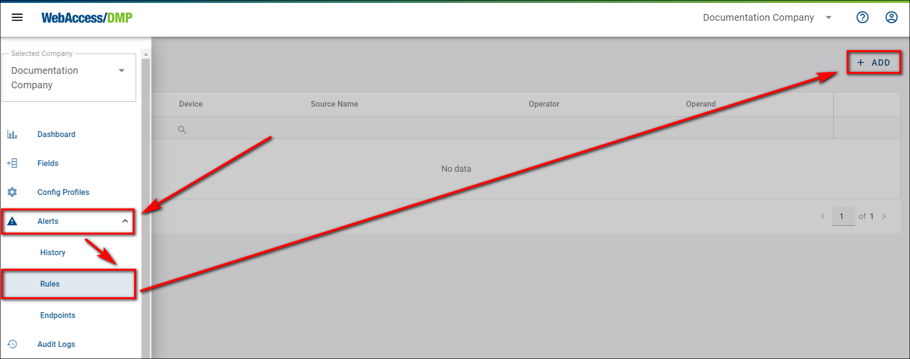
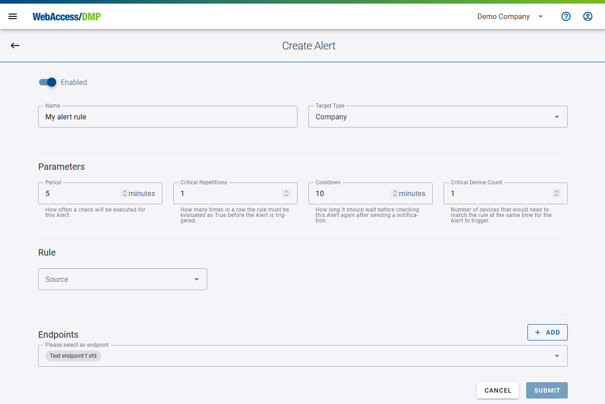
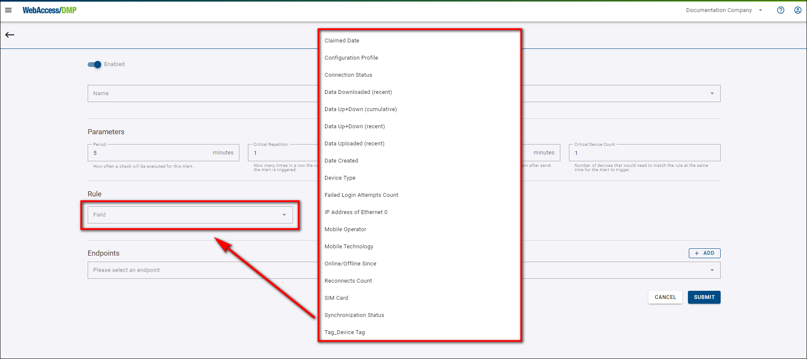
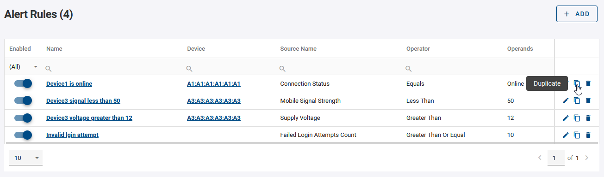
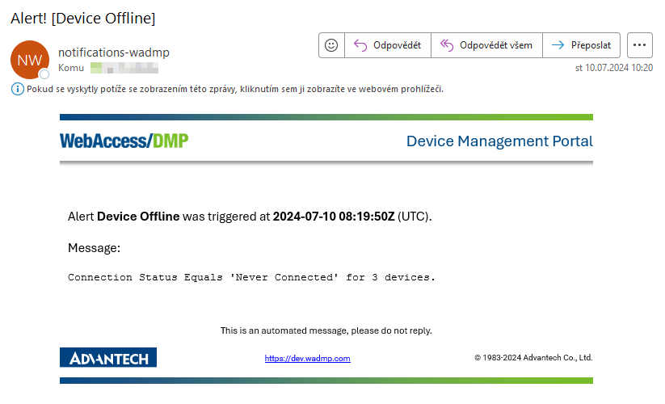
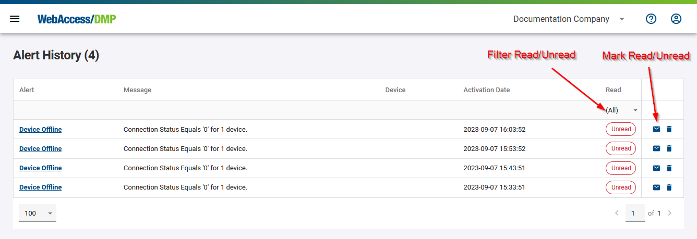

# Alerts 

Alerts are a **Premium** feature only available for companies with a Premium subscription.

**To receive notifications when an alert is triggered, you need to set up notification endpoints first. It's possible to have an Alert without an Endpoint and only check the Alerts History in DMP.**

* **Permissions are required to interact with Alerts:** 
    * View permission for reading Alerts History, Rules, and Endpoints.
    * Manage permission to create or modify Rules and Endpoints and to mark alerts as read/unread

##	1. Creating New Alerts

### To Be Notified - Create Endpoint(s)

In the **Alerts -> Endpoints** section, use the plus icon to add an Endpoint. This is the contact that will receive notifications when an alert is triggered. You can create and configure multiple endpoints.

* Provide the Name and Email for the endpoint.

* To edit an existing endpoint, click on the pencil edit icon in the right column of the Endpoints table.

## Create Rule(s)

 Create a new alert rule by using the plus icon in the Alerts section.

 **1.** When setting the **Target Type** to a company, the rule applies to all devices within that company. For individual devices, select **Single Device**.

 **2.** Define the parameters for the rule, including the cooldown period which begins immediately after an alert is triggered. The rule check occurs instantly after the cooldown and continues according to the set period.

 **3.** Configure the rule criteria—choose the parameter to evaluate and the condition. For instance, with the **NotInRange** operator, specify two integer values.

<b style="color: red;">Important Notice:</b>
 DeviceState category fields like "Online/Offline" are evaluated based on the status at the time of the check, unlike Monitoring or Auditing fields which consider data over a specified period.

 **4.** Select the endpoint(s) to notify when the alert is triggered. You can also disable the rule evaluation at any time.

 **5.** Press the **Submit** button to save the changes in rule.

 **6.** You can manage created rules in the Rules table by enabling/disabling them in the first column, editing them by clicking on the rule name or pencil icon, and duplicating them by clicking the copy icon in the right column, which opens the **Edit New Rule** form for adjustments.

## Mail And History

For alerts sent to an Email endpoint, the notification **will appear in your mail inbox like this**: 

All alerts are also recorded in **Alerts -> History**, accessible even if no endpoint is selected for the rule.

Alerts can be marked as read or unread using the envelope icon. Filters are available to view read/unread alerts.

##	2. Alerting Limitations
Alerts are subject to the following limitations:

- **Availability:** 
Alerts are only available to companies with a Premium subscription.

- **Permission Restrictions:** 
Users must have appropriate permissions to create, manage, and view alerts and their histories.

- **Endpoint Requirements:** 
An alert must have at least one active endpoint to send notifications; otherwise, it will only be recorded in the history.

- **Configuration Sensitivity:** 
Alerts depend heavily on correct configuration settings, such as the target type, parameters, and rule criteria.

- **Historical Data Retention:** 
Alerts are not automatically deleted from history and require manual management to maintain a clear record.