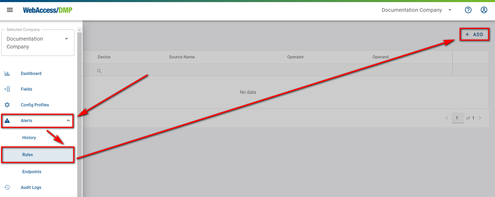
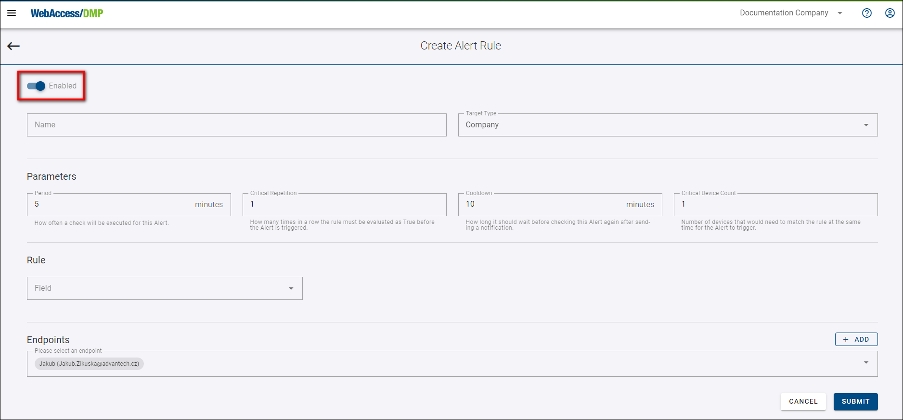
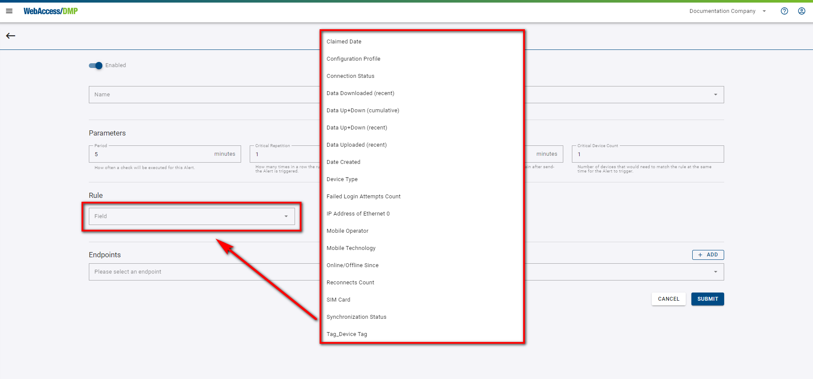
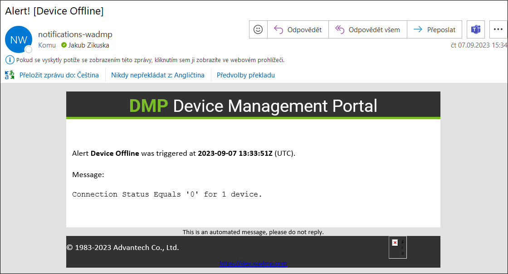
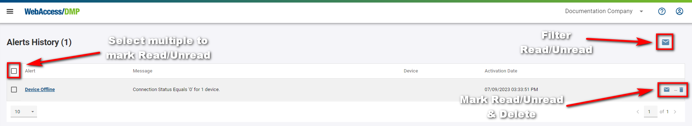

# Alerts Explained 

*Alerts* is the **Premium feature only** (Alerts and everything related can be created only for a company of Premium type).

If you want to be notified that the alert triggered, read through and prepare notification Endpoint(s) first. It is possible to have an Alert without an Endpoint and check only the Alerts History in DMP. In that case, skip to Create Endpoint(s) below.

**Notice:** Permissions apply to Alerts.
* To read Alerts History, Rules, and Endpoints, you need to have *Alerts* permission *View*. 
* To see the create icon in Rules and Endpoints, and to be able to mark alerts read/unread, you need to have *Alerts* permission *Manage*

## To Be Notified - Create Endpoint(s)

In Alerts -> Endpoints use the plus icon to prepare Endpoint for the alert. This is simply the saved contact that can be later chosen to be notified by the Alert rule. You can create as many as you want and then add multiple endpoints to an Alert to be announced. 

Note that the endpoint can be saved and is enabled by default (blue color, switch icon) but can also be disabled, so the alerts are not sent to this endpoint. Press the *Submit* button.

## Create Rule(s)

Use the plus icon to create a new Alert.

When **Target Type** is set to company, the rule is automatically applied to all the devices in that company. However, only one device can be selected when choosing the Single Device.

Set up Parameters for the rule. The cooldown period always starts immediately after the alert is triggered. After the cooldown period, the check is done instantly and then again according to Period.

Choose the rule itself - what parameter should be evaluated (Field) and how. For example, for the *NotInRange* Operator, you can set up two values. First, integer number values have to be filled. 
For Monitoring Data, the unit is always the same as in graphs on Dashboards (Graphs & Widgets).

**Important Notice:** *DeviceState* category of fields like "Online/Offline" is evaluated differently than the others. When a Monitoring or Auditing field is checked, it looks at the past “period” of minutes, and if at any moment during that time, the alert will be triggered. When an Alert with a DeviceState field rule is checked, only the situation at the time of the check is considered!

Then the endpoint(s) to be notified by alert can be chosen. 

Note that the rule can also be disabled at the top, so it is not evaluated (blue color, switch icon).

Press the *Submit* button to create a new rule.

## Mail and History

For Endpoint type Email, the alert looks like this in your mail inbox:

And always, the alert is recorded in Alerts -> History, even if no endpoint is selected at the rule.

Alerts in History can be marked as read or marked back as unread by one using checkboxes. It is possible also filter read/unread Alerts via the icon at the top left.

Alerts stay in History, and they are not automatically deleted.