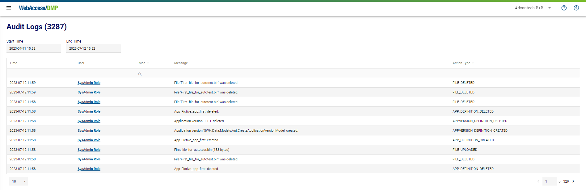
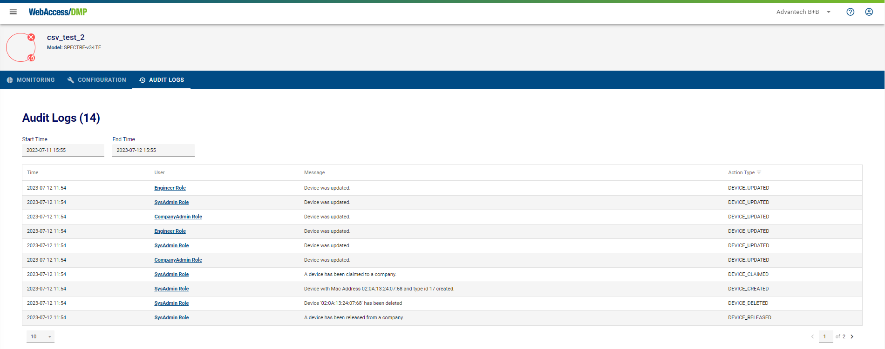
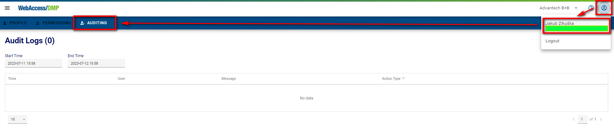
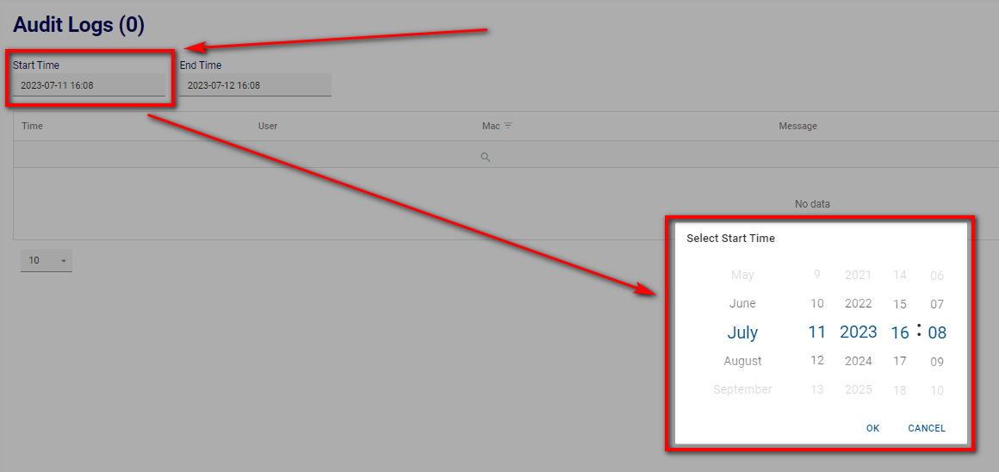

# Auditing Explained 

By default, just the last 24 hours of Audit Logs are shown. Audit Logs are stored on DMP for two months back in time (you can filter by time selection at the top). Audit Logs older than two months are forgotten.
There are more places where you can find Audit Logs on DMP:

## Overall Audit Logs

The "Audit Logs" menu item contains overall Audit Logs. You can view all of them (for Devices, Users, and the server) based on your permissions. 

## Device Audit Logs

On the Dashboard > Filter Panel section, head into the Device detail page and “Audit Logs” (the last one). You can find here all the Audit Logs related to this device.

## User Audit Logs

Similar to the User detail page. Click on your profile in the Title Panel, then “auditing”, where all the Audit Logs related to this user can be found.

## Filtering of Audit Logs

You can specify your desired Audit Logs, the date & time with the "Start Time" and "End Time" selections.

