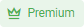
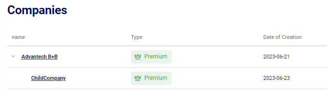
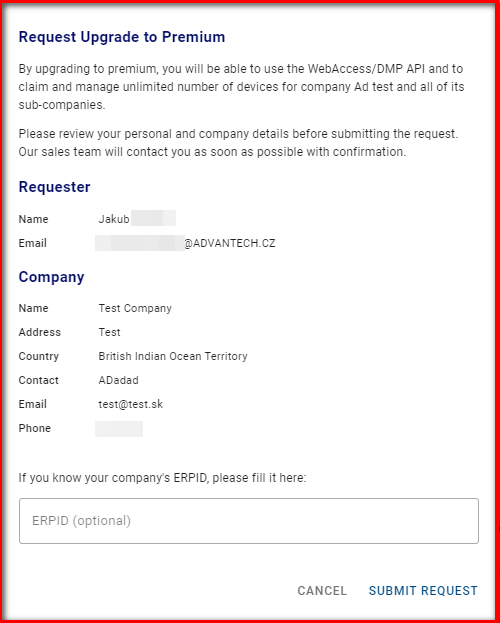
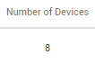
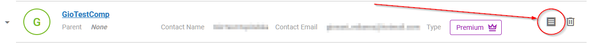
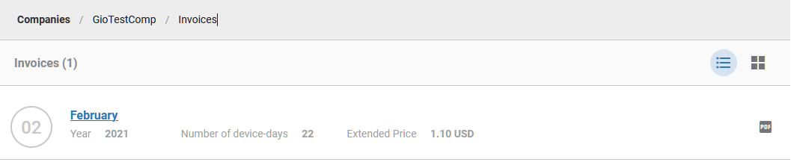

# Billing Explained 

## Types of Companies

After a new company is created, the company type is automatically set to "Free". 
Company type can be:

| Company type |   | Features     |
|------|----------------------------------------------------------|-------------------------------------------|
| Free |  | Can claim and manage up to 5 devices.     |
| Premium |         | Can claim and manage an unlimited number of devices and use the API. Billed monthly.    |

Company type can be changed only for the parent company. Child companies inherit the type from their parent.

&nbsp;    
&nbsp; 
## Request Upgrade to Premium

To request the change to Premium, go to the Companies list (in the context menu) and click on your parent company, then in the company menu click on the crown icon with "upgrade" on it. 

Fill in the request form and submit it.

Email is sent to the sales manager for your region, and a confirmation email is sent to you as the requester. The sales manager will contact you and negotiate the details.

&nbsp;    
&nbsp; 

## Request Downgrade from Premium

To downgrade a Premium account to Free, you need to release all devices which exceed a total amount of 5 and send a request for downgrading to [wadmp@advantech.com](mailto:wadmp@advantech.com).

&nbsp;    
&nbsp; 
## Premium Features

With Premium, you are not limited with the number of devices to 5.

Additionally, you can access these user permissions:

&nbsp;    
&nbsp;    
## Billing (Premium type companies)

If your company type is Premium, you are billed monthly. The billings are coming automatically on the Primary Contact Email at the company.

Email example:

You can always find all your billings in the Companies list by clicking on this paper button on the right:

There is a list of billings by month. Click on the invoice to see the details or download it as a PDF by clicking the button on the right. 

Invoice example:

