# Companies

##	1. General

###	Introduction To Companies

* It's free to create a company. Just log in or sign up. You can create as many companies as you want.
* When you create a company, you become the "Company Admin". You can manage and control the devices added to the company. The permissions for users you invite are set by you or another user with the right permissions.

###	Limitations Of Non-Premium Companies

* After a new company is created, the company type is automatically set to "Free".

* Company type can be:

| Company type |   | Features     |
|------|----------------------------------------------------------|-------------------------------------------|
| Free |  | Can claim and manage up to 5 devices.     |
| Premium |         | Can claim and manage an unlimited number of devices, has access to the *Alerts* section.    |

* Company type configuration: Company type can only be changed for the parent company. Child companies inherit their type from their parent.

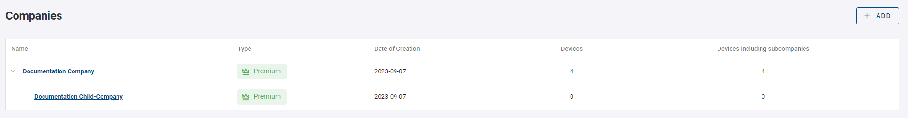

##	2. Company Structure

Each company hierarchy consists of a single Root company and zero or more Child companies (also called sub-companies).

- Users may create new Root companies (and thus separate hierarchies) only if all the following conditions are met:
  - They are not members of any companies.
  - They have not reached the limit of three created hierarchies per user account.
  - Their last created hierarchy no longer exists.

- Any companies created while the user is a member of another company become sub-companies of the currently active company.

- Child companies may create their own sub-companies. There is no limit on the number of child companies or the number of levels the company hierarchy may have.

### Managing Child Companies

- Each company must have at least one user with a "Company Admin" role. This role provides full permissions over the company and includes the following abilities for direct sub-companies:
  - Delete sub-company (deletes the entire sub-hierarchy).
  - View the device count for the sub-hierarchy (does not include any details beyond the count).

- Users automatically become Company Admins of any company they create.

- Users may give up access to a child company by removing themselves from it.

- It is not possible to change a company’s parent (to move it between parents).

##	3. Audit Logs

Each user action that creates, updates, or deletes anything generates an auditing record. These records are kept for **6 months** after their creation.

### Searching Through Audit Logs

#### Accessing Overall Audit Logs
**Navigation:** Click on "Audit Logs" in the left navigation menu.

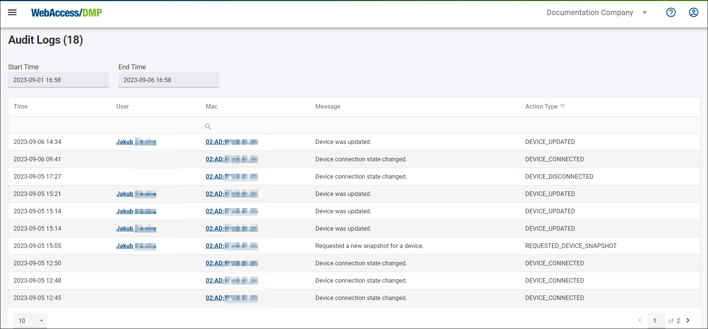

#### Accessing Device-Specific Logs
**Navigation:** From the Dashboard's table, navigate to a device page and select “Audit Logs.”

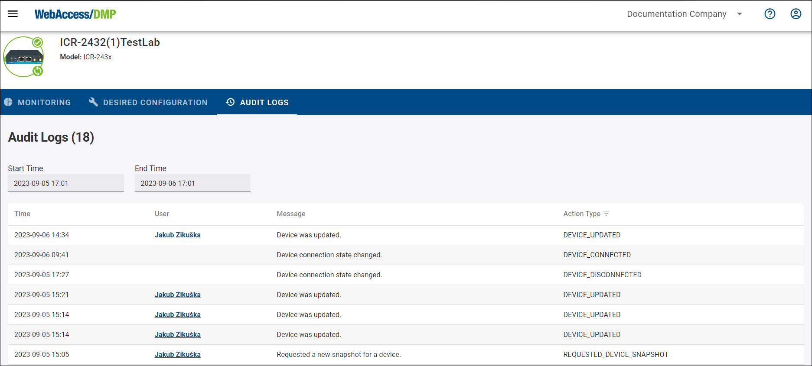

#### Accessing User-Specific Logs
**Navigation:** Click on "Users" in the left navigation menu, select the user you wish to audit, click on the "pen" icon to open their profile page, and then select the "Auditing" tab.

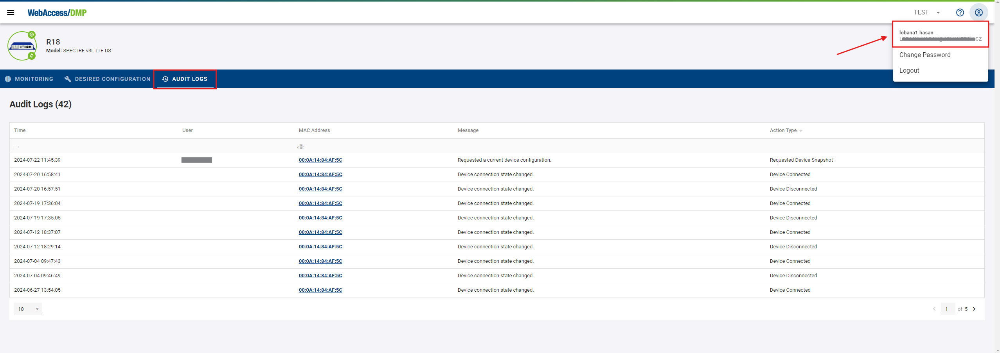

#### Filtering Audit Logs
**Date and Time Filters:** Specify the audit logs you need by selecting "Start Time" and "End Time".

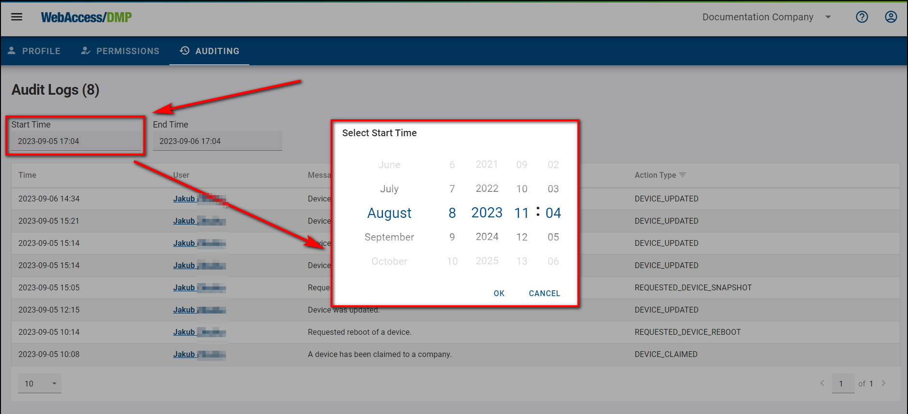

**Action Type Filters:** You can also filter logs by the type of action recorded.

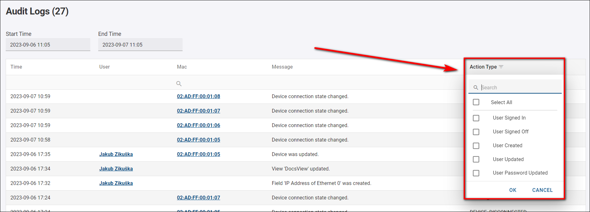

### Persistence Of Audit Logs

* **1. Default Display and Retention**

   * Initial Display: By default, only the last 24 hours of audit logs are shown immediately.

   *Retention Policy: Audit logs are retained on the DMP platform for two months. Logs older than two months are automatically purged.

* **2. Viewing Older Logs**

   * Custom Time Selection: To access logs older than the default 24-hour display but within the two-month retention period, use the time selection feature at the top of the audit logs page to adjust the displayed time range.

##	4. Premium Features

With premium:

- You are not limited to 5 devices.
- You gain access to create rules in the Alerts section.
- You gain the option to create child companies.

Please note that changing a company type (to or from premium) always applies to all companies in the hierarchy.

### How to upgrade to a premium company?

*  To request the change to Premium, go to the Companies list (in the context menu) and click on your parent company.

*  Then, in the company menu, click on the crown icon with "upgrade" on it.

 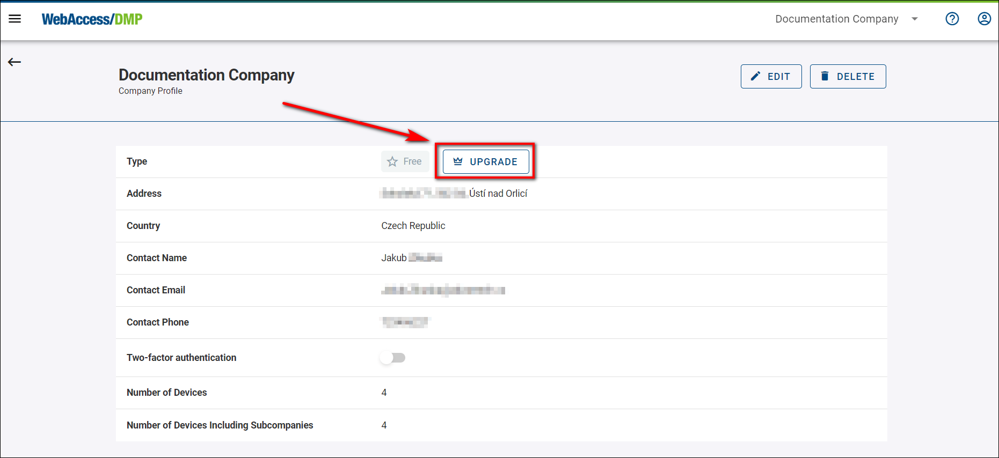

*  Optionally, you can fill up the *ERPID* of your Company. Otherwise, press the *Submit Request* button.

 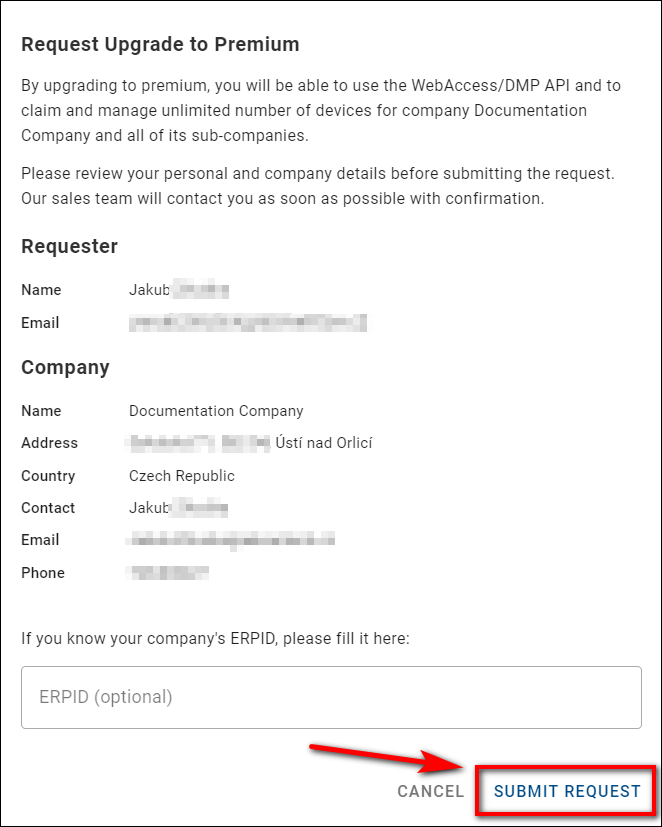

*  Confirmation and Follow-Up:**

 Upon submission, an email will be sent to the sales manager for your region, and a confirmation email will be sent to you. The sales manager will contact you to negotiate the details.

### How to downgrade a premium company?

1. Remove all excess devices. Your company must not hold more than 5 devices to be eligible for downgrade.
2. Remove all subcompanies (you may keep only the Root company).
2. Send an email your request for downgrade to [wadmp@advantech.com](mailto:wadmp@advantech.com).

##	5. Billing 
* If your company type is Premium, you are billed monthly. The billing are coming automatically on the Primary Contact Email at the company

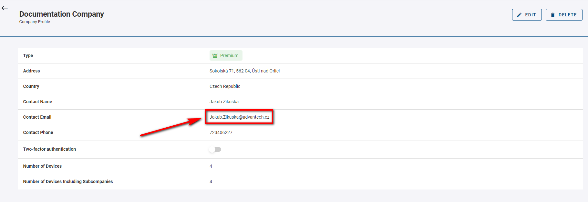

**Email example:**

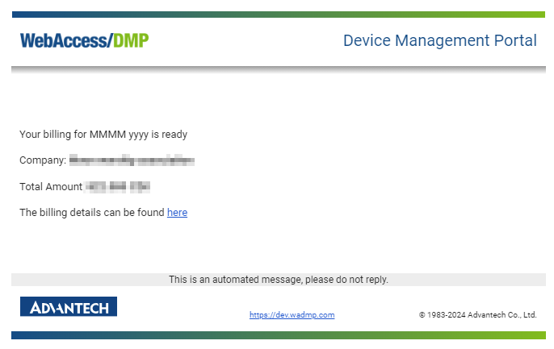

### How to view billing history?

* To access the Billing item in the side menu, you must be in a root (top parent) company and have permissions to view Billing or be a Company Admin (A list of monthly billing will appear).

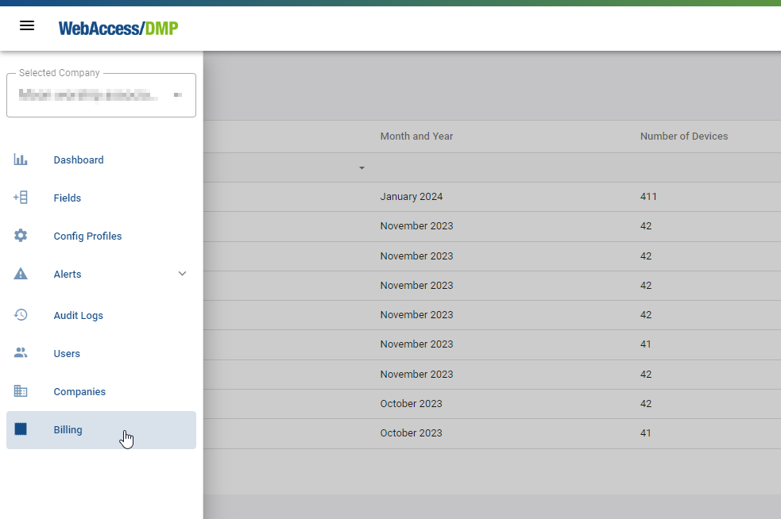

* **Billing Summaries list:**

  Click on an billing to view details or download it as a PDF by clicking the download button on the right (Arrow-Icon). 

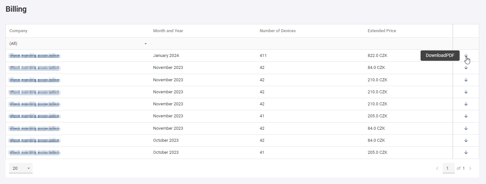

  By clicking the Billing summary, you can go to the Billing Detail page, where you can also download a PDF.

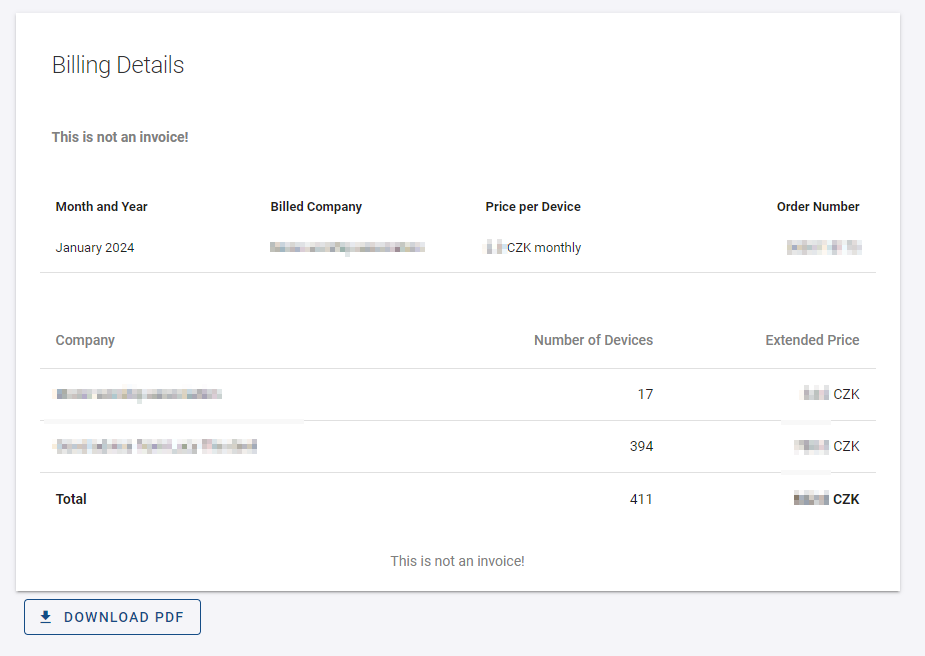
