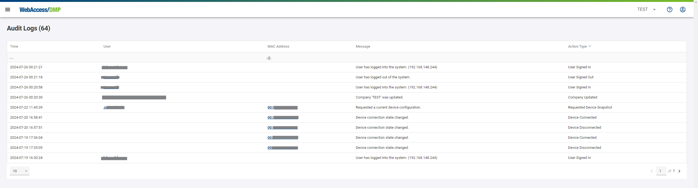
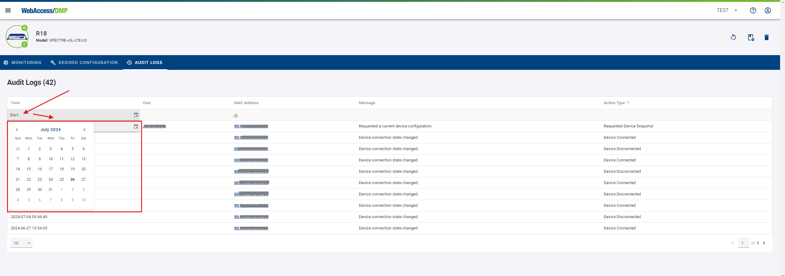
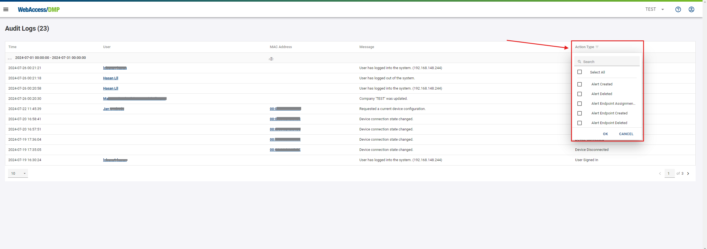

# Companies

This section will cover company setup and management on the WADMP platform, including the distinctions between premium and non-premium companies, child company management, and audit log procedures. It will also explain upgrading to premium, downgrading, and accessing billing history.

##	1. General

###	Introduction to companies

* **Company Creation:** 
   * When registering on WADMP for the first time, enter your company details to create a company. You automatically become the administrator of this newly created company. Alternatively, an existing company's administrator can invite you to their company.

* **User and Company Management:**
   * Once registered, you can create users, invite them to companies, and set their permissions. You can also create additional companies and invite users to these companies.

* **system Adminstrator:**

   * The System Administrator is the administrator of the platform. In addition to the standard permissions, the Sysadmin can also Register and Delete devices, claim devices to any company and Only the Sysadmin has the privilege to *directly create* new user accounts within the system..
   * Contact your Sysadmin if you have any issues that your company administrator cannot resolve.

###	Limitations of non-premium companies

* After a new company is created, the company type is automatically set to "Free".

* **Company type can be:**

| Company type |   | Features     |
|------|----------------------------------------------------------|-------------------------------------------|
| Free |  | Can claim and manage up to 5 devices.     |
| Premium |         | Can claim and manage an unlimited number of devices, has access to the *Alerts* section, and can use the API. Billed monthly.    |

* Company Type Configuration: Company type can only be changed for the parent company. Child companies inherit their type from their parent.

##	2. Company structure

* **Setting Up Your Company**

    * **Initial Setup:** When registering on WADMP, you're required to enter your company details, creating your parent company where you are the administrator.

    * **Adding to Existing Companies:** You can also be added as a user to an existing company by its administrator.

###	Managing child companies

* **Managing Child Companies:**
   * Creation of Companies: You can create as many parent companies as you wish, with a limit of three root companies.
   * Parent companies can have multiple child companies, and these child companies can also have their own sub-companies. 
   * There are no restrictions on the number of levels of child companies.

* **Example of Company Hierarchy:**

| Root and Parent | Parent and Child | Child                 |
|-----------------|------------------|-----------------------|
| company_1       | company_1_child  | company_1_child_child |

* **Device Management:**

    * **Claiming Devices:** To manage a device, it must first be claimed by your company.
    * **Device Configuration and Monitoring:** After claiming a device, you can configure and monitor it as needed.

##	3. Audit logs

* This section outlines how to access and filter audit logs on the DMP platform and explains their retention policy, highlighting the 24-hour default display and the two-month storage limit.

### Searching through audit logs

* **1. Accessing Overall Audit Logs:**

    * Navigation: Go to the "Audit Logs" menu to access overall audit logs. You can view logs related to devices, users, and servers according to your permissions.

* **2. Finding Device-Specific Audit Logs**

   * Steps: From the Dashboard, navigate to the Filter Panel, proceed to the Device detail page, and select “Audit Logs” to find all logs related to that specific device.

* **3. Accessing User-Specific Audit Logs**

   * Procedure: Click on your profile in the Title Panel and select “Auditing” to view all audit logs associated with your user activities.

* **4. Filtering Audit Logs**

  * Date and Time Filters: Specify the audit logs you need by selecting "Start Time" and "End Time".

  * Action Type Filters: You can also filter logs by the type of action documented.

### Persistence of audit logs

* **1. Default Display and Retention**

   * Initial Display: By default, only the last 24 hours of audit logs are shown immediately.

   *Retention Policy: Audit logs are retained on the DMP platform for two months. Logs older than two months are automatically purged.

* **2. Viewing Older Logs**

   * Custom Time Selection: To access logs older than the default 24-hour display but within the two-month retention period, use the time selection feature at the top of the audit logs page to adjust the displayed time range.

##	4. Premium features

 **Company type can be:**

| Company type |   | Features     |
|------|----------------------------------------------------------|-------------------------------------------|
| Free |  | Can claim and manage up to 5 devices.     |
| Premium |         | Can claim and manage an unlimited number of devices and use the API. Billed monthly.    |

**With Premium:**

- You are not limited to the number of devices to 5.
- You gain access to create rules in the *Alerts* section.
- You can access the API Clients and Device Management Server.

##	5. Billing 

**If your company type is Premium, you are billed monthly. The invoices are coming automatically on the Primary Contact Email at the company.**

**Email example:**

### How to upgrade to a premium company ?

**1. To request the change to Premium, go to the Companies list (in the context menu) and click on your parent company.**

**2. Then, in the company menu, click on the crown icon with "upgrade" on it.**

 

**3. Optionally, you can fill up the *ERPID* of your Company. Otherwise, press the *Submit Request* button.**

 

**4. Confirmation and Follow-Up:**

 Upon submission, an email will be sent to the sales manager for your region, and a confirmation email will be sent to you. The sales manager will contact you to negotiate the details.

### How to downgrade a premium company ?

* **Release Excess Devices:**

  1. Ensure that your company holds no more than 5 devices.

* **Send Downgrade Request:**

  2. Email your request to downgrade to a Free account to  [wadmp@advantech.com](mailto:wadmp@advantech.com).

### How to view billing history ?

* **Access the Companies List:**

  Go to the companies list where your Premium company is listed.

* **Locate Billing Information:**

  Click the paper button next to your company to access the billing information.

* **Review Invoices:**
  A list of monthly invoices will appear. Click on an invoice to view details or download it as a PDF by clicking the download button.

* **Invoice list:**

* **Invoice example:**

