# Graphs & Widgets - Company Dashboard, Device Dashboard

## WebAccess/DMP Client - Enable Monitoring

When a router installs the “WebAccess/DMP Client” User Module, the client may be configured to send monitoring data to the server. The data is displayed with Graphs and widgets. Graphs and widgets are used in WADMP: Home Dashboard → Company Dashboard and individual Device Dashboard.

On the WADMP client, the “Enable Monitoring” checkbox must be checked (the default is yes), and note the “Monitoring Interval”.

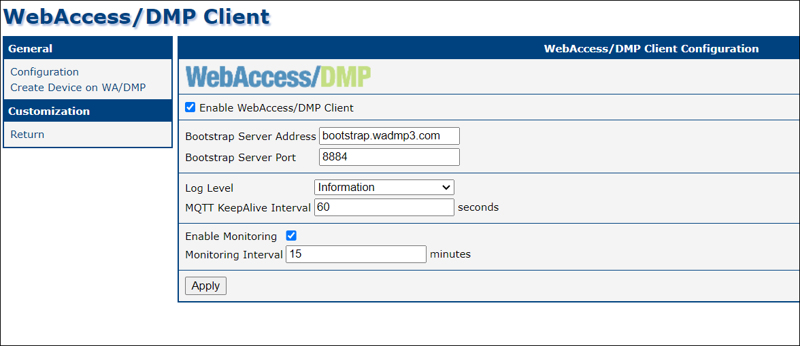

&nbsp;    
&nbsp; 
## Company Dashboard

When there are some online devices for the selected company, you should see aggregated company data like this:

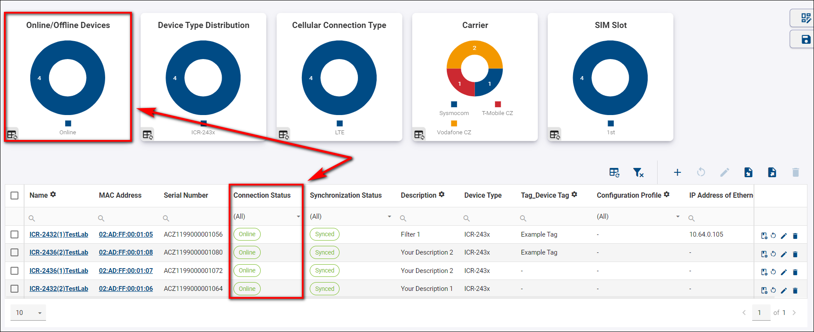

When there is not any online device, the dashboard looks like this:

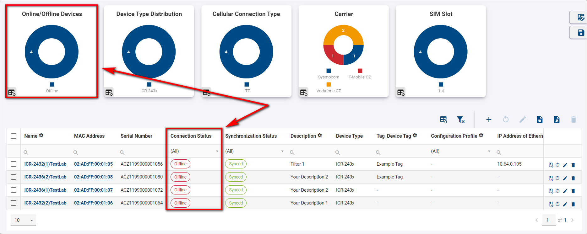

&nbsp;    
&nbsp; 
### Description of Individual Fields

|        Name of graph/widget         |    Description       |
| :--------------------------  | :------------------- |
| Claimed Date | Date of claim. |
| Configuration Profile | Assigned configuration profile. |
| Connection Status | Connection Status. |
| Data Downloaded (recent) | Amount of data downloaded within the last monitoring period. |
| Data Up+Down (cumulative) | Total amount of data uploaded + downloaded. |
| Data Up+Down (recent) | Amount of data uploaded + downloaded within the last monitoring period. |
| Data Uploaded (recent) | Amount of data uploaded within the last monitoring period. |
| Date Created | Date when this device was created on the server (usually corresponding to its manufacture date). |
| Description | Description of a device. |
| Device ID | ID of the device. |
| Device Type | Type of device. |
| IMEI | IMEI of a device. |
| MAC Address | MAC address of the device's primary LAN interface. |
| Mobile Operator | The name of a mobile operator. |
| Mobile Technology | Mobile technology (e.g., GSM, UMTS, LTE) ("N/A" when no SIM is present). |
| Name | Name of the device. |
| Online/Offline Since | Date and time when this device has last connected or disconnected from DMP. |
| Reconnects Count | Number of times the device went from offline to online state. |
| Serial Number | Serial number of a device. |
| SIM Card | Active SIM card. |
| Synchronization Status | Synchronization status of device. |

> **NOTE:** These are the default fields that you will find in the *Fields* section placed in the Title Panel. Information about additional fields can be acquired by clicking the *+ ADD* button in the *Fields* section and browsing through all available ones.

&nbsp;    
&nbsp; 
## Device Dashboard

To see the device dashboard, go to the Dashboard section → Filter Panel → And select a specific device.

When you're configuring your first device, the page will be blank with no monitoring data to be displayed:

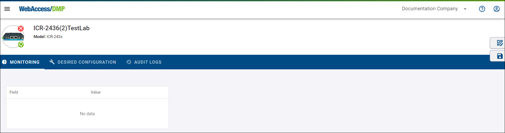

You can customize the dashboard of your device with the *Edit View* to look like in the example:

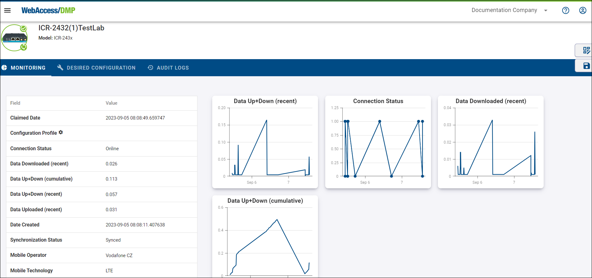

To add Tables to the device's dashboard, press *Edit View* → *Table* and make your already added Tables visible. You can add more by clicking the *+ Add Field* button.

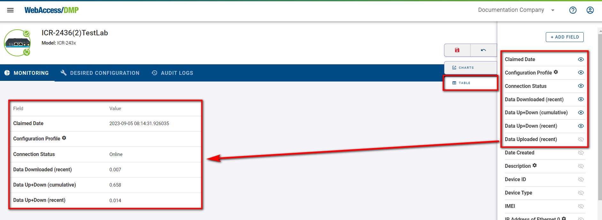

To add Charts to the device's dashboard, press *Edit View* → *Charts*, select either Line Chart or Map (this is only functional when the device has GPS active), and choose your desired *Field* that will appear as graph widget on the device's dashboard. Click the "Save" button.

> **NOTE:** Remember that every action in the *Edit View* must be saved by clicking the Floppy Disc icon.

&nbsp;    
&nbsp; 
## Tips & Tricks

&nbsp;    
&nbsp; 
### Sizing and Moving

You can specify the sizing and position of your Graphs & Widgets by selecting *Edit View* mode and then dragging your specified field. To end the * Edit View* mode, click the Floppy Disc icon or undo made changes with the undo button next to it.

&nbsp;    
&nbsp; 
### Filtering

You can interact with Graphs by clicking on a specific part of it. For example, If you want to show only devices of "Vodafone CZ" operator, click on the particular part of the graph that represents devices of "Vodafone CZ". This will add your active filter that can be removed by clicking the "Clear Filters" button.

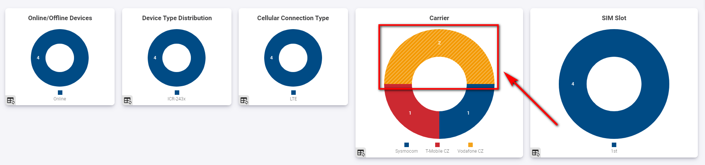

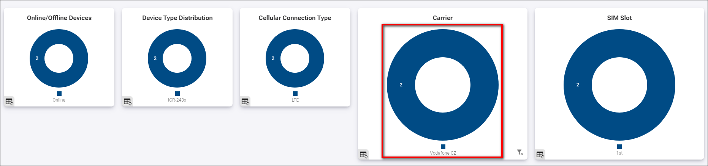

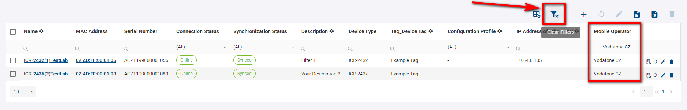

&nbsp;    
&nbsp; 
### Data Export

You can export CSV data files in Excel from your devices:

1. With no selection of your devices, you will download CSV files with data from them in bulk.

2. You can select your preferred devices and export only data. There's also an option to choose your preferred devices on the graph and then download data from them in bulk.

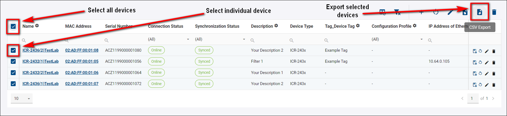

### Data Import

You can import your devices from CSV data files by clicking the *CSV Import* button and selecting your specified data file. You can scroll down the *Help for input format* for details about importing your data files. Click the *Submit* button. 

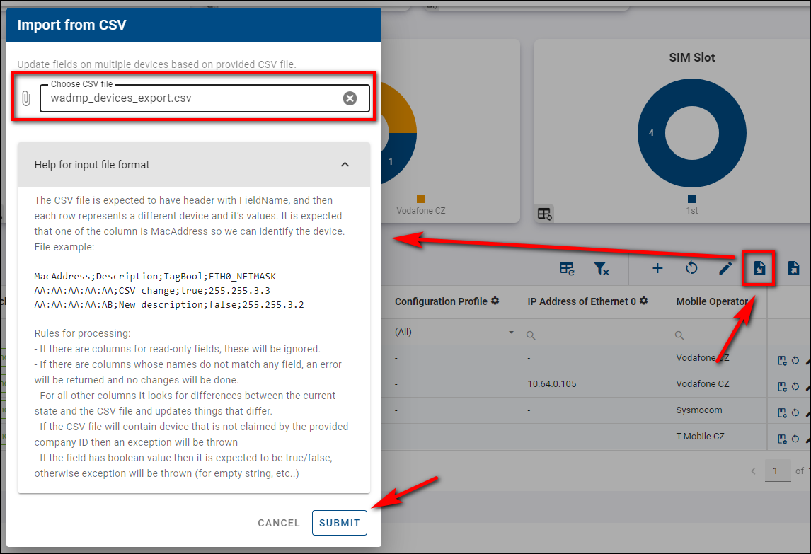