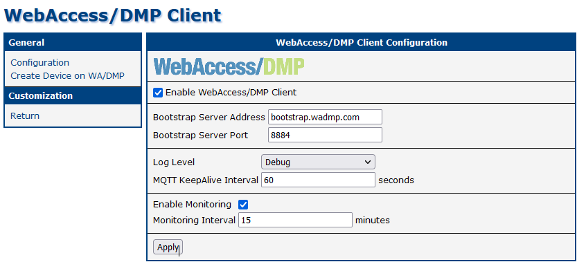
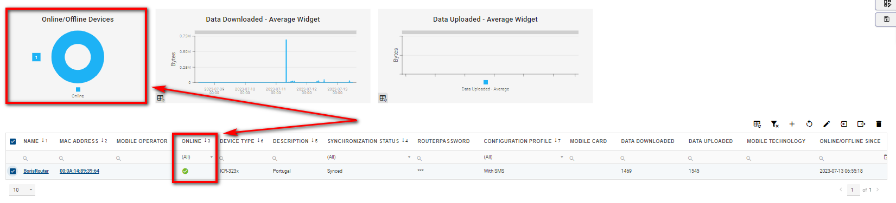
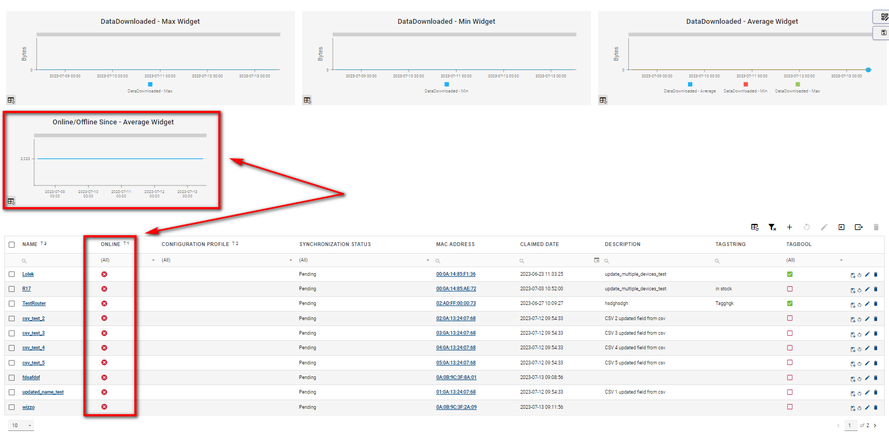
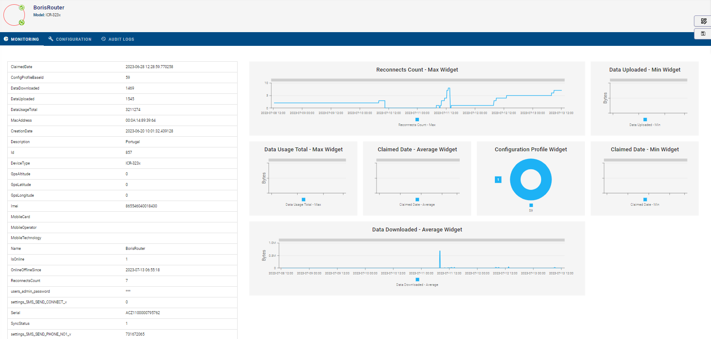
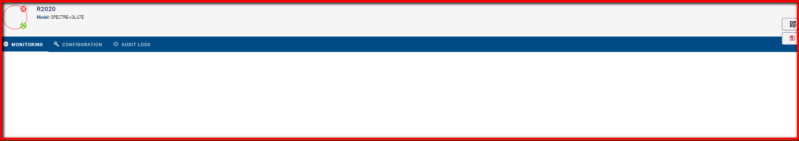
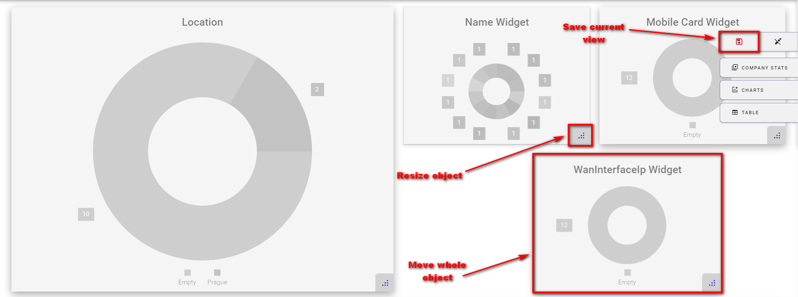
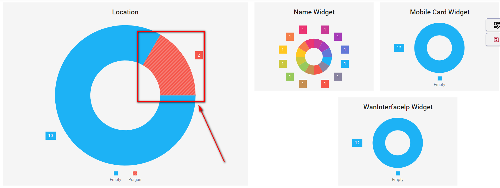
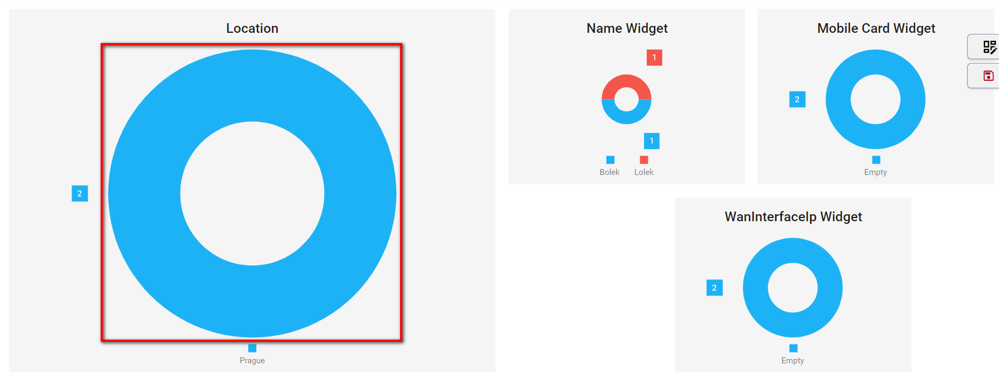
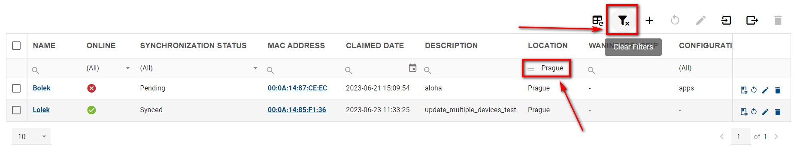
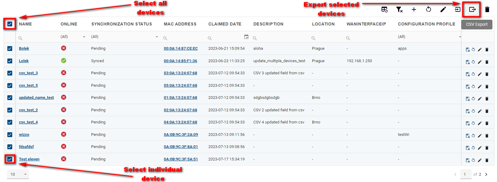

# Graphs & Widgets - Company Dashboard, Device Dashboard

## WebAccess/DMP Client - Enable Monitoring

When a router installs the “WebAccess/DMP Client” User Module, the client may optionally be configured to send monitoring data to the server. The data is displayed with Graphs & Widgets. Graphs & Widgets are used in WADMP: Home Dashboard → Company Dashboard and individual Device Dashboard.

On the WADMP client, the “Enable Monitoring” checkbox must be checked (the default is yes), and note the “Monitoring Interval”.

&nbsp;    
&nbsp; 
## Company Dashboard

When there are some online devices for the selected company, you should see aggregated company data like this:

When there is not any online device, the dashboard looks like this:

&nbsp;    
&nbsp; 
### Description of Individual Fields

|        Name of graph/widget         |    Description       |
| :--------------------------  | :------------------- |
| Online | Connection status. |
| Online / Offline Since | Date and time when this device has last connected or disconnected from DMP. |
| Device ID | ID of the device. |
| Name | Name of the device. |
| Configuration Profile | Assigned configuration profile. |
| Synchronization Status | Synchronization status of the device. |
| Device Type | Type of the device. |
| Mobile Operator | The name of the mobile operator. |
| Serial Number | Serial number of a device. |
| Mobile Card | Mobile Card ID. |
| Date Created | Date when this device was created on the server (usually corresponding to its manufacture date). |
| Reconnects Count | Number of times the device went from offline to online state. |
| Mobile Technology | Mobile technology (e.g., GSM, UMTS, LTE), ("N/A" when no SIM is present). |
| Data Usage Total | Total amount of data uploaded + downloaded. |
| Data Uploaded | Amount of data uploaded through mobile WAN interface. |
| Description | Description of the device. |
| IMEI | IMEI of a device. |
| RouterPassword | Password of some user on a device. |
| GpsLongitude | GPS longitude in degrees. |
| GpsLatitude | GPS latitude in degrees. |
| GpsAltitude | GPS altitude in meters. |
| SMS on Connect | A unique setting to this router (overrides configuration profile). |
| Phone Number | A unique setting to this router (overrides configuration profile). |

&nbsp;    
&nbsp; 
## Device Dashboard

To see the device dashboard go to the Dashboard section → Filter Panel → And select a specific device.

When the device is online, there should be data displayed similar to this example:

When the device has never been online, there are no monitoring data to be displayed:

&nbsp;    
&nbsp; 
## Tips & Tricks

&nbsp;    
&nbsp; 
### Sizing and Moving

You can specify the sizing and position of your Graphs & Widgets by selecting "edit view" mode and then dragging your specified field. To end edit view mode click the "save view" button or undo made changes with undo button next to it.

&nbsp;    
&nbsp; 
### Filtering

You can interact with Graphs by clicking on a specific part of it. For example, If you want to show only devices located in "Prague", click on the particular part of the graph that represents devices from "Prague". This will add your active filter that can be removed by clicking the "Clear Filters" button.

&nbsp;    
&nbsp; 
### Data Export

You can export CSV data files in Excel from your devices:

1. With no selection of your devices, you will download CSV files with data from them in bulk.

2. You can select your preferred devices and export only data. There's also an option to selection your preferable devices on the graph, and then download data from them in bulk.

