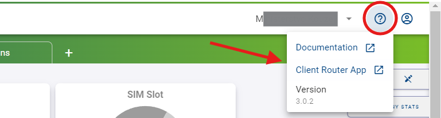
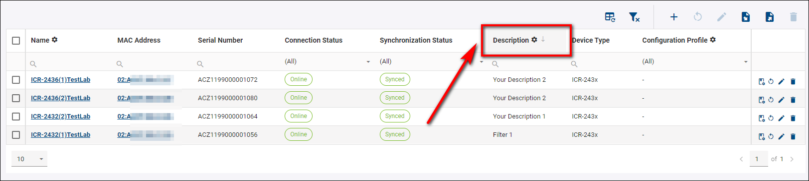
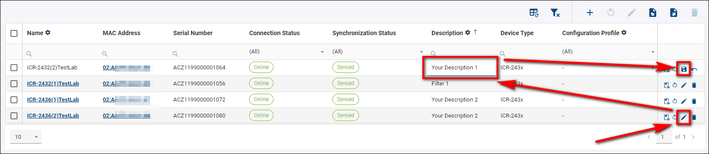
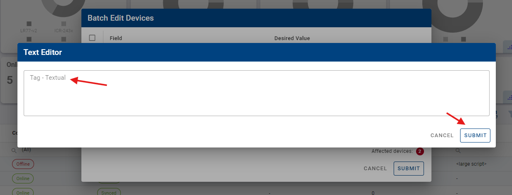

# Dashboards & Widgets

The Company Dashboard (home page) allows you to create different views, and the Device Dashboard lets you similarly customize views for data per single device.

## Customization Of Views

## Structure of company dashboard

The UI is structured into four main areas:

.png)

&nbsp;    
&nbsp;

**A: The Title Panel**

* The Title Panel contains a link to the context panel, where you can specify your output on panel C. 

* It also includes a link to the documentation, client router App, version and information about the currently logged-in user.

&nbsp;    
&nbsp;

**B: The Views Panel**
* This is where you can create empty views or select already defined settings for panels C and D.

.png)

* To create a new view, click on the "+" add icon, enter the name of your view, and click "Create".

* You can edit, duplicate, or delete a view by clicking on the *three dots icon* next to the name of the view you want to modify.

&nbsp;    
&nbsp;

**C: The Details Panel**
This is the central panel of information. The details presented here depend on the context and actions selected. You can access the Edit View menu by clicking the top icon.

* You can specify your desired widgets, including Company Stats Widgets, Chart Widgets, and columns in the Table. All of these can be moved at will. By clicking on the floppy disc icon, you save your current view.

&nbsp;    
&nbsp;

**D: The Filter Panel**
In this section, you can filter based on any available parameters. You can also export, import (from CSV file), add devices, delete devices, reboot devices, create configuration profiles, and configure your current filters at will.

* When there are online devices for the selected company, you should see aggregated company data like this:

* When there are no online devices, the dashboard looks like this:

&nbsp;    
&nbsp;

**Description of Individual Fields:**
    For detailed information about the fields, visit [Fields](https://docs.wadmp.com/gen3/explanations/device%20management/#_2-fields).

## Searching And Filtering (For company dashboard)

You can search, filter, and sort your devices at will, but remember that this only applies to your active view.

### Searching for a Specific Device

To search for a specific device:
1. Choose the appropriate column.
2. Enter your desired parameter. 

* For example, to find devices with "Description 2" in the *Description* column:

### Sorting Devices

To sort devices by a specific column, such as *Description*:
1. Click the *Description* column header.
2. Choose either descending or ascending mode.

### Filtering

* You can interact with graphs by clicking on specific parts of them. 

* For example, to display only devices of the "Vodafone CZ" operator, click on the section of the graph representing "Vodafone CZ" devices. This action will apply an active filter.

* To remove this filter, click the "Clear Filters" button.

## Customizing Columns

You can edit, show/hide, or add more columns in the Edit View mode, as detailed in the **General Structure of the UI >> C: The Details Panel** section.

To customize your table fields, press the "Add field" button.

&nbsp;    
&nbsp;
## Device Dashboard

* To see the device dashboard, go to the Dashboard section → Filter Panel → And select a specific device (By clicking on the device name).

* When you're configuring your first device, the page will be blank with no monitoring data to be displayed:

* To add Tables to the device's dashboard, press *Edit View*. 

* press *Table* and make your already added Tables visible. You can add more by clicking the *+ Add Field* button.

* To add Charts to the device's dashboard, press Edit View → Charts, select either Line Chart or Map (this is only functional when the device has GPS active), and choose your desired Field that will appear as graph widget on the device's dashboard. Click the "Save" button.

> **NOTE:** Remember that every action in the *Edit View* must be saved by clicking the Floppy Disc icon.

&nbsp;    
&nbsp; 
## Device Dashboard

### WebAccess/DMP Client - Enable Monitoring
When a router installs the “WebAccess/DMP Client” User Module, the client may be configured to send monitoring data to the server.
 * To check this you can visit [Device monitoring](https://docs.wadmp.com/gen3/explanations/device%20monitoring/#device-monitoring).

&nbsp;    
&nbsp; 

## Tips & Tricks

### Sizing and Moving

This feature applies to both the company and device dashboards. To adjust the size and position of your graphs and widgets:

1. Select *Edit View* mode.
2. Drag the desired field to adjust its size and position.

To exit *Edit View* mode, click the *Floppy Disc* icon to save your changes, or click the *Undo* button next to it to discard any changes.

&nbsp;    
&nbsp; 
### Editing or Adding a Device Description

To edit or add a new description to a device:
1. Click the *Edit* icon on the router you wish to modify.
2. Enter your desired description.
3. Save the changes by clicking on the *Floppy* disc icon that replaced the *Edit* icon.

&nbsp;    
&nbsp;

### Devices Tagging

* You can filter and overview the devices using tags. Using tags, you can create overlapping bunches of devices.

Tagging can make it easier to find the devices by giving them specific properties with tags and then filtering or searching for them.
After logging in to the [system](https://wadmp3.com), you must ensure a *Tag - Textual* field in the Filter Panel of the Devices.

If you don't have it, you can add this field by check [Adding/Removing fields](https://docs.wadmp.com/gen3/explanations/device%20management/#adding-removing-fields).

* After adding the *Tag - Textual* field and making it visible, Select your desired devices to create a Tag for your device and click the *Batch Edit Filtered Devices* icon.

* In the *Batch Edit Filtered Devices* form, specify the name tag you want to use for the selected devices in the Tag - Textual Desired Value field and click submit. Above the submit button, there's a note showing how many devices are affected by this action.

* Your desired devices should now be Tagged.

* You can filter devices by simply typing in your specified tag; only the devices with this tag will appear.

### Data Export

You can export CSV data files from your devices in Excel format:

1. **Export All Devices:** Without selecting any devices, you will download a CSV file containing data from all devices in bulk.
2. **Export Selected Devices:** You can select your preferred devices and export only their data. Additionally, you can choose your preferred devices on the graph and then download their data in bulk.

&nbsp;    
&nbsp;
* For more information, visit [Exporting data to CSV](https://docs.wadmp.com/gen3/explanations/device%20monitoring/#_2-exporting-data-to-csv).

&nbsp;    
&nbsp;
### Data Import

You can import your devices from CSV data files by following these steps:

1. Click the *CSV Import* button.
2. Select your specified data file.
3. For details about the input format, scroll down to the *Help for input format* section.
4. Click the *Submit* button to complete the import process.

&nbsp;    
&nbsp;
* For more information, visit [Device monitoring](https://docs.wadmp.com/gen3/explanations/device%20monitoring/#device-monitoring).
