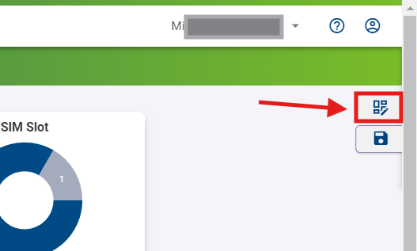
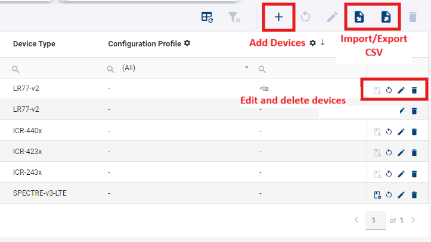
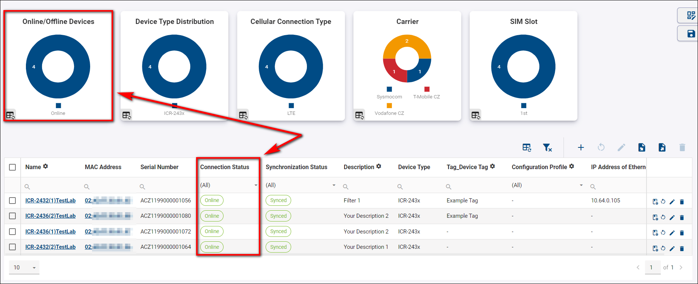
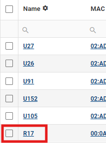

# Dashboards & Widgets

## WebAccess/DMP Client - Enable Monitoring

When a router installs the “WebAccess/DMP Client” User Module, the client may be configured to send monitoring data to the server. The data is displayed with Graphs and widgets. Graphs and widgets are used in WADMP: Home Dashboard → Company Dashboard and individual Device Dashboard.

* On the WADMP client, ensure the **Enable Monitoring** checkbox is checked (the default setting is *yes*), and note the **Monitoring Interval**.

&nbsp;    
&nbsp;

## General Structure of the User Interface

The UI is structured into four main areas:

.png)

&nbsp;    
&nbsp;

**A: The Title Panel**

* The Title Panel contains a link to the context panel, where you can specify your output on panel C. 

* It also includes a link to the documentation, client router App, version and information about the currently logged-in user.

&nbsp;    
&nbsp;

**B: The Views Panel**
* This is where you can create empty views or select already defined settings for panels C and D.

.png)

* To create a new view, click on the "+" add icon, enter the name of your view, and click "Create".

* You can edit, duplicate, or delete a view by clicking on the *three dots icon* next to the name of the view you want to modify.

&nbsp;    
&nbsp;

**C: The Details Panel**
This is the central panel of information. The details presented here depend on the context and actions selected. You can access the Edit View menu by clicking the top icon.

* You can specify your desired widgets, including Company Stats Widgets, Chart Widgets, and columns in the Table. All of these can be moved at will. By clicking on the floppy disc icon, you save your current view.

&nbsp;    
&nbsp;

**D: The Filter Panel**
In this section, you can filter based on any available parameters. You can also export, import (from CSV file), add devices, delete devices, reboot devices, create configuration profiles, and configure your current filters at will.

## Customization Of Views

### Company Dashboard

* When there are online devices for the selected company, you should see aggregated company data like this:

* When there are no online devices, the dashboard looks like this:

&nbsp;    
&nbsp;

**Description of Individual Fields:**
    For detailed information about the fields, visit [Fields](https://docs.wadmp.com/gen3/explanations/device%20management/#_2-fields).

## Device Dashboard

* To see the device dashboard, go to the Dashboard section → Filter Panel → And select a specific device (By clicking on the device name).

* When you're configuring your first device, the page will be blank with no monitoring data to be displayed:

* To add Tables to the device's dashboard, press *Edit View*. 

* press *Table* and make your already added Tables visible. You can add more by clicking the *+ Add Field* button.

* To add Charts to the device's dashboard, press Edit View → Charts, select either Line Chart or Map (this is only functional when the device has GPS active), and choose your desired Field that will appear as graph widget on the device's dashboard. Click the "Save" button.

> **NOTE:** Remember that every action in the *Edit View* must be saved by clicking the Floppy Disc icon.

## Searching And Filtering

## Tips & Tricks

### XXXXXXXX