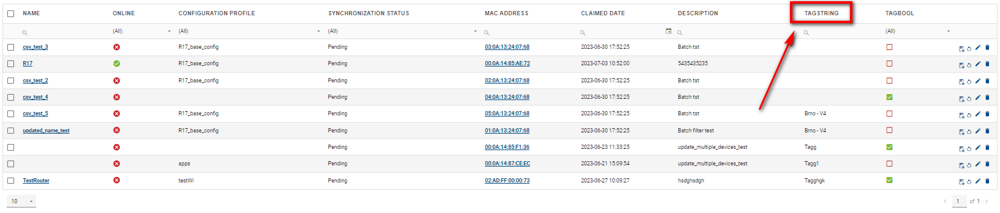
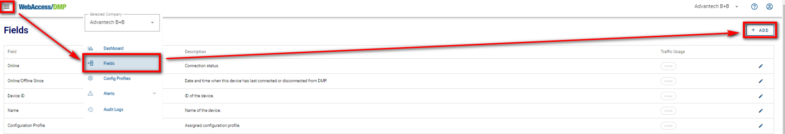
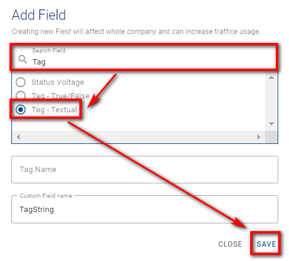
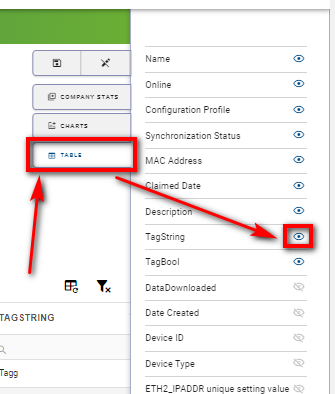
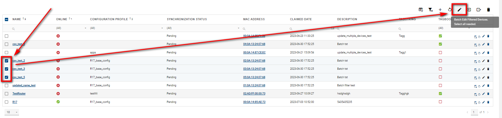
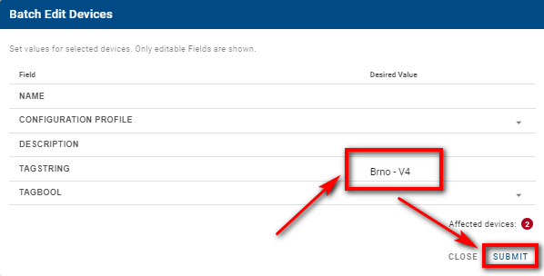
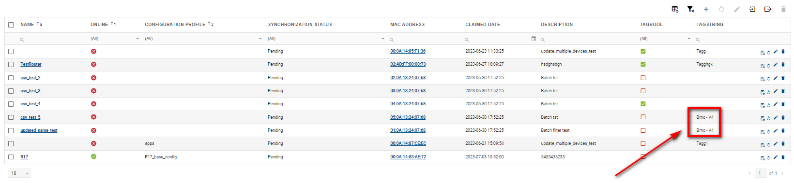
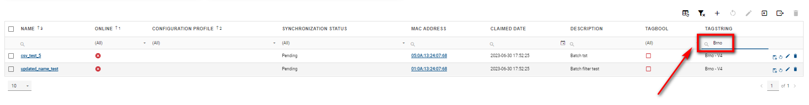

# Devices Tagging

You can filter and overview the devices using tags. Using tags, you can create overlapping bunches of devices.

## Tagging

Tagging can make it easier to find the devices by giving them specific properties with tags and then filtering or searching for them.

After logging in to the [system](https://wadmp.com), you need to ensure a TagString field in the Filter Panel of the Devices. 

If you don't have it, you can add this field by doing the following:

1. Head into the Title Panel and select Fields.
2. In the Fields section, select "add".

1. In the "Add Field" form, search for Tag - Textual.
2.  You can give it an arbitrary Tag Name or leave it blank. The Custom Field name stays the same.
3.  Click "save".

Now head into the Dashboard section and Filter Panel of devices. You may need to make this field visible.

1. Click the Edit View mode and select Table.

2. Make sure that the TagString is visible.

 
3. TagString should now be available for your customization in the Filter Panel (e.g., 1st picture).

Select your desired devices to create a Tag for your device and click the "Batch Edit Filtered Devices" icon.

In the Batch Edit Devices form, specify the name tag you want to use for the selected devices in the TagString Desired Value field and click submit. Above submit button, there's a note showing how many devices are affected by this action.

Your desired devices should now be Tagged.

You can filter devices by simply typing in your specified tag; only the devices with this tag will appear.

