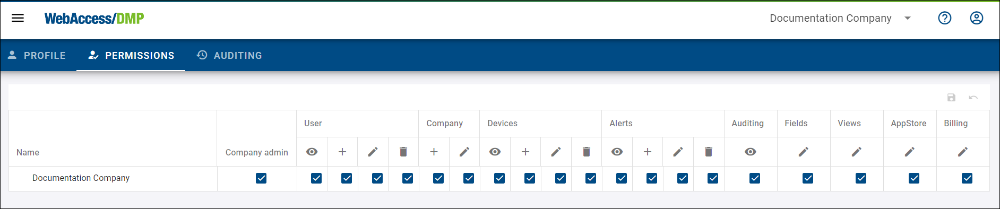

# Permissions Explained

## Permissions Behaviour

Permissions regarding Companies and Users behave according to this rules:

* A user can not edit his own permissions.
* A user may not add himself into any company.
* A user can remove himself from a company if that company contains at least 1 other Company Admin and if such action doesn't cause the user to have 0 companies, and if the user has "Edit Users" permission on the company that he is leaving.
* User may always edit his own profile information (email, name, etc.), no matter what permissions he has.
* A user may remove another user from a company only if the change initiating user has "Edit Users" permission on that company.
* A user may edit profile informaion (email, name, etc..) of another user only if the change initiating user has "Edit Users" permission for at least one of the companies that the user is in.

## Permissions Description

* Company Admin - sets a fixed set of permissions

* User
  * View - Allows viewing a list of users they have access to
  * Create - Allows the user to create new users to their company in the system
  * Edit - Allows the user to edit an existing user in the system
  * Delete - Allows the user to delete another user in the system

* Company
  * Create - Allows the user to create new standalone companies
  * Edit - Allows the user to edit an existing company
  
* Devices
  * View - Allows the user to view the device's details
  * Claim & Release - Allows the user to claim a device in the system
  * Edit - Allows the user to make changes to a device
  * Delete - Allows the user to delete a device from the system

* Alerts History, Rules & endpoints
  
  * View - Allows viewing a list of Alerts History, Rules & Endpoints
  * Create - Allows the user to create new Alerts History, Rules & Endpoints
  * Edit - Allows the user to edit an existing Alerts History, Rules & Endpoints
  * Delete - Allows the user to delete Alerts History, Rules & Endpoints

* Auditing
  * View - Allows the user to view the auditing

* Fields
  * Manage - Allows the user to manage fields in the Fields section

* Views
  * Manage - Allows the user to manage the Views

* AppStore
  * Manage - Allows the user to manage the AppStore 
  
* Biling
  * Manage - Allows the user to manage the billing section
