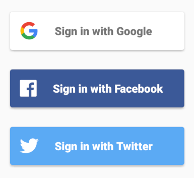
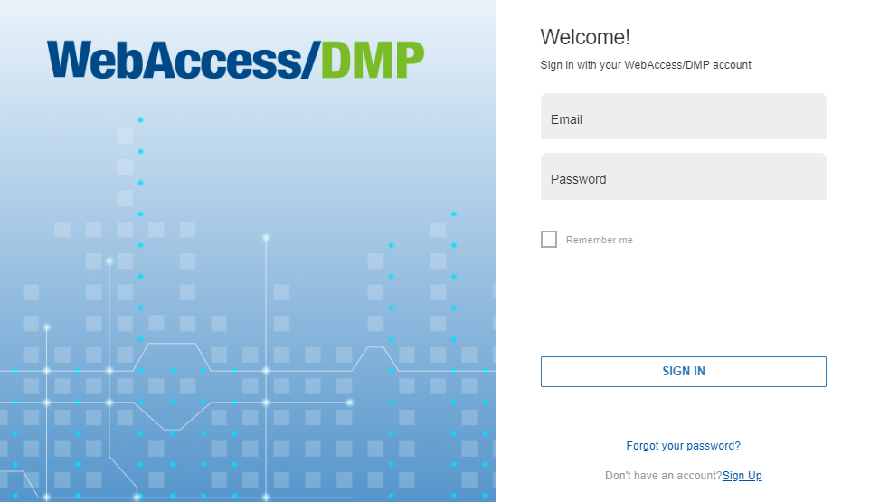
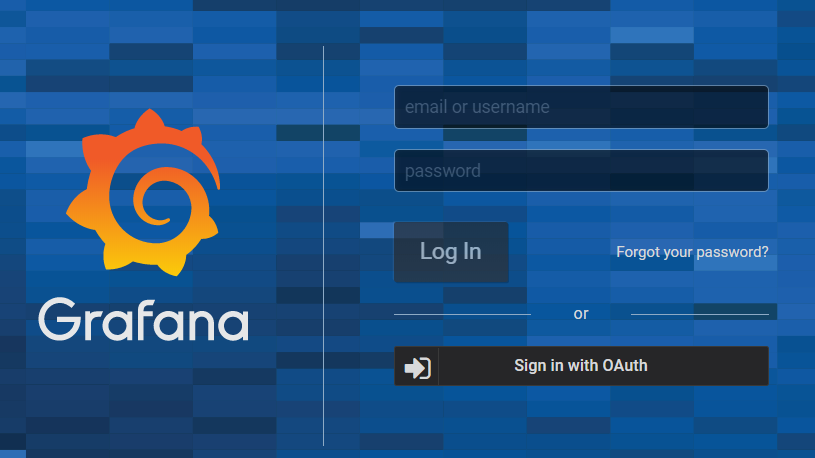
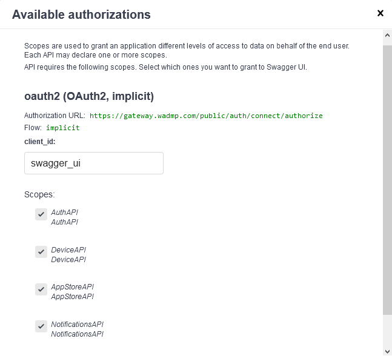
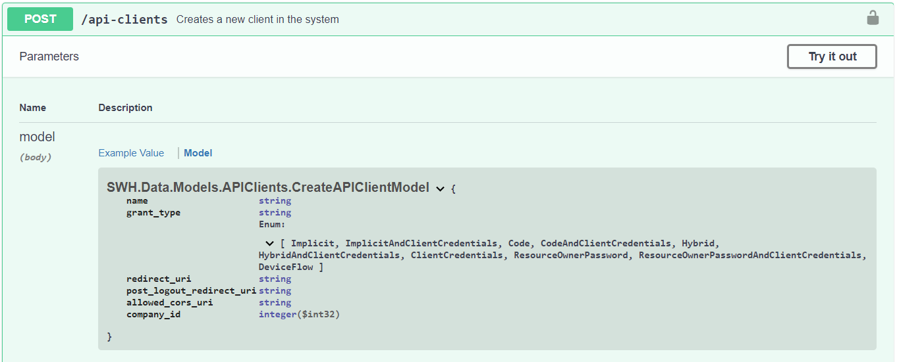

# Understanding OAuth

## Introduction

You are probably already familiar with the concept. When you visit a particular website or use a specific mobile app, instead of asking you to create a new account, *it prompts you to log in using an existing account on some other service*, such as Google, Facebook, or Twitter.



There are several advantages:
* You do not have to create and remember yet another password!
* You do not have to give your password to a website or app you possibly do not trust.
* Only the "identity provider" (in this case, Google, Facebook, or Twitter) handles your user credentials.

WebAccess/DMP uses the same concept.

> Remember that the User Interface or web app that you see at [wadmp.com]([https://wadmp.com) is only one example
> of a client application that consumes the WebAccess/DMP API.

WebAccess/DMP (the platform) acts as the "identity provider" for users. *Any* client application that consumes the WebAccess/DMP API should redirect to our built-in Sign-In page. You can see this when you connect to [wadmp.com]([https://wadmp.com) for the first time (or try it in an Incognito window). The browser is redirected to [gateway.wadmp.com/public/auth/public/auth/login](https://gateway.wadmp.com/public/auth/public/auth/login):



Another good example is Grafana. Our main UI utilizes Grafana to display dashboards for device monitoring data. These dashboards are embedded in the [wadmp.com](https://wadmp.com) web pages, but you can also access Grafana directly at [grafana.wadmp.com](https://grafana.wadmp.com).
Note that *you do not have to create an account* with Grafana: click "Sign in with OAuth":



You are automatically redirected to the WebAccess/DMP sign-in page.

## API Clients Endpoints

The public REST API provides the following endpoints which allow you to manage your OAuth clients:


The API Client is an abstraction for the type of authentication procedure that will be started after the calling authorization endpoint. For example, it governs whether you need to provide a username and password directly in the payload or if you will be redirected to a Login screen.

Some OAuth clients are provided by default in every WebAccess/DMP instance:
* "SWHWebApp" is the client used by our built-in User Interface, [wadmp.com](https://wadmp.com);
* "grafana" is the client used by Grafana, [grafana.wadmp.com](https://grafana.wadmp.com);
* "swagger_ui" is the client used by the "Try it out" feature on [api.wadmp.com](https://api.wadmp.com) (for browsing API in a web browser);
* "python" is the client used by the example Python scripts provided as part of the documentation in [docs.wadmp.com](https://docs.wadmp.com). It can be used for calling API endpoints from your application. It is not limited to python.

### Authorization

* When using the Web UI, you do this by clicking on authorize, typing in “swagger_ui”, ticking all scopes, and pressing Authorize, then entering your DMP user credentials (if not already signed in). We advise to use all four Scopes at all times, since the Scopes feature will soon be replaced with an improved system.


* When using a script or an application, you can do this by using the following endpoint:
     * URL: https://gateway.wadmp.com/public/auth/connect/authorize (replace wadmp.com with your domain name if not using our public server)
     * Content type: json
     * Data:
     ```
     {
     'username': username,
     'password': password,
     'client_id': 'python',
     'grant_type': 'password'
     }
     ```

API authorization will only succeed for those users who have the appropriate permission.


## More details

OAuth is an *authorization* framework.
OAuth 2.0 is defined in [RFC 6749](https://tools.ietf.org/html/rfc6749) and Bearer Token Usage is in [RFC 6750](https://tools.ietf.org/html/rfc6750).

```
Protocol Flow

     +--------+                               +---------------+
     |        |--(A)- Authorisation Request ->|   Resource    |
     |        |                               |     Owner     |
     |        |<-(B)-- Authorisation Grant ---|               |
     |        |                               +---------------+
     |        |
     |        |                               +---------------+
     |        |--(C)-- Authorisation Grant -->| Authorization |
     | Client |                               |     Server    |
     |        |<-(D)----- Access Token -------|               |
     |        |                               +---------------+
     |        |
     |        |                               +---------------+
     |        |--(E)----- Access Token ------>|    Resource   |
     |        |                               |     Server    |
     |        |<-(F)--- Protected Resource ---|               |
     +--------+                               +---------------+
```

* The end-user is called the "Resource Owner".
* The "Client" is any application that the Resource Owner uses to access WebAccess/DMP.
* The Client receives an authorization "Grant" from the Resource Owner, which is a credential representing the Resource Owner's authorisation.
* Several Grant types are supported. Each type has its own protocol "flow".
* The "Authorisation Server" is a micro-service within WebAccess/DMP that authenticates the client, validates the authorisation grant, and if valid, issues an access token.
* The "Resource Server" is another micro-service within WebAccess/DMP that hosts the various resources that the end-user wants to access.

We also use [OpenID Connect](https://openid.net/connect/), an *authentication* layer built on OAuth 2.0.

* WebAccess/DMP is an "OpenID Provider" (OP). i.e., It is an OAuth 2.0 authorization server capable of authenticating the end-user and providing claims to a Relying Party (RP) about the authentication event and the end-user.
* When you create a new website or application that consumes the WebAccess/DMP API, your app is called a "Relying Party" (RP). i.e., It is an OAuth 2.0 client application requiring end-user authentication and claims from an OpenID Provider.

WebAccess/DMP uses [IdentityServer4](https://identityserver4.readthedocs.io/en/aspnetcore2/), which is an [open-source](https://github.com/IdentityServer/IdentityServer4), [certified](https://openid.net/developers/certified/) OpenID Provider for C# and ASP.NET Core.


### Grant type

The model for the payload for the `POST /api-clients` endpoint looks like this:



`grant_type` is usually one of the following:
* `Implicit`. See the [OAuth 2.0](https://tools.ietf.org/html/rfc6749) and [IdentityServer4](https://identityserver4.readthedocs.io/en/aspnetcore2/topics/grant_types.html#implicit) documentation. For example, this is the type used by the SWHWebApp and swagger_ui clients.
* `Code`. Called "Authorisation Code" in [OAuth 2.0](https://tools.ietf.org/html/rfc6749) and [IdentityServer4](https://identityserver4.readthedocs.io/en/aspnetcore2/topics/grant_types.html#authorization-code). For example, this is the type used by the grafana client.
* `ResourceOwnerPassword`. See the [OAuth 2.0](https://tools.ietf.org/html/rfc6749) and [IdentityServer4](https://identityserver4.readthedocs.io/en/aspnetcore2/topics/grant_types.html#resource-owner-password) documentation. For example, this is the type used by the python client.