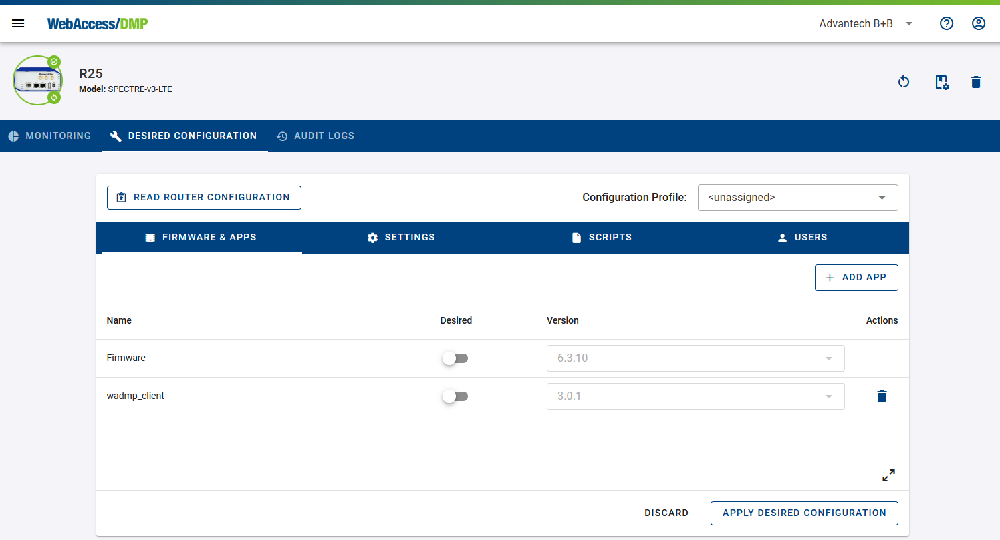
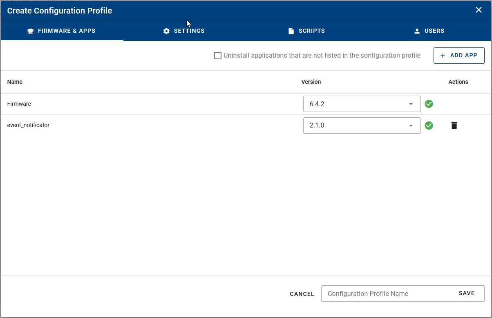
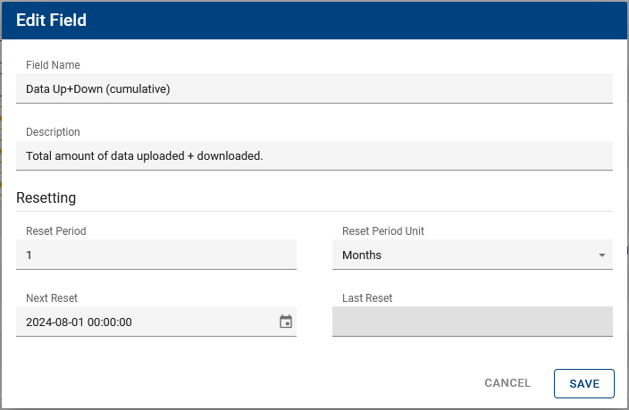
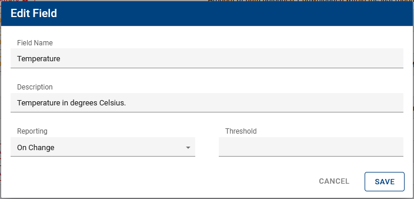
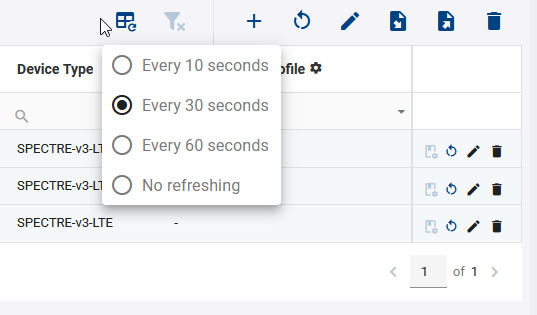
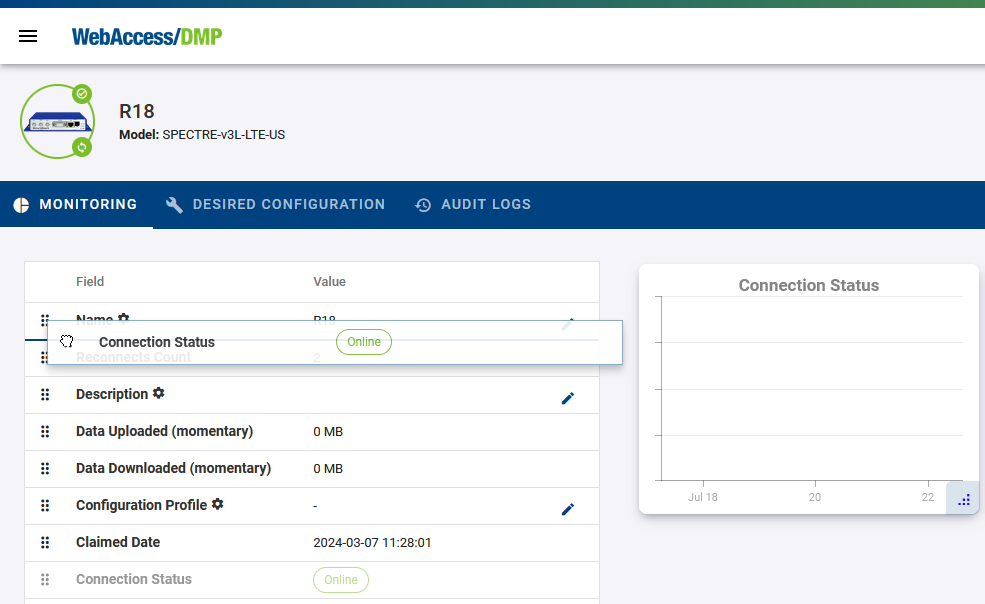

# 3.1.0: July 22, 2024

### Improvements:

- Added new field types: User Role, Unique Script, Unique Firmware, and Unique Application Version.

- Reworked the "Desired Configuration" page to simplify individual router management.

- Introduced an alternative method for creating new configuration profiles, allowing users to select specific items to include.

- Added a manual option to read the actual router configuration.

- Added a feature to configure periodic resets of cumulative fields for easier tracking of data usage and other metrics.

- Introduced an option to restrict reporting of numeric metrics from routers to cases where the value change reaches a configurable threshold, reducing mobile data usage.

- Enabled sign-in via other identity providers (Google, Microsoft).

- Added functionality to distinguish "unset" values (shown as “-”) from empty values in the dashboard table, including support for filtering empty or “unset” values.

- Increased the retention period for auditing and monitoring data from 2 months to 3 months.

- Raised the maximum number of Ping Latency and Ping Status fields per company to 10.

- Added an option to adjust the refresh interval on the dashboard by right-clicking the “Refresh” button.

- Removed the mandatory system name input parameter from the creation of Tag fields.

- Updated the default layout of the device page to include several fields and charts.

- Added an option to edit field values directly from the device page.

- Enabled users to adjust the order of table items on the device page.

- Enhanced the text of several auditing logs for greater informativeness.

### Bug Fixes:

- Fixed UI freezing during batch operations on a large number of devices.

- Fixed the dashboard page occasionally not fully loading, which required a page reload.

- Fixed the dashboard table's edit mode being unintentionally canceled by a periodic data refresh.

- Fixed the user permissions page not visibly disabling individual settings when “Company Admin” is selected.

- Fixed the user permissions edit dialog incorrectly offering the “Enable API Scripts” option for users in companies without 2-factor authentication.

- Fixed the Connection Status value incorrectly resetting to “Never Connected” if the status remained unchanged for 2 months.

- Fixed the MacAddress column reappearing in the dashboard table after being removed.

- Fixed the diskette icon sometimes not changing color when there are unsaved changes.

- Fixed the company list in the top right corner sometimes overlaying its associated input box.

- Fixed zooming out not working correctly for line charts.

- [On-Premises] Fixed the device creation dialog incorrectly showing errors for its inputs briefly before succeeding.

- Fixed the “Create Configuration Profile” button incorrectly appearing for offline routers.

- Fixed device selection sometimes not working properly across multiple table pages on the dashboard.

- Fixed page refresh on the user auditing page unintentionally switching tabs to the user profile page.
