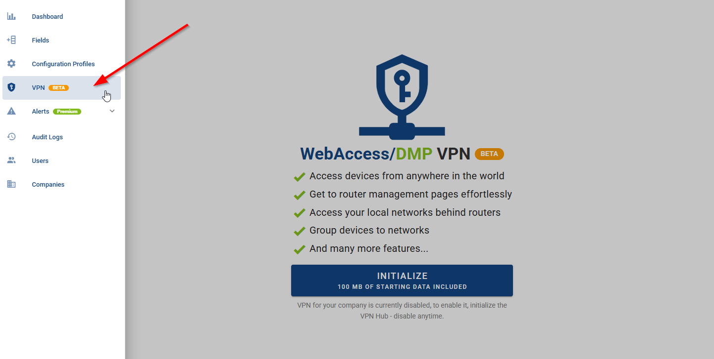

# 3.2.0 March 13, 2025

### Improvements:

- Added a new, long-awaited VPN management feature to streamline network security and control.  
  For more information see [VPN Documentation](../docs/vpn/)

### Bug Fixes:

- Fixed an issue where the Desired Configuration page incorrectly displayed applications that are not compatible with the selected device type.

- Fixed inconsistent sorting of application versions across multiple sections of the platform.

- Fixed filtering by selection of multiple audit log types on Auditing page.

- Fixed a formatting issue with View tabs that had very long names, ensuring they display correctly.

- Fixed the reset password feature for user accounts that had not yet confirmed their email.

- Disabled the reset password feature for user accounts created via third-party identity providers.

- Resolved an issue where "0" was displayed as the default value for numeric fields before any data was reported by a router.

- Fixed GPS coordinate values being unintentionally rounded.

- Fixed multiple error notifications to provide more actionable explanations of failure.

- Fixed an issue where the Map widget failed to center correctly on devices if the company had at least one device without GPS location data.

- Fixed ServiceAccount flag not being configurable by Company Admins.
