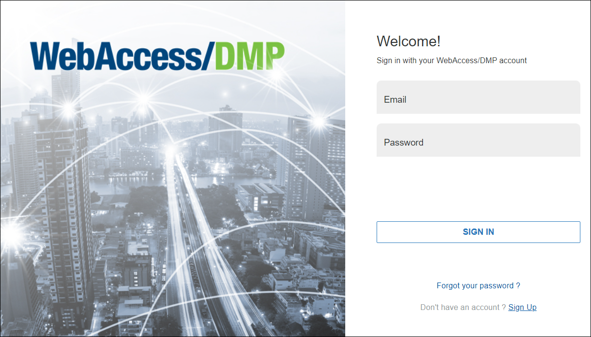
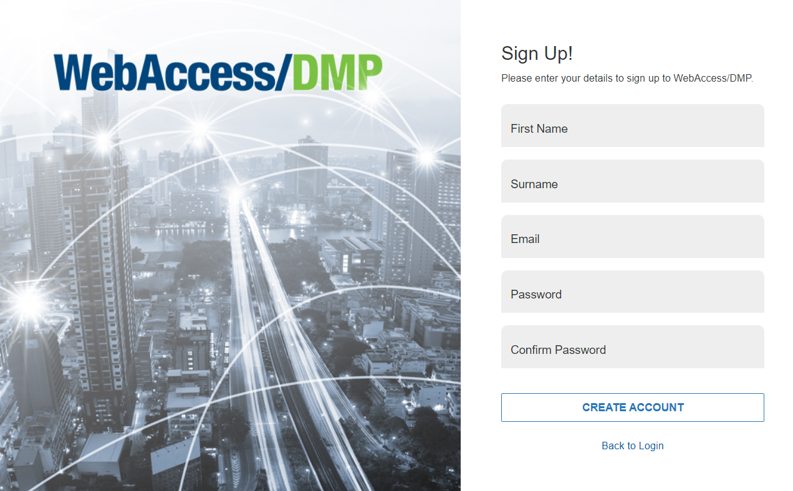
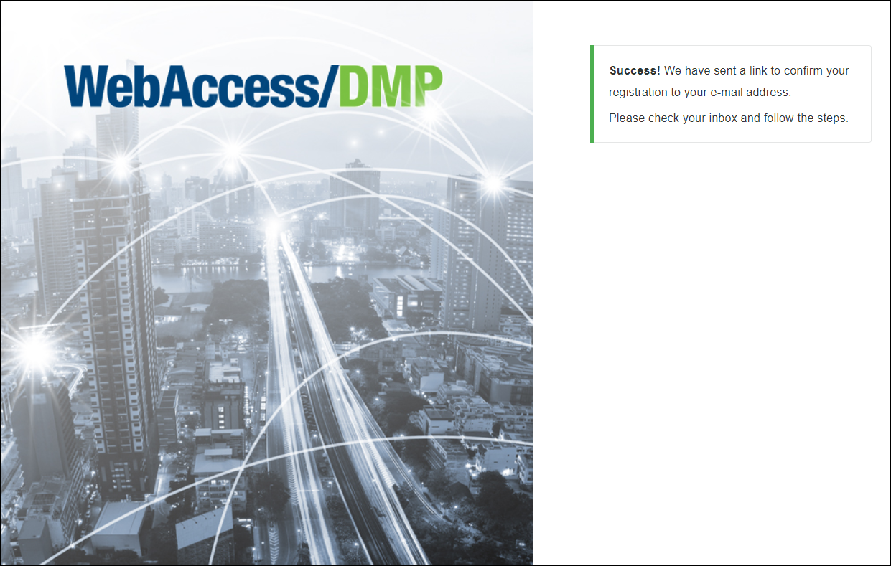
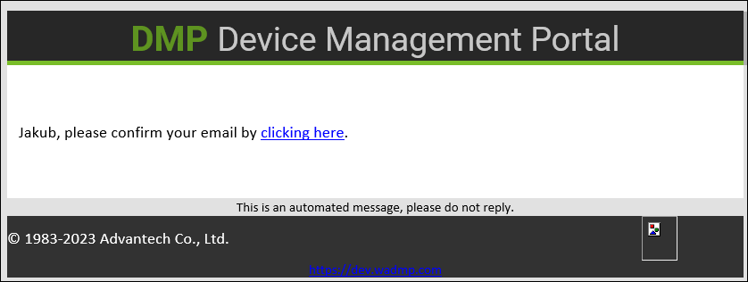

# Sign Up

To start using WebAccess/DMP, you need a user account first. 

Use Sign Up link only if you are the first from your company to access the platform. If someone else has already Signed Up, ask them to create a user to add you to the company.

## Sign Up Process

- Go to [wadmp3.com](https://wadmp3.com). You will be redirected to the login page.

- Click on the Sign Up link and fill in your details and the ones of your company.

- After clicking on the Create Account button, go to your email inbox and confirm your new user.
  

- After clicking the confirmation in your email, your account will be ready to log in to WebAccess/DMP with your login data on the main page.

