# Configuration Profiles

## Installing/Upgrading SW of the Device

Configuration profiles are used for easy installation of any of our Router Apps, as well as router firmware and its overall settings as individual devices or bunch devices in bulk.

1. First, you must choose an example router that will be used as a default configuration for your Configuration Profile.

2. Connect to your router via IP address to the user GUI.

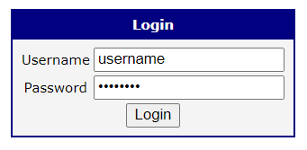

3. Ensure you're running the latest WebAccess/DMP Client in the Router Apps section so the router is connected with WA/DMP. You can check the Client Release Notes section for the latest version of WA/DMP.

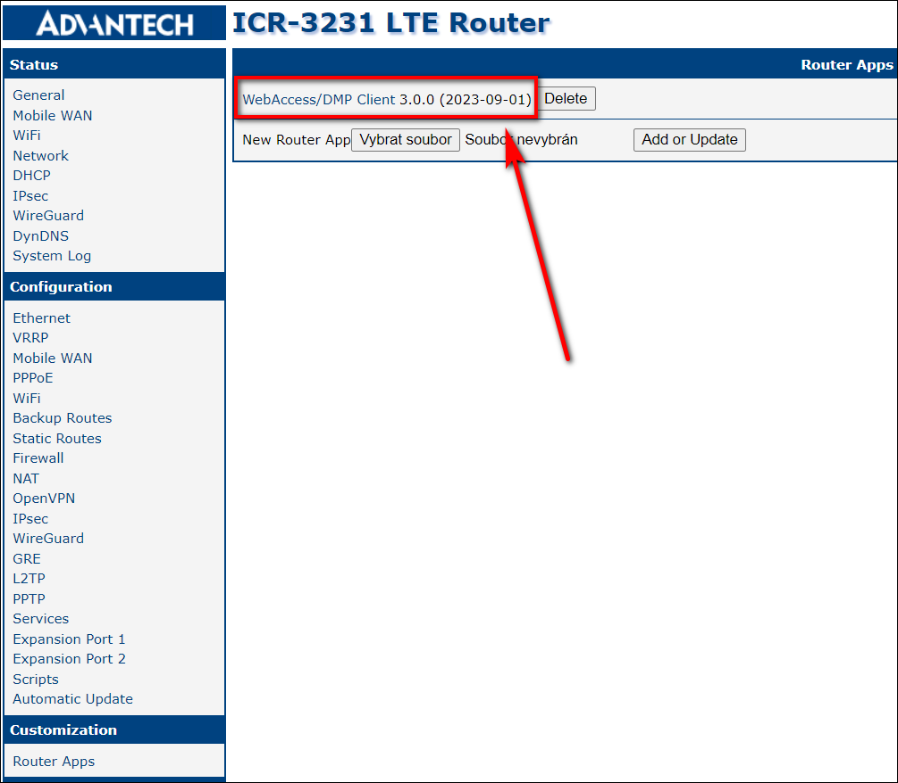

4. From now on, you can make all desired settings in the Configuration Profile. This includes all your desired Router Apps, Firmware, and Configuration settings of the router.

5. At this point, you will head for the Dashboard section into the Filter Panel section, where you will make a Configuration Profile out of this router.

   Note, that current selected profile in the router is used for creating the Configuration Profile (despite other saved Profiles available in router's interface Administration - Change Profile)

1. Now, you can apply your newly created Configuration Profile to any router in your current Company, as showcased in the picture below.

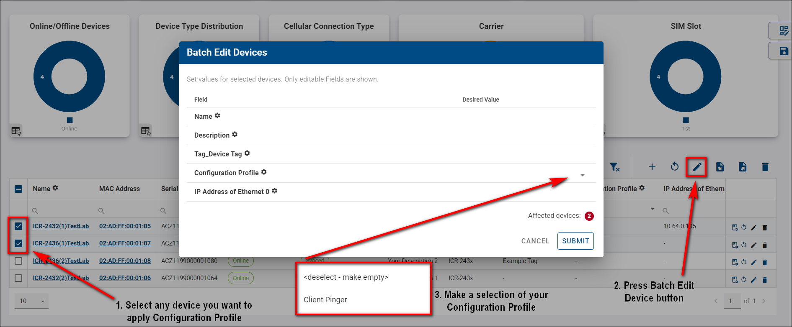

::: tip Example Tip:
If you apply Configuration Profile, the router will apply all configurations from the router from which Config Profile was created.

For example:

- You have router_1 with an IP address on eth0=10.10.10.1 and router_2 with an IP address on eth0=10.10.10.2.
- If you create a Config Profile from router_1, it will contain setting ETH_IPADDR=10.10.10.1. and if you apply that Config Profile to router_2, setting ETH_IPADDR on router_2 will be overwritten to 10.10.10.1.
- Only if you create a Unique setting with Setting Name ETH_IPADDR (the exact name of the setting from the router) and display the name, for example, Unique_ETH_IPADDR, and edit that field to Unique_ETH_IPADDR=10.10.10.2, the setting will not be overwritten.

:::

7. You can overview, compare, and delete your Configuration Profiles in the _Config Profiles_ section.

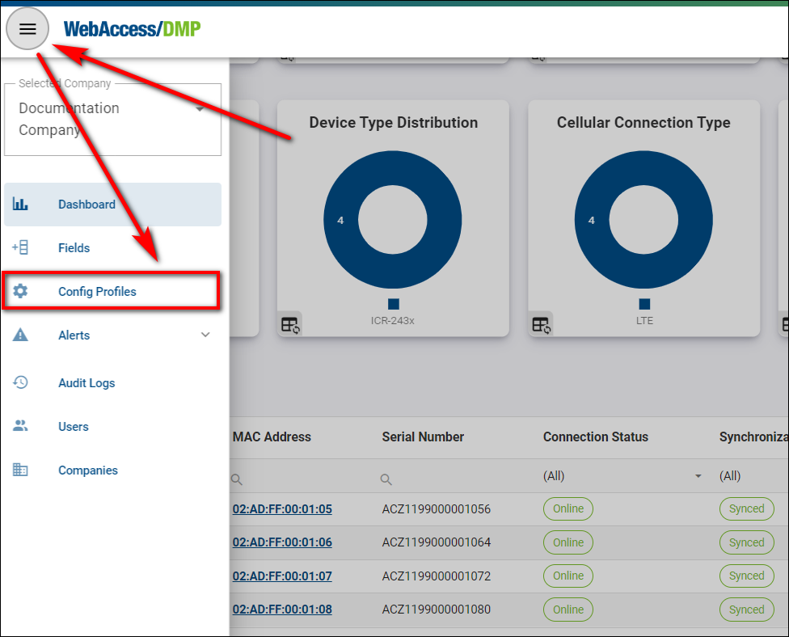

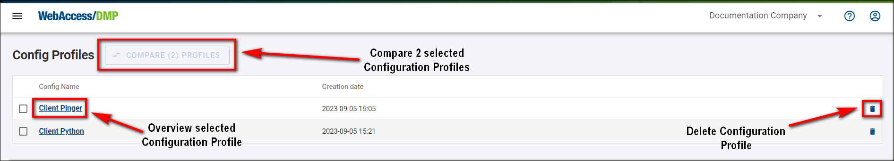

8.  Compare by choosing 2 Configuration Profiles of your desire.

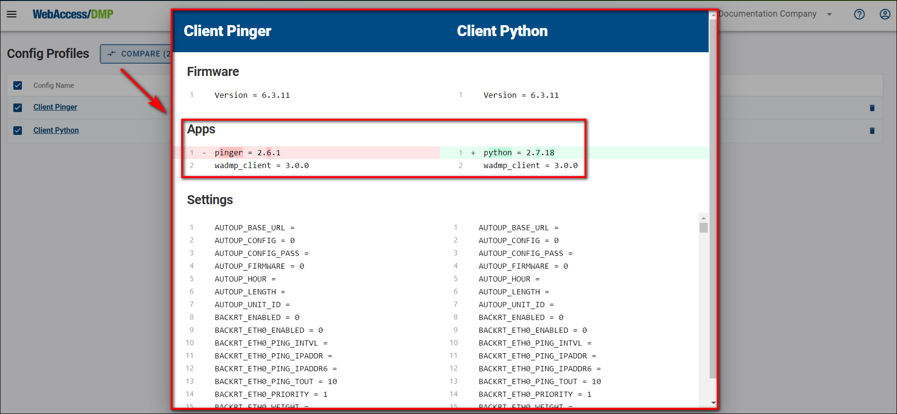

## How to Create a Configuration Profile via API

This tutorial describes how to create a configuration profile directly (rather than from an existing device).

1. Learn the ID of the company where you want to create the configuration profile.

   - Go to a company page in the main DMP UI. The ID of the currently viewed company can be found in the URL. Write this ID down, you will need it later.
     

2. Authorize for using the API via swagger.

   - Go to api.wadmp3.com, select _DMP Protected API_ and press _Authorize_ button.

   - Fill in “swagger*ui” as \_client_id*, tick _MainAPI_ and press _Authorize_.
     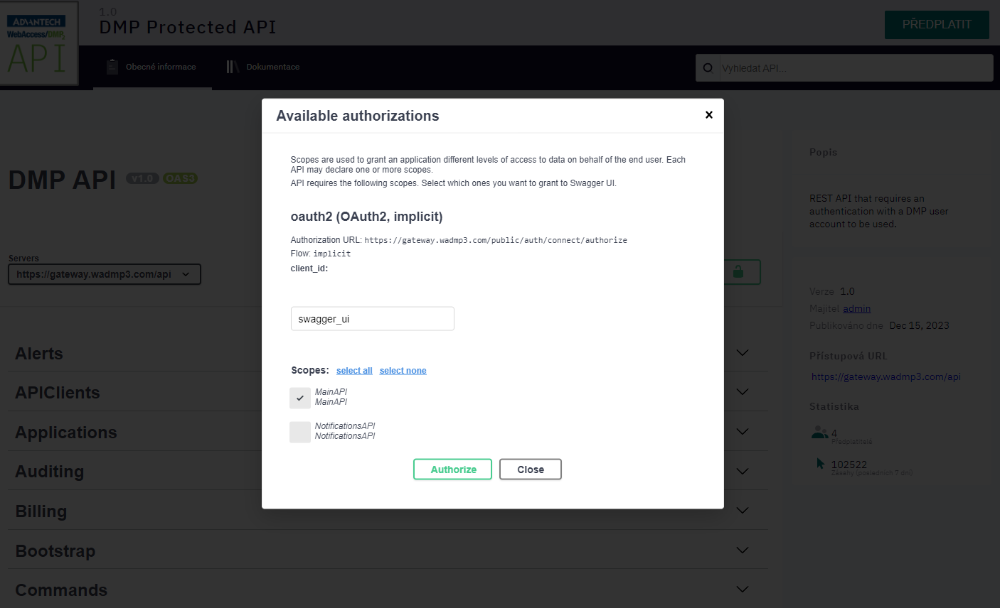

3. Find the endpoint for creating configuration profiles.

   - Press the “Try it out” button that is shown after clicking at the POST endpoint in _ConfigProfiles_ section.
     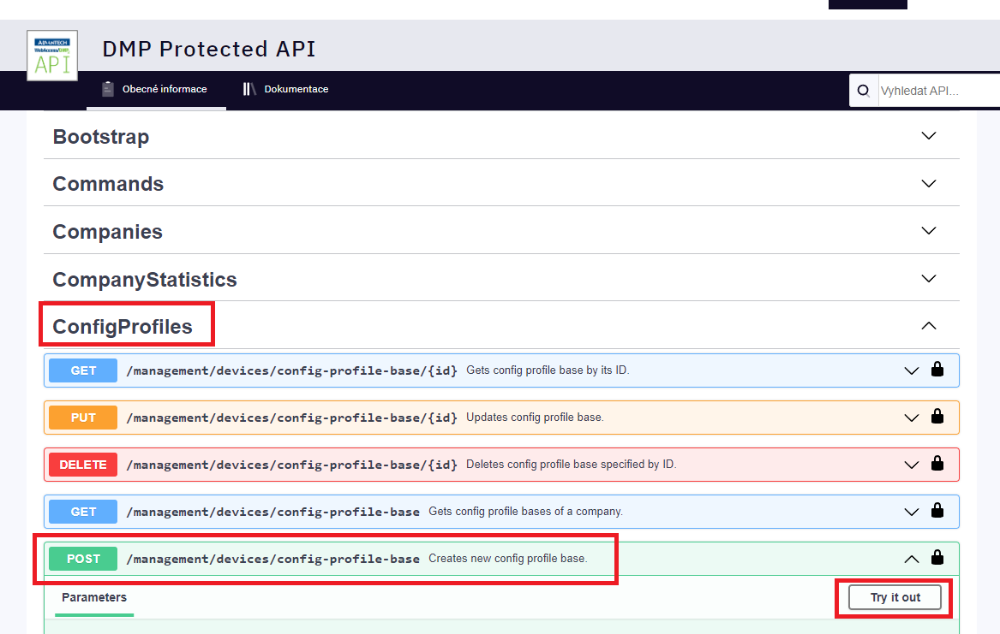

4. Specify the company ID and the name of the config profile.

   - Input the ID of your company and the name for your configuration profile.  
     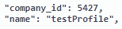

5. You may add settings.

   - If you want this configuration profile to manage any settings, the “settings” section is used for that. You can add as many settings as you want. Each item consists of the name of the setting (equal to the one that can be found in setting files located within _/etc/_ folder of routers) and the structured object containing a value for that setting (see the example bellow). Any settings whose names do not match those on router will be ignored.

     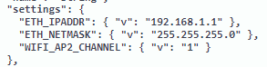

6. You may add applications.

   - If you want this configuration profile to manage apps on your devices, you need to list those apps within the “applications” section. See the example bellow. Please beware that if you do not add “wadmp_client” here, the newest available version will automaticly be inserted into the configuration profile for you.

     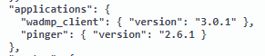

7. You may add firmware version and behavior.

   - If you want to manage firmware, you can specify its version in the “firmware” subsection of a “system” section.

   * The “unlisted_behavior” property configures how the client should treat the applications that are installed in the router but not mentioned in the configuration profile. There are 2 possible values:

     - “Ignore” - The client will ignore applications that are not listed in Applications section.

     - “Purge” - The client will uninstall any applications that are not specified in the Applications section of the configuration profile.

       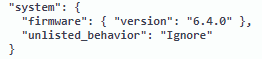

8. You may add files.

   - If you want to deploy scripts or other files via the configuration profile, you can specify those within the “files” section. The names of the properties in “files” section must be unique. The parameters are:

     - “path” - specifies at what location will the file be created in the router (if file already exists there, it will be overwriten).

     - “data” - the contents of the file, encoded into a base64 string.

       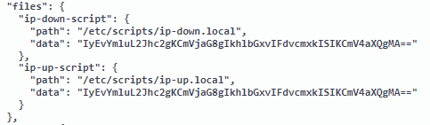

9. You may add users.

   - If you want to manage users (and/or their passwords) through the configuration profile, you can add them within the “users” section. For each user you can only specify their name and password (hash). The value for the password must be obtained from the “/etc/shadows” file of a router.
     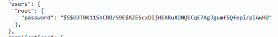

10. Press execute button.

    - Your configuration profile should now be complete. Press the Execute button.

    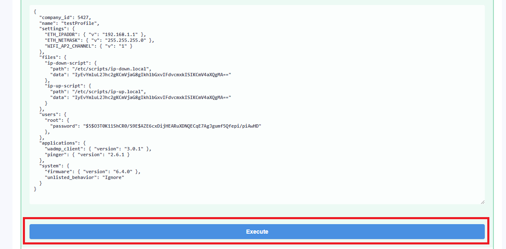

### Using an Already Existing Configuration Profile as a Template.

Rather than creating a new configuration profile from scratch, you can use an existing configuration profile as a template:

- Firstly, list existing configuration profiles in your company to learn the ID of your configuration profile.

  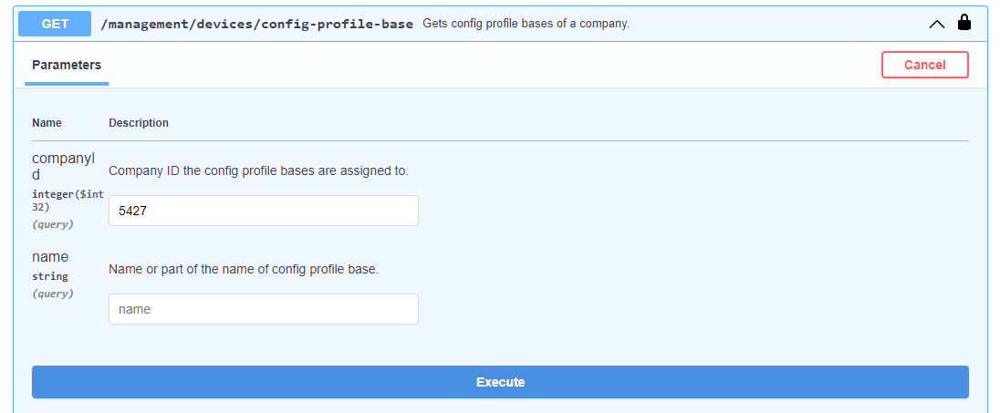

- Secondly, obtain the configuration profile by its ID.

  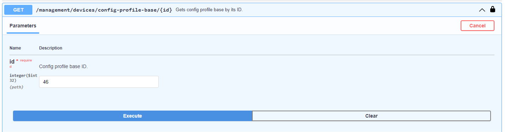

- Lastly, copy the value of the “body” element of the configuration profile into a text editor and replace all occurences of `\"` with just `"`. After that, remove `"{` from the beginning (the first two characters) and `}"` from the end (the last two characters). Then edit the contents (delete settings/apps/scripts/files/users that you do not want to manage or add new ones) and paste the result into the endpoint for creating new configuration profiles (shown in the step #3 above). Add "company*id" and "name" and press the \_Execute* button.

  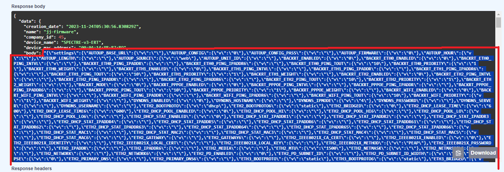

  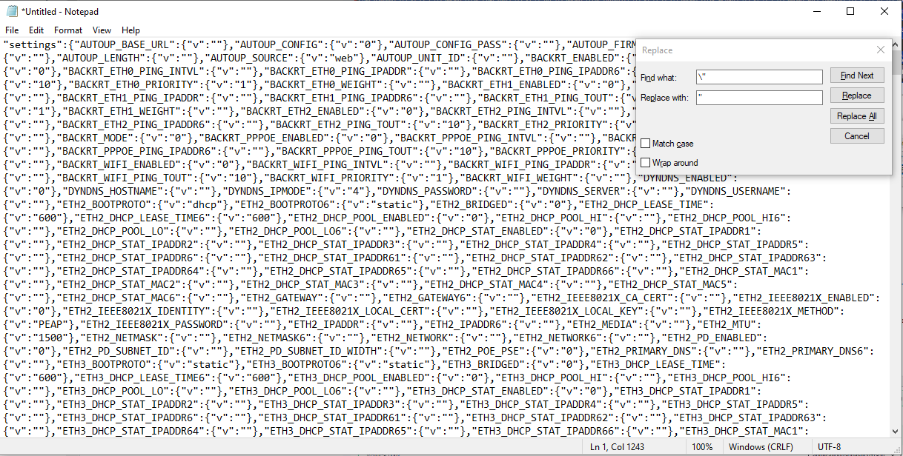

  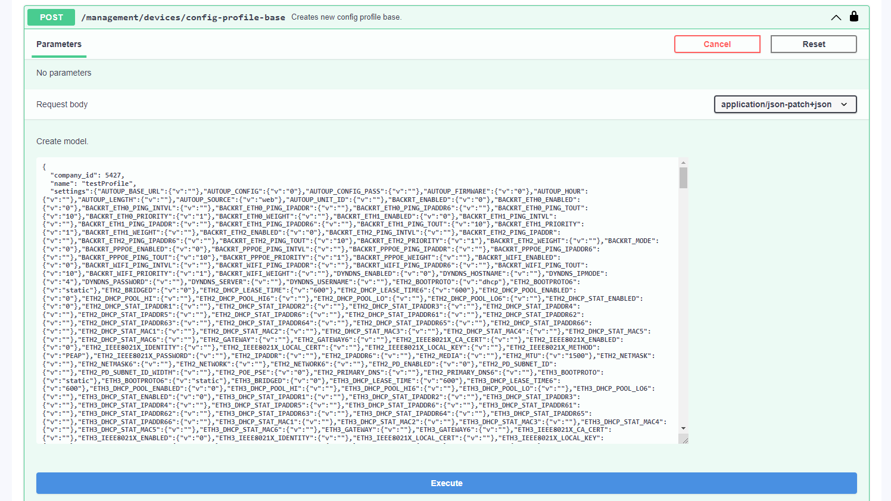
