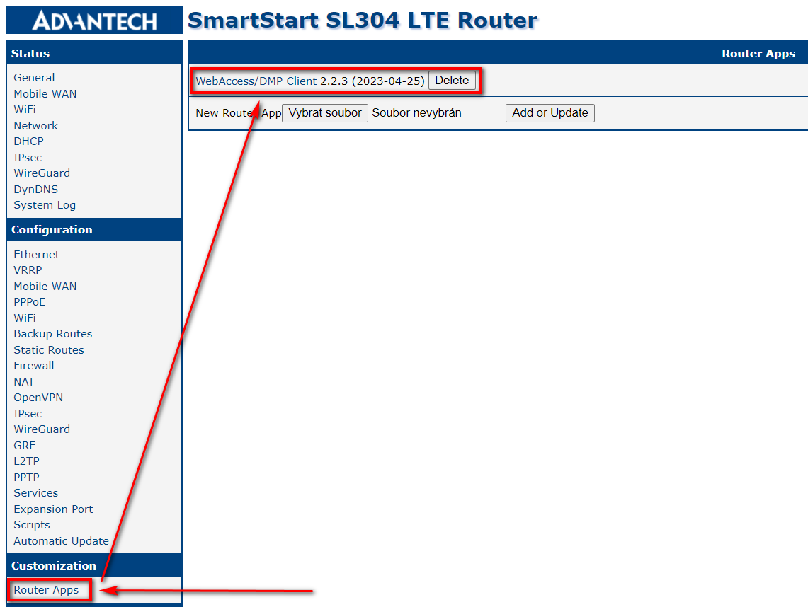
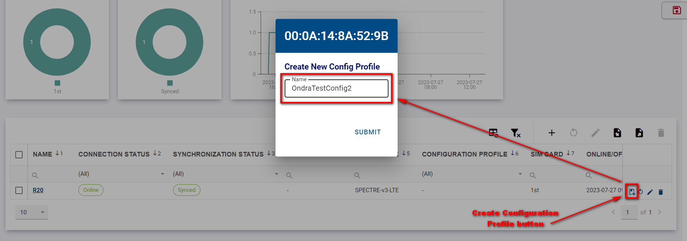
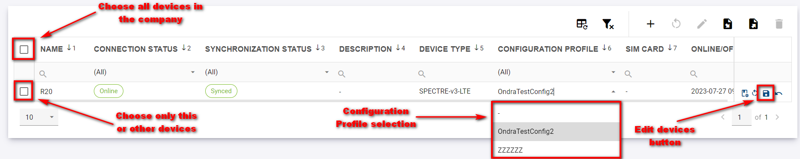
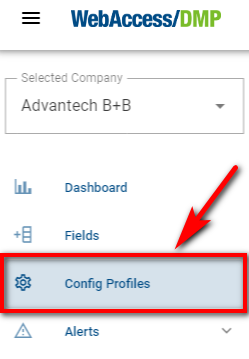
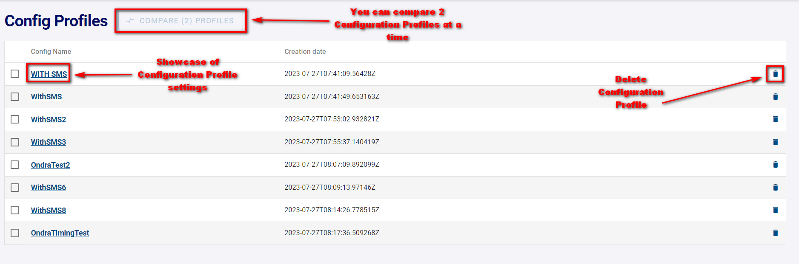
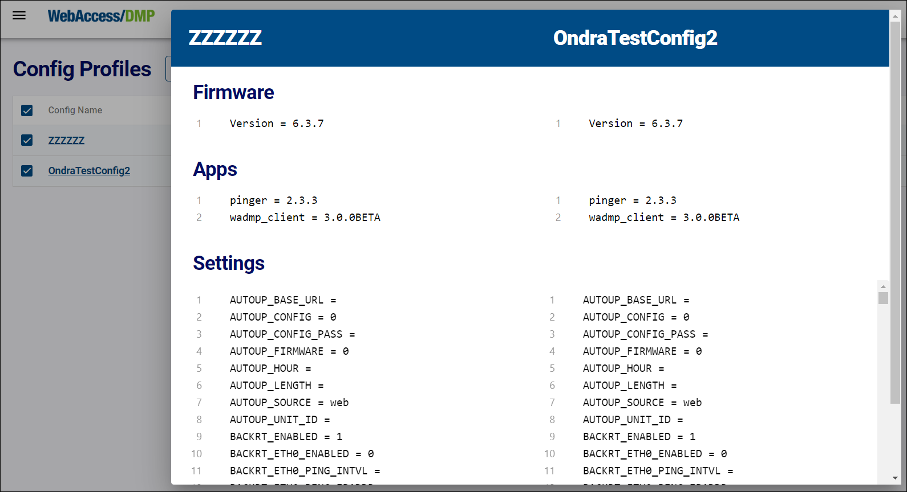

# Configuration Profiles - Installing/Upgrading SW of the Device

## Summary

Configuration profiles are used for easy installation of any of our Router Apps, as well as router firmware and its overall settings as individual devices or bunch devices in bulk.

1. First, you must choose an example router that will be used as a default configuration for your Configuration Profile.

2. Connect to your router via IP address to the user GUI.

3. Ensure you're running the latest WebAccess/DMP Client in the Router Apps section so the router is connected with WA/DMP. You can check the Client Release Notes section for the latest version of WA/DMP.

4. From now on, you can make all desired settings that will be used in the Configuration Profile. This includes all your desired Router Apps, Firmware, and Configuration settings of the router.

5. At this point, you will head for the Dashboard section into the Filter Panel section, where you will make a Configuration Profile out of this router.

6. Now, you can apply your newly created Configuration Profile to any router in your current Company, as showcased in the picture below.

7. You can compare and delete your Configuration Profiles in the Config Profiles section.

 8. Compare by choosing 2 Configuration Profiles of your desire.

