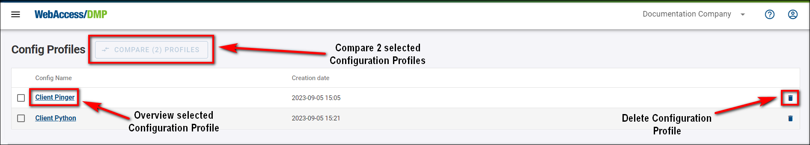
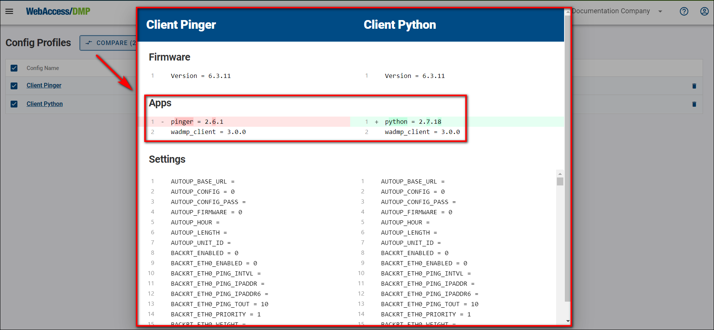

# Configuration Profiles - Installing/Upgrading SW of the Device

## Summary

Configuration profiles are used for easy installation of any of our Router Apps, as well as router firmware and its overall settings as individual devices or bunch devices in bulk.

1. First, you must choose an example router that will be used as a default configuration for your Configuration Profile.

2. Connect to your router via IP address to the user GUI.

3. Ensure you're running the latest WebAccess/DMP Client in the Router Apps section so the router is connected with WA/DMP. You can check the Client Release Notes section for the latest version of WA/DMP.

4. From now on, you can make all desired settings in the Configuration Profile. This includes all your desired Router Apps, Firmware, and Configuration settings of the router.

5. At this point, you will head for the Dashboard section into the Filter Panel section, where you will make a Configuration Profile out of this router.

6. Now, you can apply your newly created Configuration Profile to any router in your current Company, as showcased in the picture below.

::: tip Example Tip: 
If you apply Configuration Profile, the router will apply all configurations from the router from which Config Profile was created. 

For example:

- You have router_1 with an IP address on eth0=10.10.10.1 and router_2 with an IP address on eth0=10.10.10.2.
- If you create a Config Profile from router_1, it will contain setting ETH_IPADDR=10.10.10.1. and if you apply that Config Profile to router_2, setting ETH_IPADDR on router_2 will be overwritten to 10.10.10.1.
- Only if you create a Unique setting with Setting Name ETH_IPADDR (the exact name of the setting from the router) and display the name, for example, Unique_ETH_IPADDR, and edit that field to Unique_ETH_IPADDR=10.10.10.2, the setting will not be overwritten.

:::

7. You can overview, compare, and delete your Configuration Profiles in the *Config Profiles* section.

 8. Compare by choosing 2 Configuration Profiles of your desire.

