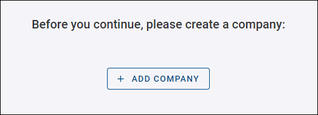
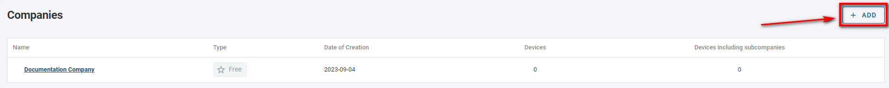
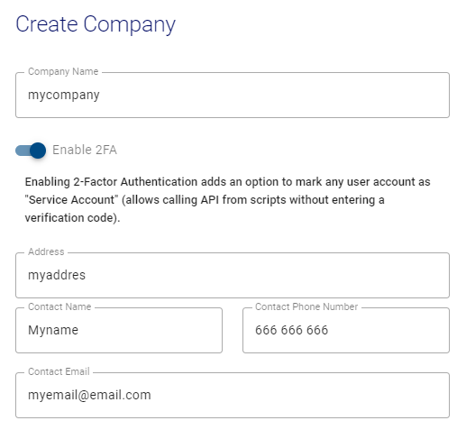

# Create New Companies

When it comes to creating a company, we will distinguish two different scenarios:

1. You're creating your first company, which will lead you to the Creating Company form by clicking the *+ ADD COMPANY* button. In the first scenario, you can skip the next step of creating additional companies.

2. In the second scenario, you're creating your additional companies as described in the text below.  

You can create more companies to represent a logical subdivision for practical purposes. For example, you may want to make a new company under your organization with different devices because:

You want your devices to be managed by different users
You want one aggregated dashboard per device group
It makes sense for the structure to resemble the hierarchy of your organization. e.g., Buildings or Areas where devices are installed
Go to Companies on the top left menu and click on the *+ ADD* button for a new company on the right of the page menu.

Remember, the creation of a company depends on these conditions:
- You can log in to the platform and
- That you have permission to create companies
- Free companies cannot create child-companies
- User can only create three root companies

If you can't see the new company icon, contact your company's admin to get the appropriate permissions.

In summary, these are the fields you have to fill when creating a new company: 

1. Name of the Company that you are creating. 

2. Enable 2-Factor Authentication. (Optional)

3. Business address for this new Company.

4. Name, phone number, and email address of the person who will be the Primary Contact person in this new Company. 

> **_Note:_** This information is "metadata": this step does _not_ create a User in the system, nor does it assign a User any permissions for this new Company. 

5. Click the "SAVE" button to create your new company.

