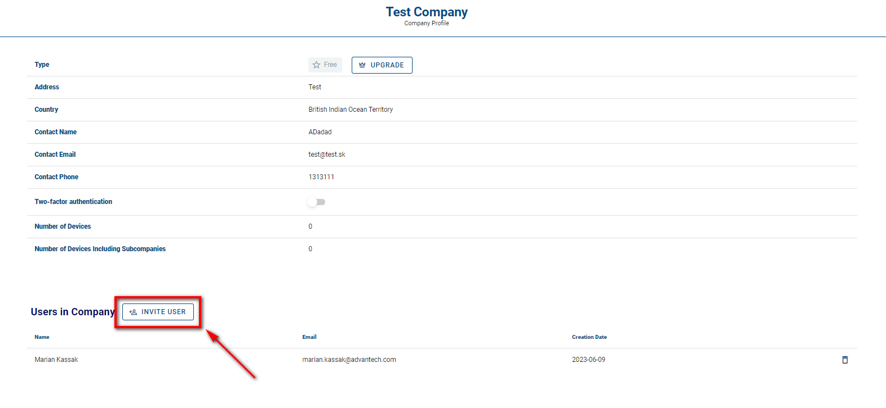
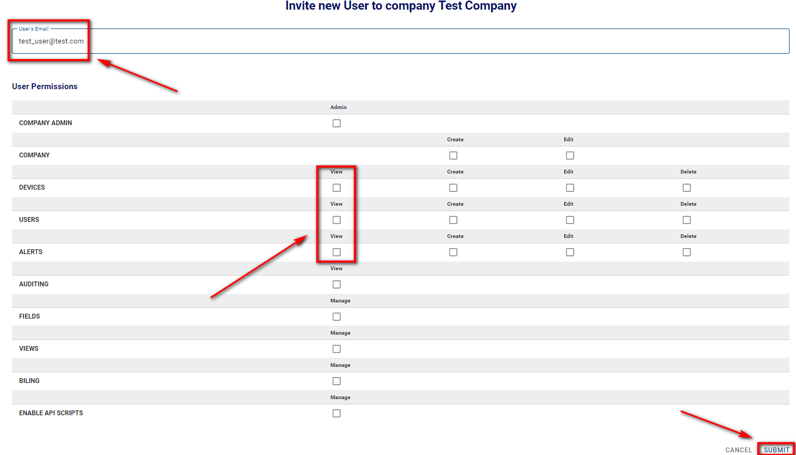

# Create more Users

The only way to add users to your companies is by creating them yourself. When a user signs up, he will also create a company, one with no relation to yours.

As with companies, remember that the creation of a user depends on two conditions:
- That you can log in to the platform and
- That you have permissions to create companies

You can check your permissions if you edit your user. Your assigned permissions are shown as check marks.

To create a user:

1. Select "Companies" from the Context menu. 
2. On the Companies page, click on your desired company, then on "Invite User" action button .

3. On the prompt that follows, enter the following criteria: 

   1. E-mail address of the user. 

