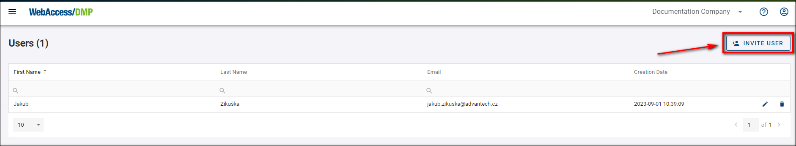
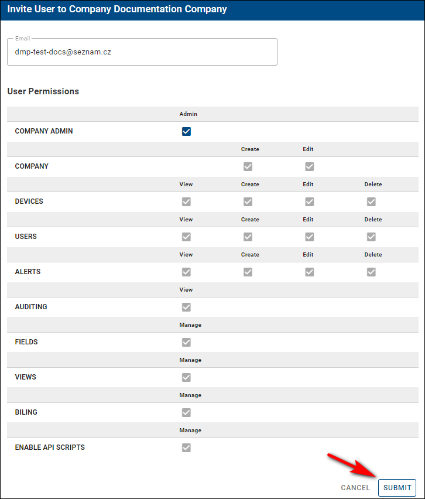
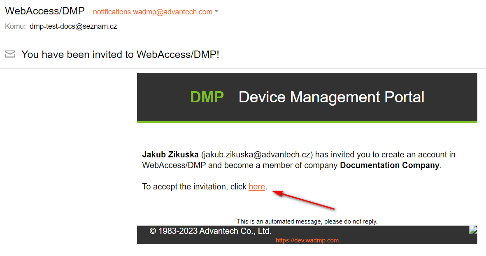
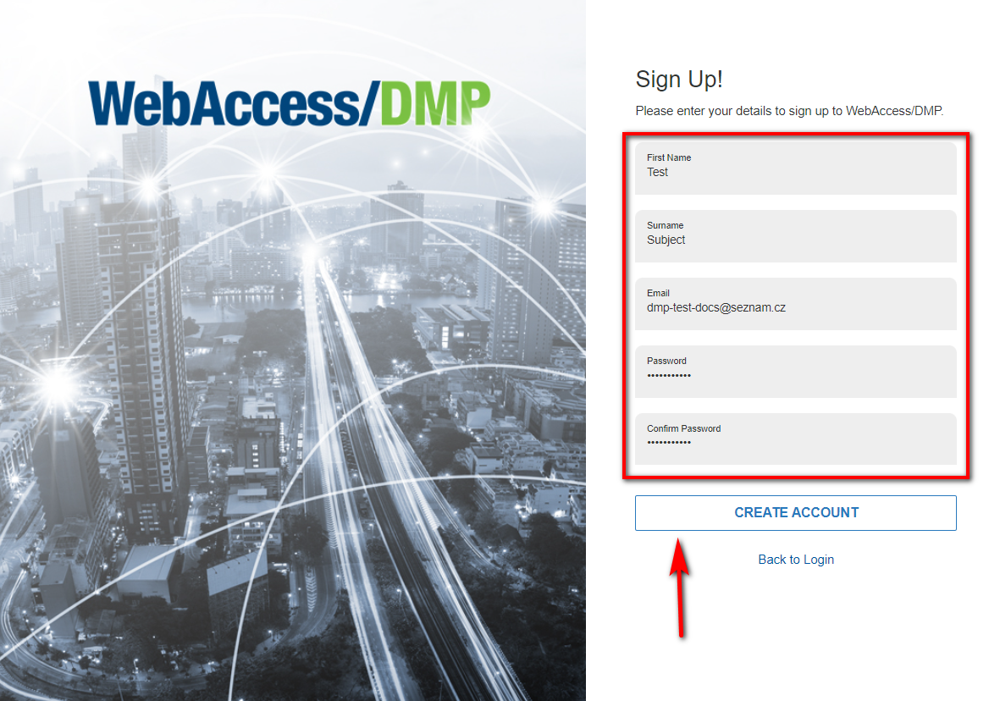

# Create More Users

Creating them yourself is the only way to add users to your companies. When a user signs up, he can also make a company with no relation to yours.

As with companies, remember that the creation of a user depends on two conditions:
- You can log in to the platform and
- That you have permission to create companies

You can check your permissions if you edit your user. Your assigned permissions are shown as check marks.

To create a user, you can do it in two almost identical ways:

1. Make sure that you're in the right company where you want to invite the user, then select *Users* from the *Title Menu*.
2. On the *Users* page, click the *Invite User* action button on the right top of the page.

3. To the invitation form, fill in the user's email and set up your specific permissions for him to use.

4. Now, the user needs to head to his email to confirm the sent invitation by clicking on the link in the email.

5. After clicking on the invitation, the link will redirect him to our main page, where he will need to fill up his login data and click the *Create Account* button, as shown in the picture below. The email is already set up from the link and cannot be changed.

6. After clicking the create account button, you will get a message that your registration has been completed. You can now access your account by clicking the *Dashboard* link or logging in on the main page.

The second way to create a user:

1. Select "Companies" from the *Title Menu*. 
2. On the Companies page, click on your desired company, then on the "Invite User" action button.

.png)

3. From now on, the process is the same as in the first way of creating a user.

