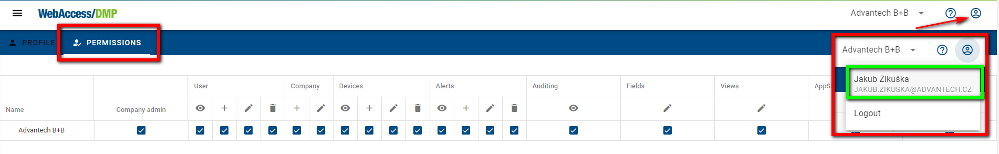
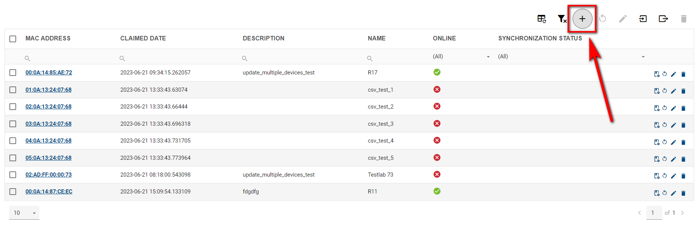
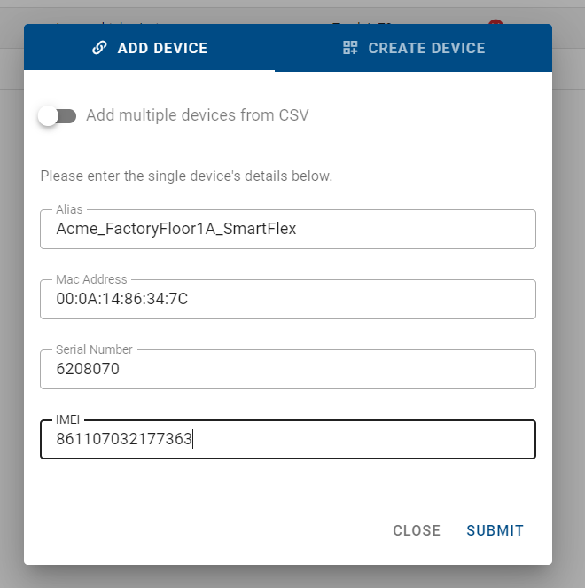
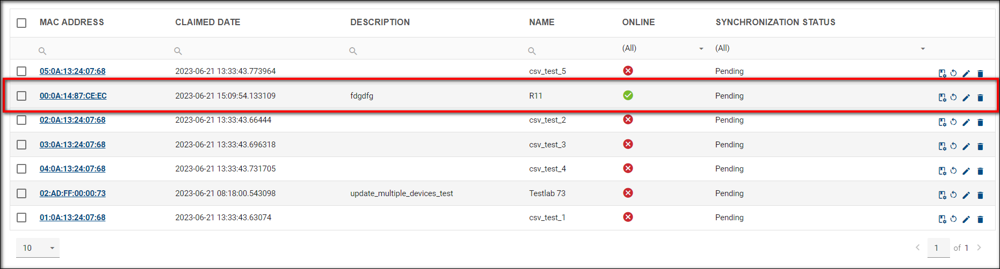

# Claim a Device to Your Company

To Claim a Device from one of your Companies, you must have the authority to Claim a Device. 

Claiming a Device depends on 2 User criteria: 

User Authentication (successful login) is the first: User Authorisation (permissions) is the second. 

You may select your username from the Users list to check your user permissions.

Your assigned permissions are shown in the example picture below.

e.g. 

**Rules**: 

Only unclaimed (aka "Released") Devices can be Claimed by a Company.

A Device may only be claimed by one Company. 

That Company may release a Device that a Company has claimed. 

A Company must claim a Device before it may be managed or monitored by that Company. 

**Steps**: 

Assuming you have the required permissions, you may Claim a Device to one of your Companies by following these steps: 

1. Select "Dashboard" on the Title Panel menu. 

2. click the "Add devices" action button on the Filter Panel.

    

3. You can choose "add device" or "create device" on the open form. On the "add device" form, there are four fields.

   1. **Alias**

      Enter a human-friendly name here. 

      This will help you to identify the physical device by Alias name later. 

      This is not a required field: you may leave this empty.  

   2. **MAC Address**

      Please enter the exact MAC Address for ETH0 of your Device, as it is printed on the label for the device. 

      The MAC address format is 00:0A:14:aa:bb:cc

      You may enter the MAC address with or without the semi-colons.

      This is a required field: enter a valid MAC address for your device here.

   3. **Serial Number**

      Please enter the exact Serial Number for this device, as it is printed on the label for the device.

      Some Serial Numbers have alphanumeric characters: enter them as you see them. 

      This is a required field: you must enter a valid Serial Number for your device here. 

   4. **IMEI**

      Please enter the exact IMEI for this device, as it is printed on the label for the device.

      This is a required field: you must enter a valid IMEI for your device.

      **Note**: Some Devices do _not_ have an IMEI number. For those Devices, you will not be required to enter an IMEI. 

4. If you have more than one Device to Claim, you may enable the "Add multiple devices from CSV".

5. Submit.

Here's an example of a printed Device label: 

For this device, the Claim Device form would look something like this:

 

After a Company has successfully claimed a Device, it will appear in the Device List for that Company, for example like this: 

