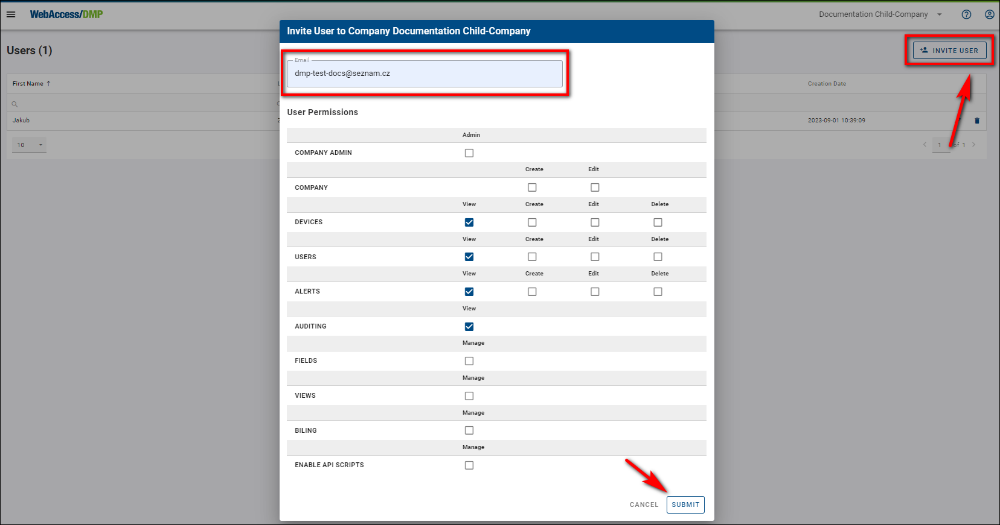
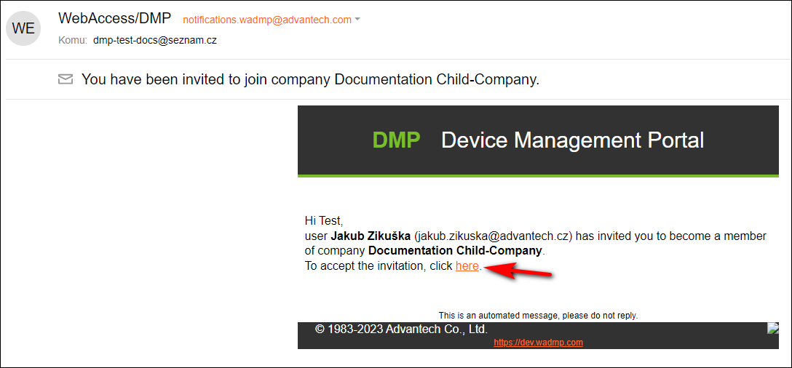
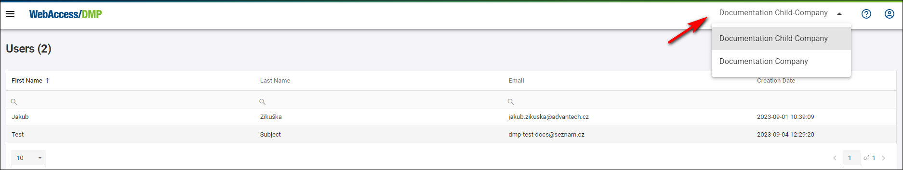

# Invite Already Existing or New Users

You can invite existing or new users who just created their account to any company you have permission to. You can do it similarly, like when creating a new user.

You can check your permissions if you edit your user. Your assigned permissions are shown as check marks.

To invite a user:

1. Make sure that you're in the right company where you want to invite the user, then select *Users* from the *Title Menu*.
2. On the *Users* page, click the *Invite User* action button on the right top of the page.

3. To the invitation form, fill in the user's email and set up your specific permissions for him to use.

4. Now, the user needs to head to his email to confirm the sent invitation by clicking on the link in the email.

5. After clicking on the invitation, the link will redirect him to our main page, where he will be notified that he has been added to the company.

6. From now on, the user can click the "Continue to Dashboard" link and check that he's in the company.

