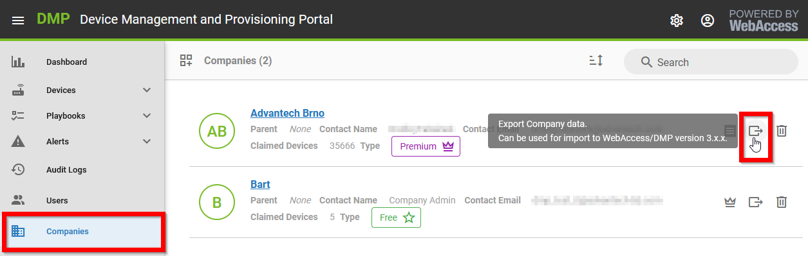
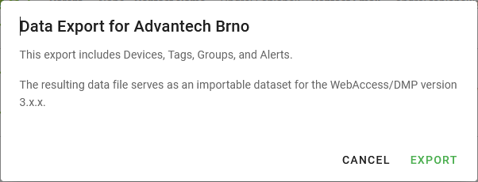
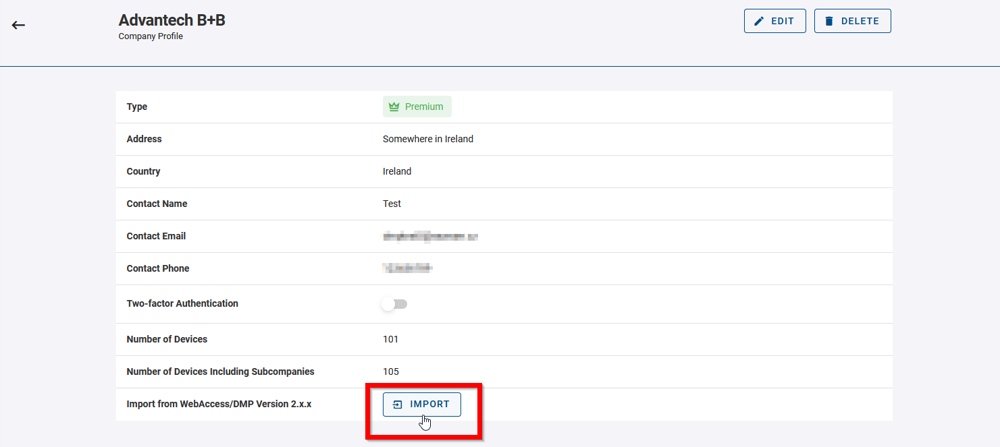
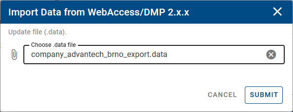
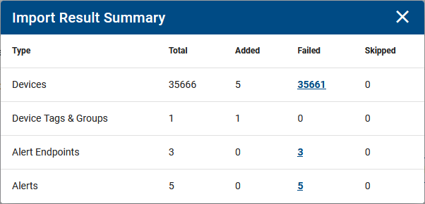

# Migration from 2.x.x to 3.x.x Instance

This guide explains the process of transferring data from a 2.x.x instance (www.wadmp.com ) to 3.x.x. instance (www.wadmp3.com). The migration specifically moves data from one company in GEN2 to another company in GEN3 without affecting the company structure. It's important to note that the presence of both companies in their respective instances is a necessary condition for the migration to take place.

**What is migrated:**

- Device Memberships (the same devices from 2.x.x will be added to your 3.x.x. company)
- Tags and Groups (added through automatically created _Fields_ of type _Tag - True/False_)
- Alerts and Alert Endpoints

## Step 1. Export Data from 2.x.x Instance

Go to _Companies_. Find a company you want to export data from. Click the _Export_ icon on the right.

A dialog box will pop up, providing details about the export. Save the file company_name_export.data to your computer.

## Step 2. Import Data into 3.x.x Instance

Log in to your account at www.wadmp3.com. Select or create a company you want data to be imported to. Go to _Companies_ in the menu and select the company details. On the _Company Profile_ page, click on the _Import_ button:

Select the data file containing exported data from 2.x.x instance and press Submit.

After a while (which depends on the volume of imported data), the import results will be displayed, along with the following overview:

You have the option to examine the outcome of the import process. If certain items appear as skipped, it indicates they were either previously imported or manually added. If any failures occur, you can investigate the reasons by selecting the number of failed items. Additionally, you can generate a CSV failure report by using the export icon at the top.

## Step 3. Migrate Devices

To effectively administer your devices in the 3.x.x instance, it is essential to upgrade the _wadmp_client_ Router App on your devices to version 3.0.0. To achieve this, utilize the 2.x.x instance.

Installing the updated Router App version will seamlessly transition your device to connect to the 3.x.x instance. Note that following this procedure, those devices will lose the ability to connect to the 2.x.x instance. We highly recommend testing the migration process first on a small number of devices.
