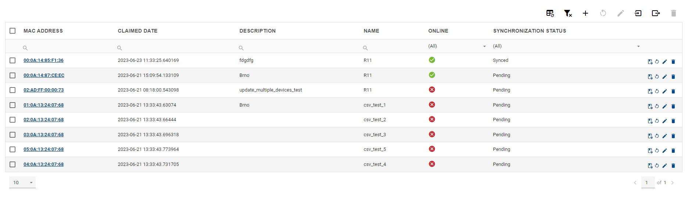
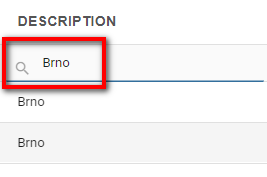
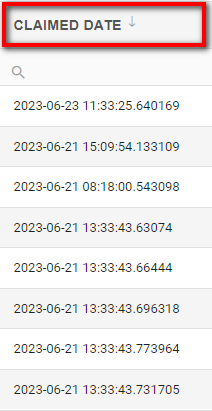
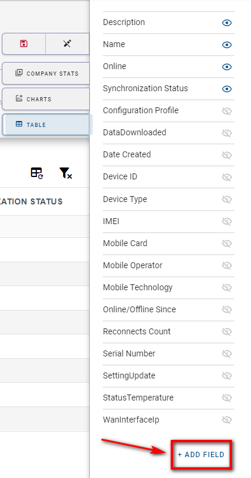
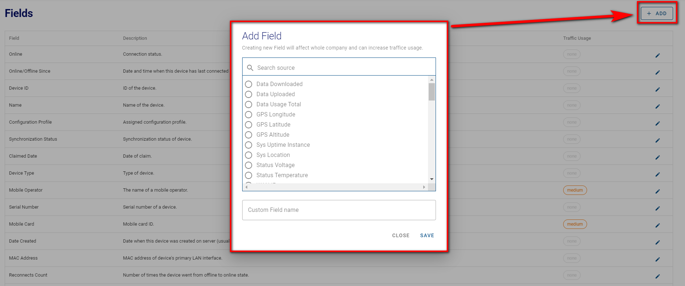

# Searching, filtering, and sorting devices

You can search, filter and sort your devices at will, but remember that this only applies to your active view.

If you want to search for a specific device, choose your particular column and write down your desired parameter. As a result of the example below, you should get only devices with "Brno" in the description.

If you want to sort, for example, by the claimed date of the device, you just press the claimed date button and choose either descending or ascending mode.

You can edit, show/hide or add more columns in the Edit View mode as mentioned in the **General Structure of the UI >> C: The Details Panel** section.

By pressing the "Add field" button, you'll be able to customize your custom table fields as well as edit the available ones.  

