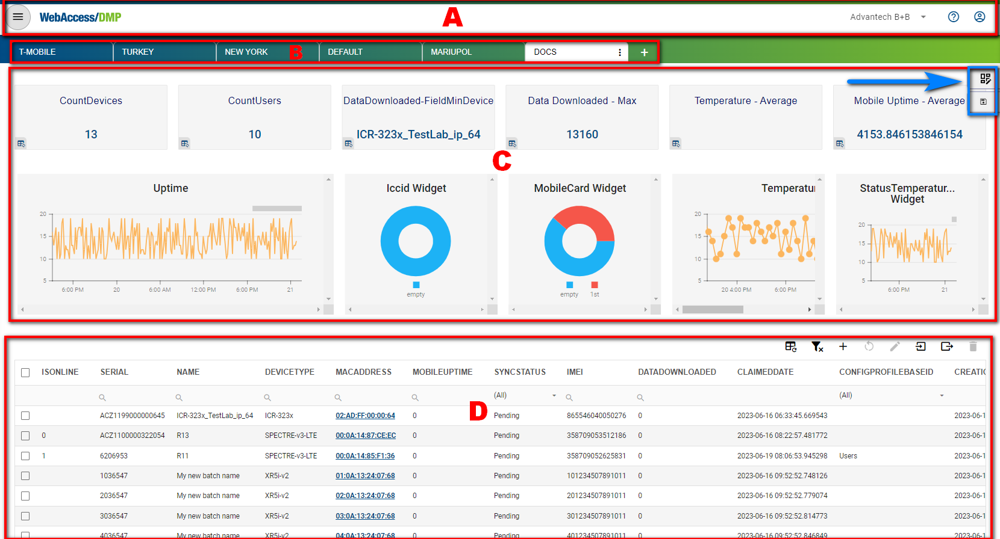
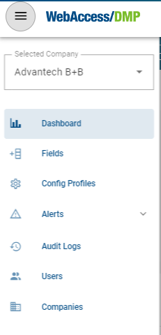
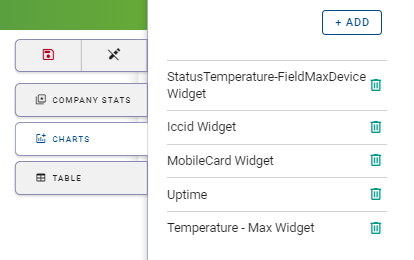

# General Structure of the User Interface

The UI is structured into four main areas. 

<u>A: The Title Panel</u>

The Title Panel contains a link to the context panel (as shown in the picture below), where you can specify your output on panel C. It also includes a link to the documentation and information about the currently logged user.

<u>B: The Views Panel</u>

This is where you can create empty or select already defined panel C and D settings.

<u>C: The Details Panel</u>

This is the central panel of information. The details presented here depend on the context and actions selected. You can access the edit menu by clicking the top icon next to the blue marker.

You can specify your desired widgets, including Company Stats Widgets, Charts Widgets, and Tables. All of these can be moved at will. By clicking on the red floppy disc, you save your current view.

<u>D: The Filter Panel</u>

In this section, you can filter based on any available parameters. Export, import (from CSV file), or delete devices and config your current filters at will.
