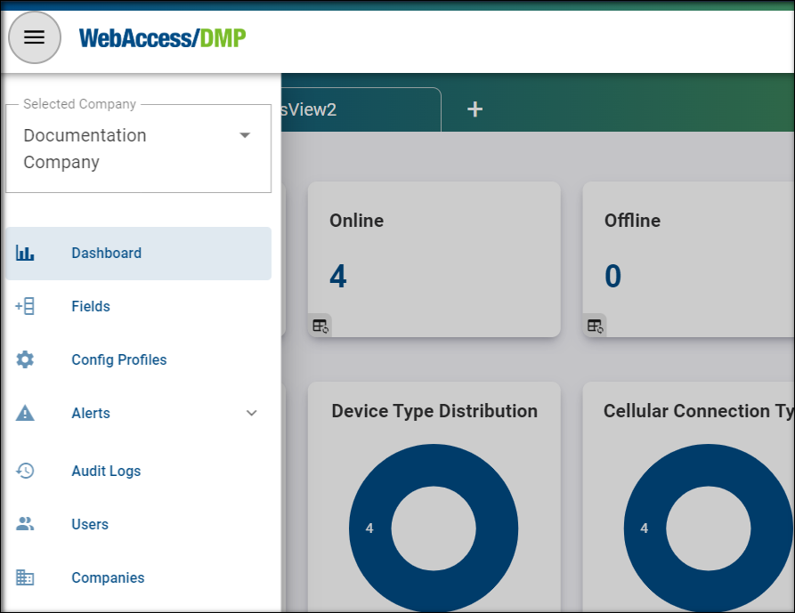
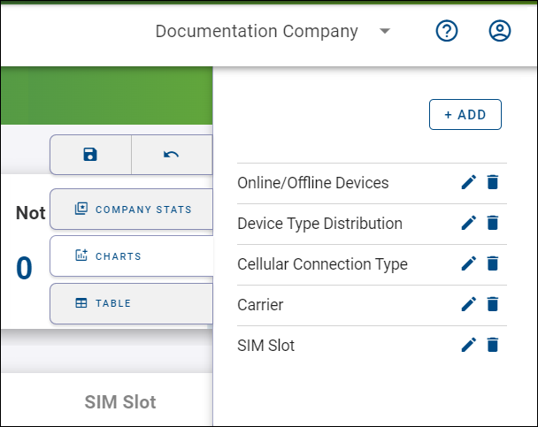

# General Structure of the User Interface

The UI is structured into four main areas. 

.png)

**A: The Title Panel**

The Title Panel contains a link to the context panel (as shown in the picture below), where you can specify your output on panel C. It also includes a link to the documentation and information about the currently logged user.

**B: The Views Panel**

This is where you can create empty or select already defined panel C and D settings.

**C: The Details Panel**

This is the central panel of information. The details presented here depend on the context and actions selected. You can access the *Edit View* menu by clicking the top icon.

You can specify your desired widgets, including Company Stats Widgets, Charts Widgets, and columns in the Table. All of these can be moved at will. By clicking on the floppy disc, you save your current view.

**D: The Filter Panel**

In this section, you can filter based on any available parameters. You can also export, import (from CSV file), add device, delete device, reboot device, create configuration profiles and configurate your current filters at will.
