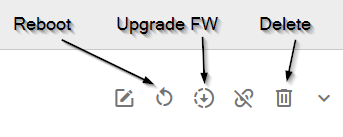

# 2.4.0: December 11, 2021

### User Interface

#### Features:

* There is a new **Alert** feature available. Alerts allow users to observe specific parameters of a single device or a company and set notification triggers based on its values. The Alert feature is only available for Premium accounts.

* The **Auditing** feature - gives Users the option to browse auditing events related to a single Device, Users, and the WADMP application. Complete Auditing records are available under the new menu item - Audit Logs. The Device logs are located on the Device page on the tab Audit Logs. The User-related records can be found on the “Audit Logs” tab in the Users section.

* Added reboot button and upgrade firmware button for a single device (on the right on the device detail page):

* As we now support device deletion, the icon to delete is shown at all times at the device (showed previously at unclaimed devices only).

#### Improvements:

* In login web, we removed the redundant "Remember Me" checkbox (this is enabled by default), allowed all special characters in the password and corrected some formatting.

* User edit form was changed to on-page form (previously modal dialog) for better readability and usability. Also, the error placement was changed to a popup message.

* Two state filters on the "My Devices" page (online/offline, claimed/unclaimed, in-sync) now have green color for positive selection, so it is clear what state they are in.

* Added EULA and Privacy policy popup dialog to record user agreements. 

* Aggregated Router Apps were hidden from the installation menu (these apps will be installed automatically when the parent app is installed).

* Added missing message about being empty to empty tag filter at devices. 

#### Bugfixes:

* Added missing Back button to Create new playbook form.

* Fixed rendering of icons with initials for companies/users whose names contained spaces.

* Added missing error message for incorrect Company Contact Email on the sign-up form.

* Fixed "Value is not an integer" error at the device configuration that occurred in the situation when the router reported the value of ports in the NAT section.

* Error message shown when saving an invalid device configuration is now more specific.

---

### Code / API

#### Features:

* Alerts feature has been implemented, including API endpoints.

* Auditing API endpoints were merged into one that allows filtering by company, user, and device (in the previous version, only filtering by user or company was possible).

* Moved auditing data to a more appropriate database to improve performance.

* Device delete. It is now possible to delete a device (previously, devices could only be deleted if they had never been claimed before). Some information about deleted devices remains in the database for auditing purposes. It is possible to create a deleted device again.

#### Maintenace:

* Updated our database with monitoring data to the newest version.

#### Bugfixes:

* Fixed routers were getting out of sync due to the server not sending a particular message to the router in some situations.

* Fixed server sometimes not reconnecting to MQTT brokers after its maintenance.

* Fixed password check at sign-up/password change so all special characters can be used.

* Fixed Playbook sometimes not shown as “running” for the first device of the device group where it was running.

* Default value for devices with no temperature sensor was changed to -273 degrees Celsius from 0 degrees Celsius.

* Fixed monitoring data not being available after re-claim of device.

* Fixed error "Instance ID already in use" when installing Router App after the previous fail to install the same app.

* Modified default parameters for several GET endpoints.

* Fixed “InSync” status sometimes not updated after application (un)installation.

* Fixed "/management/devices/{macAddress}/commands/trigger-bootstrap" API endpoint not returning 401 Not Authorized message when it should.

* Fixed internal server error popup that was incorrectly shown when deleting a company (the company was correctly deleted, but the error was established).
  
* Removed unused Family ID parameter from "/identity/device-families/{familyId}/device-types/{typeId}" API endpoint. This parameter was redundant and the API endpoint was changed to "/identity/device-families/device-types/{typeId}".

---

### Content

#### Bugfixes:

* Fixed Backup Routes firmware section on v2i routers.

* Fixed USB Port model section at all firmware.

---

### docs.wadmp.com

* Added explanantion page: [Alerts Explained](https://docs.wadmp.com/explanations-discussions/alerts.html).
* Added explanantion page: [Auditing Explained](https://docs.wadmp.com/explanations-discussions/auditing.html).
* Added explanantion page: [Grafana - Company Dashboard, Device Dashboard (Monitoring Data)](https://docs.wadmp.com/explanations-discussions/grafana.html).

