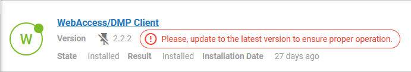

# 2.5.3: May 3, 2023

This release contains improvements.

### Improvements:

* Improved monitoring database performace by setting up sharding, so the database load is spread accross multiple databases and much better handled.
 
* Added alert in UI: If the latest version of WebAccess/DMP Client is not installed on the device, the user is noticed on a Device detail page, Router Apps, where installations are managed.

* Updated wording in billing PDF automatically sent. Changed "Invoice Number" to "Order Number" and added notice that this is not an invoice.