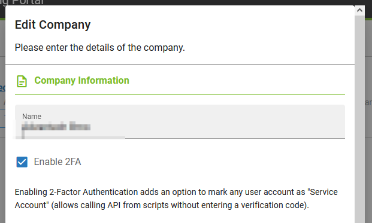
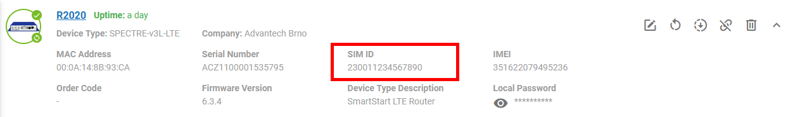
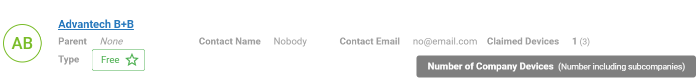
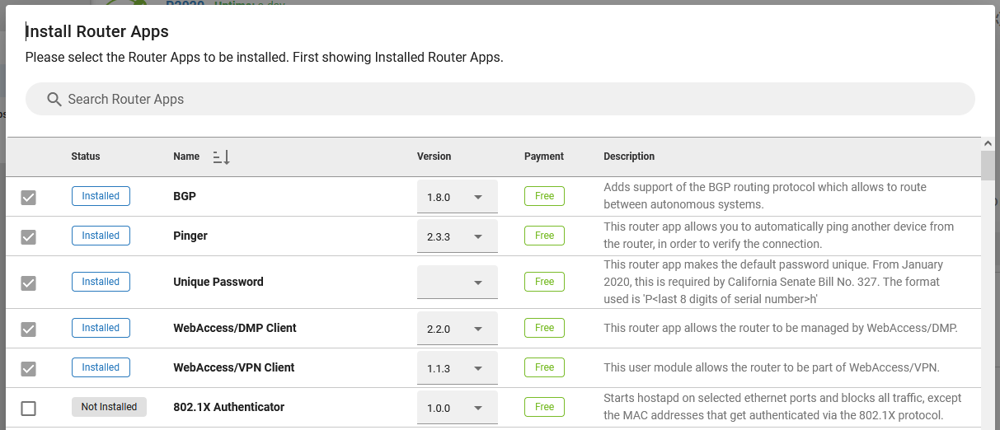
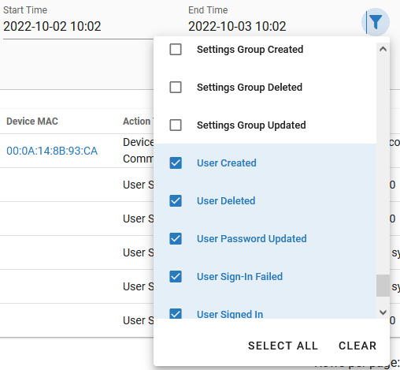

# 2.5.0: October 6, 2022

This release contains a bunch of new features, bug fixes, and game-changing improvements to the core architecture.

### New Features

* Added an option to set a **2-Factor Authentication** (2FA) for a company. Once enabled any user of the company is required to use Apps like Google Authenticator or Microsoft Authentification to be able to log in to the WADMP account. In case of need, a *Service Account* can be set up, so API scripts can bypass the 2FA. More information on 2FA can be found [here](https://docs.wadmp.com/explanations/2fa/).

* Added support for storing and displaying a SIM ID (IMSI) if reported by the device (requires 2.2.0 or newer WebAccess/DMP Client). The SIM ID is displayed on the device detail page.

* Added a number of Claimed Devices to the list of companies. It is now easier to see a number of company’s devices. If the company has sub-companies, there is also an overall number of devices, including sub-companies, displayed.

* Added memory for filters and sorting in the UI. All the filters/sorting on the Devices page, as well as on most of the other pages,  are now remembered when navigating somewhere else. The card view was removed across the GUI.

* Modified “change-password” API endpoint (*/management/devices/{macAddress}/commands/change-password*) to support 2 new parameters (*User, Password*), which allow the configuration of a specific password. Previously only random passwords could be generated (which is still possible if no password is provided to the endpoint).
  
* Added support of automatic update of WebAccess/DMP clients (requires 2.2.0 and higher client version). As soon as the client detects its current version is no longer supported, it will perform an automatic update to the newest supported version.

### Improvements

* Changed the overall backend architecture, which significantly improved the performance of the system and opens a path to new delivery options in the later releases. 

* Sorted Router Apps by status in the Install dialog, so that the installed apps are now shown first, before any non-installed apps.

* Unified naming of the Auditing Action Types at the Audit Logs. Added “Select All” and “Clear” options for better usability. Added GET */auditing/action-types* API endpoint.

* Made swagger API endpoints (documentation at [api.wadmp.com](https://api.wadmp.com)) displayed in alphabetical order and updated API gateway to a new major version. It has a different-looking UI.
  
* Updated billing email text so it highlights the billing overview and invoices are sent in separate emails.

### Bug Fixes 

* Fixed edits of Alerts sometimes cause the Alert to repeatedly trigger when it should not.

* Fixed edits of Alert Endpoint not being applied.

* Fixed apps becoming pinned after their update.

* Fixed repeatedly adding a Device to the same Device Group did not return any information notice that this device had already been in the group.
  
* Added missing redirects after the Save button back to the list page on several places in UI - when creating or editing items like Device Group, Settings Group, Alert Rule, and Alert Endpoint.

* Fixed completed playbooks with no devices shown in playbooks. Now the Playbook won't show if all related devices are deleted.

* Fixed User Permissions sometimes show error notifications despite a change being successfully saved.

* Made *Page* and *PageSize* parameters optional for all API endpoints.

* Removed *ignore_devices_with_different_vesions* parameter from POST */management/settings-groups* API endpoint.

???? *  The permissions follow the rules mentioned in this [Permissions Explanation](https://docs.wadmp.com/explanations/permissions/).

