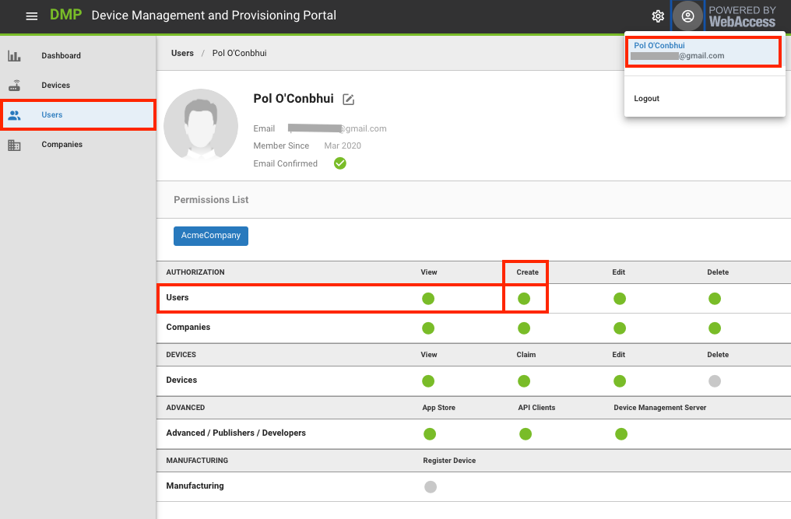
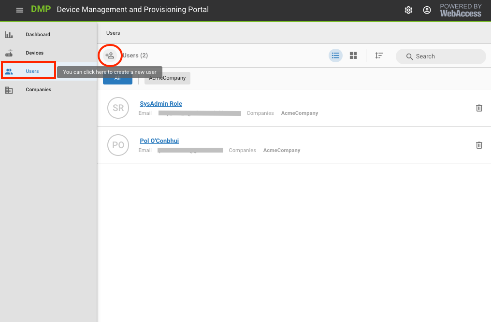
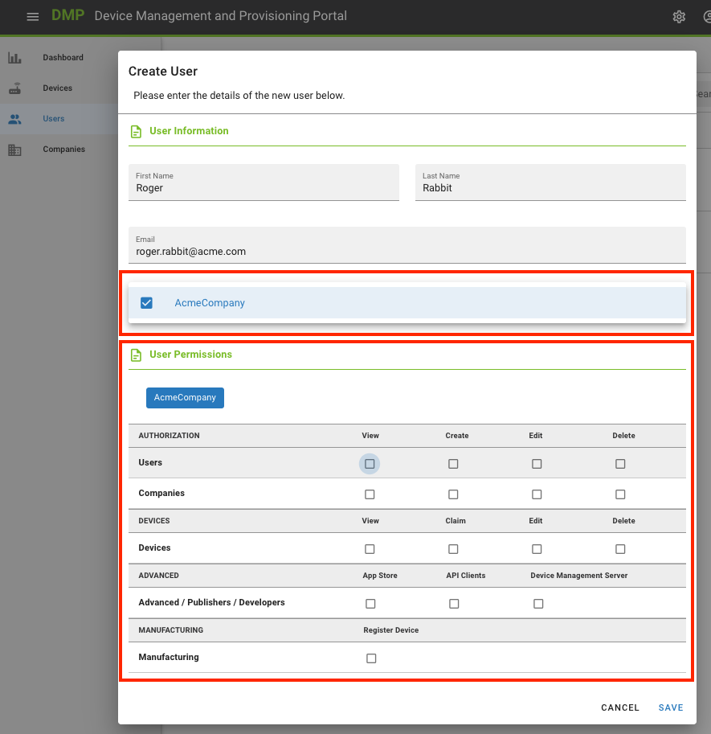
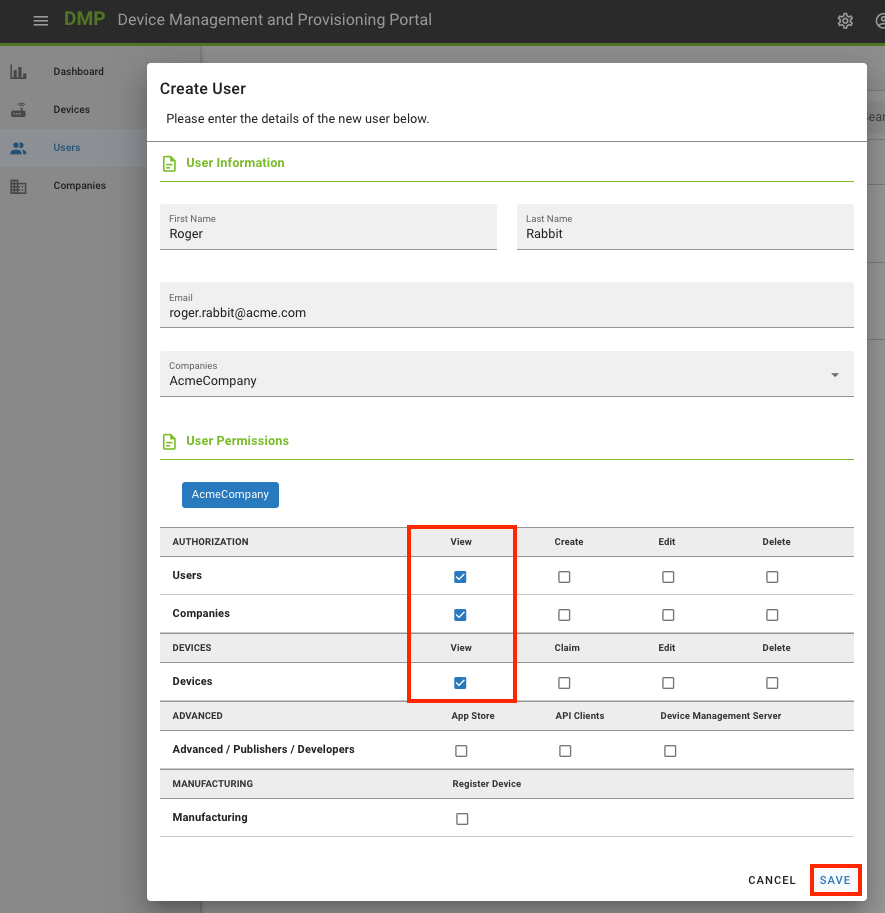

# Create more Users

The only way to add users to your companies is by creating them yourself. When a user signs up, he will also create a company, one with no relation to yours.

<iframe width="560" height="315" src="https://www.youtube.com/embed/Hl3ElX1BUvo" frameborder="0" allow="accelerometer; autoplay; encrypted-media; gyroscope; picture-in-picture" allowfullscreen></iframe>

As with companies, remember that the creation of a user depends on two conditions:
- That you can log in to the platform and
- That you have permissions to create companies

If you can't see the new company icon, contact your company's admin to get the appropriate permissions.
You can check your permissions if you edit your user. Your assigned permissions are shown as green dots.

To create a user:

1. Select "Users" from the Context menu. 
2. On the Actions bar, click on the "Create User" action button.

3. On the prompt that follows, enter the following criteria: 

   1. First Name and Last Name of the User you are creating. 

   2. Valid email address for the User that you are creating. 

      **Note**: This email address **must** be valid. The User will receive an emailed verification request from the Platform and must click on the link that has been emailed to them to create and verify their Authentication credentials.

   3. Select one or more companies you wish to Authorise this User to interact with.

      **Note**: After you have selected one or more Companies, you must assign permissions to that User on a granular basis.

   4. Assign the appropriate Permissions for the User you are creating for each of the Companies that you wish them to be able to interact with. 

      **Note**: By default, there are **no Permissions** granted, for a new User, in any Company. There must be a deliberate action to assign Permissions, per Company, to this User. 
   
      **Note**: You may only create a new User in Companies where you are authorized to make Users.
   
      **Note**: You may only assign Permissions to a new User for a Company if you have that Permission yourself. 
   
   5. Save.

