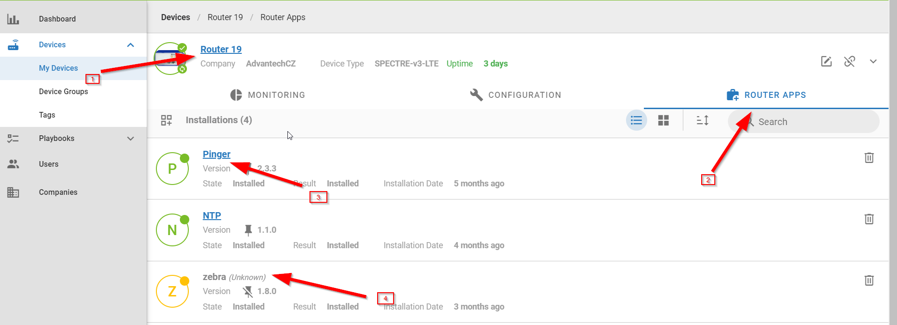
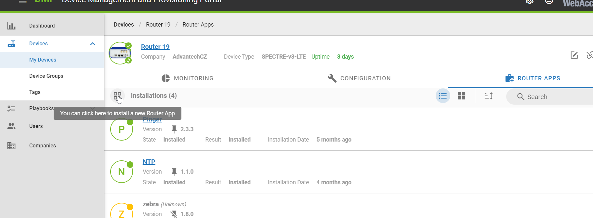
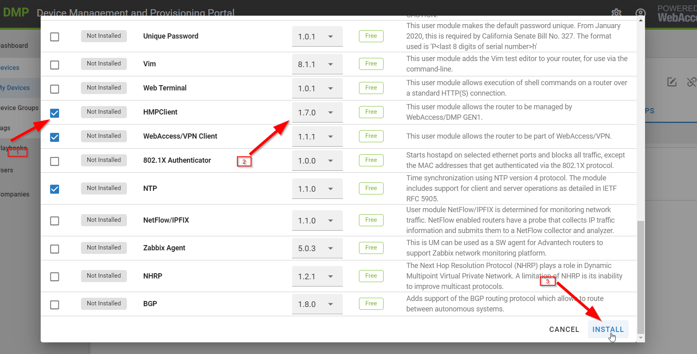
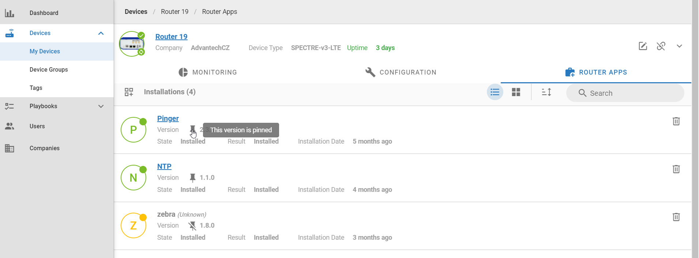

# Installing/Upgrading Router Apps

<a href="/tutorials/search-filter-sort-devices.html">< Prev: Searching, filtering and sorting devices</a>

Router Apps can extend the features of the device above the firmware features.

1. Select the device,
2. click on "Router Apps".
3. There is Router App installed.
4. There is no way to edit properties of yellow (unknown) Router Apps, because they are not supported by the platform, yet. When the App is known by the platform, but the version in device is not known, it is also yellow - you can reinstall it with known version.

If you want to add more Router Apps, click on this icon. 

1. Select the Router Apps to install,
2. choose the version.
3. Click on "Install".
   

To keep a specific Router App and version in device, pin it.
Pinned Router app will be always synced in the device - if the Router App is deleted or updated localy in device, it will be installed back to pinned version immediately when synced with DMP again. 

Firmware can be pinned the same way.

<a href="/tutorials/configuring-devices.html">Next: > Configuring online and offline devices</a>
