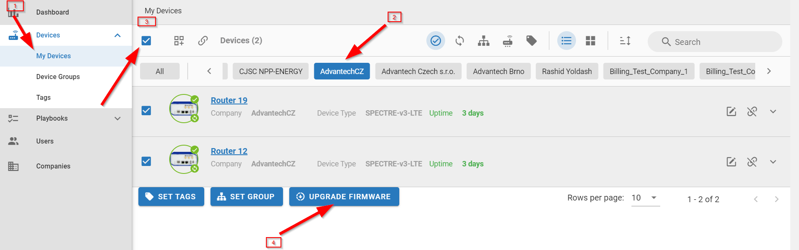
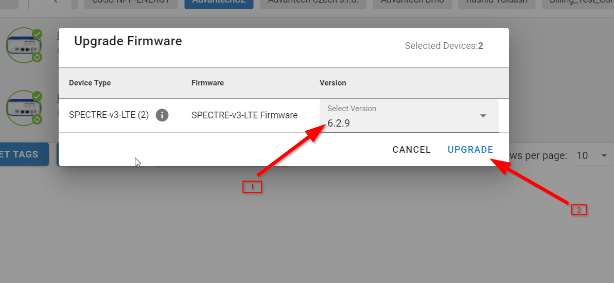

# Upgrade devices to the latest Firmware

To upgrade your devices to the latest Firmware, first filter the devices you want to upgrade.

1. Choose My Devices,
2. Select exactly one company so you can select the devices. Optionally filter the devices using Groups, Tags, other filters on the right top, or search.
3. Select all filtered devices (or you can manually select only some devices from the list).
4. Click Upgrade Firmware button at the bottom.

1. For every Device Type select the version of Firmware.
2. Click on Upgrade.

